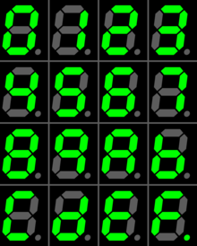

# 7-LED Segment DIGIT
Implementați un modul verilog care să afișeze in funcție i_w_digit o cifră specifică.

Intrările modulului sunt:
 - i_w_digit - ce cifră se va afișa (2 biți)

Ieșirele modulului sunt:
 - o_w_ca - linia ca din 7-led segment
 - o_w_cb - linia cb din 7-led segment
 - o_w_cc - linia cc din 7-led segment
 - o_w_cd - linia cd din 7-led segment
 - o_w_ce - linia ce din 7-led segment
 - o_w_cf - linia cf din 7-led segment
 - o_w_cg - linia cg din 7-led segment

Pentru a afla cifrele ce trebuie afișate în funcție de i_w_digit apăsați butonul "evaluate" din VPL.

Avem un 7-led segment cu anod comun și ieșirele vor fi active când vor avea valoarea 1'b0.

Mai jos puteți vedea cum sunt poziționate linile cx ale 7-led segment.

Mai jos puteți vedea cum sunt afișate cifrele zecimale pe un 7-led segment.

