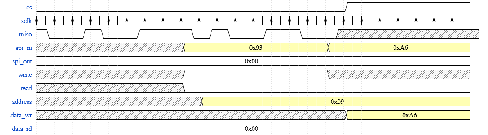

# Tema: Generator semnal PWM

## Background

În cadrul multor dispozitive electronice, inclusiv microcontrolere ca ATmega328P care se află pe plăci Arduino Uno, se regăsesc circuite dedicate pentru generarea semnalelor de tip PWM (Pulse Width Modulation).
Aceste semnale sunt foarte utile, putând fi aplicate asupra elementelor optoelectronice (oricăror tipuri de LED-uri) pentru a ajusta luminozitatea lor, a controla turația sau direcția motoarelor electrice, și multe alte nenumărate aplicații.
Semnalele de tip PWM au niște caracteristici universale (perioada semnalului, aliniere și factor de umplere), apoi fiecare producator poate adăuga diferite specificații (exemplu poate fi generare de semnale complementară sau cu timp mort).

1. Perioada semnalului reprezintă timpul în care secvența activă și inactivă determinată de factorul de umplere trebuie să fie completată. De obicei se dă fie în interval de timp, sau se poate da frecvența semnalului (inversul perioadei).
2. Factorul de umplere reprezintă partea din acea perioadă în care semnalul PWM va fi activ. De obicei se oferă printr-un procentaj sau unitate de timp.
3. Alinierea PWM-ului se referă la modul în care PWM-ul începe generarea semnalului (fie activ fie inactiv).

Un exemplu se poate vedea în graficul de mai jos:

_Figură: Forma de undă pentru un semnal PWM de perioadă de 8 cicli de ceas cu factor de umplere de 25%_

## Arhitectura modulului

Arhitectura perifericelor nu sunt standard, ci sunt modelate în funcție de cerințele producătorului și a pieței în care acestea vor fi folosite.
Astfel, implementarea lor e particulară de la producător la producător, dar ca funcționalitate modulele de genul sunt asemănătoare.
În cadrul acestei teme, acest modul îl putem asocia cu un periferic care poate fi integrat în designuri mai complexe, precum un microcontroller.
Acestea fiind zise, generatorul de PWM are următoarele componente majore pe care va trebui să le dezvoltați:

_Figură: Nivelul de ansamblu al perifericului, împreună cu legăturile dintre submodule_

### Bridge-ul de comunicație

Pentru orice periferic, trebuie să existe o metodă prin care acesta să poată comunica cu mediul extern pentru a putea fi programat de către utilizator (de exemplu un inginer software embedded).
În industrie se folosesc diverse protocoale de comunicație, fiecare cu avantajele si dezavantajele lui, dar cel mai important aspect de reținut este locul în care acesta se utilizează.
Având în vedere că tema are scop didactic, vom utiliza un protocol serial ușor de înteles, care e [SPI](https://en.wikipedia.org/wiki/Serial_Peripheral_Interface) (Serial Peripheral Interface).
Detaliile legat de protocol le găsiți și pe link-ul atașat de Wikipedia sau [aici](https://www.analog.com/en/resources/analog-dialogue/articles/introduction-to-spi-interface.html), dar noi nu vom complet protocolul.
Ce trebuie să știti este în felul următor:

- SPI este un protocol serial master-slave, adică mesajele vor fi împărțite pe biți și vor fi trimiși pe o linie într-o ordine aleasă (în cazul nostru va fi MSB primul bit transmis din mesaj), de la master, care cere sau trimite date către slave;
- SPI prezintă un ceas (SCLK) pe care trimite și primește datele. În standardul complet, datele pot fi aliniate diferit în funcție de niște modificatori, pe numele lor CPOL (**c**lock **pol**arity) și CPHA (**c**lock **pha**se), care în cazul modulului vor rămâne 0 amândoi.
Asta rezultă faptul că datele vor fi plasate pe linie pe frontul descrescător și citite pe frontul crescător al ceasului;
- Există un semnal prin care slave-ul este înștiințat de activarea liniei de date pentru următoarele transferuri, fiind CS (**C**hip **S**elect). Acesta este un semnal activ pe valoarea joasă a liniei (practic ca la reset-ul flip-flopilor);
- Are 2 linii de comunicație, MISO (Master In Slave Out) și MOSI (Master Out Slave In), fiecare cu timingul lui dat de CPOL și CPHA. Având în vedere că perifericul nostru este un slave pentru restul sistemului, atunci MISO este linia de scriere și MOSI este linia de citire a perifericului.

Acest semnal de ceas al SPI-ului nu este neapărat identic cu cel al perifericului, nici în perioadă nici în fază, și de aceea trebuie considerată sincronizarea datelor provenite de la sistem către periferic și înapoi.
Pentru asta, e recomandat să urmăriți lecția de design, secțiunea bonus.
În cazul arhitecturii noastre, vom considera că **SCLK = 10MHz și ceasul perifericului = 10MHz, ceasurile fiind sincrone** și că pot veni oricâte secvențe de 8 biți vrea masterul să comunice cât timp CS este negat.

### Decodorul de instrucțiuni

Orice tip de circuit integrat care prelucrează niște informații are o logică în spate care procesează informațiile trimise de utilizator.
Având în vedere că toate aceste informații sunt niște secvențe de biți, acestea trebuie "traduse" astfel încât perifericul să poată efectua niște operații.
Așadar, decodorul de instrucțiuni este asemănat unui FSM, care citește secvențele de biți și execută operațiile care au fost descrise de arhitect.
Decodorul are următoarele etape, fiecare de lungimea unui byte:

1. Faza de setup: aici procesează primul byte din mesajul transmis prin bridge-ul de SPI. În acest byte se află toate informațiile necesare pentru un transfer de date cu sistemul, prin care se poate programa perifericul. În tabelul de mai jos regăsiți informația specifică cum este decodificat acest byte:

| Rază | Denumire   | Semnificație                                                                                                                                      |
|------|------------|---------------------------------------------------------------------------------------------------------------------------------------------------|
| 7    | Read/Write | Semnifică dacă instrucțiunea este de tip citire sau scriere, unde 1 reprezintă write și 0 read                                                    |
| 6    | High/Low   | Semnifică zona din registru (MSB/LSB, mai multe detalii în secțiunea următoare) unde byte-ul de date va fi scris, 1 fiind [15:8] și 0 fiind [7:0] |
| 5:0  | Adresa     | Adresa la care acel registru poate fi adresat, mai multe detalii în secțiunea următoare                                                           |

2. Faza de date: aici va fi primit sau transmis byte-ul care reprezintă datele propriu-zise în funcție de ce s-a identificat în faza de setup. Toate aceste date sunt transmise pe 8 biți, deși registrii sunt pe 16 (mai multe detalii în faza următoare).

_Figură: Forma de undă pentru o operație de scriere, în cele 2 etape. Atenție la domeniile de ceas, aici e in raport cu ceasul SPI!_

În figura de mai sus se poate vedea un transfer de date în 2 etape. Prima dată, se poate vedea cum după 8 cicluri de ceas SPI, se captează numărul `0x93`, care, dacă despărțim în biți (`1001_0011`), putem observa că este o operație de scriere în registrii, în secțiunea LSB al spațiului de 16 biți.

### Blocul de regiștrii

Orice periferic are nevoie de o zonă în care să se rețină informații legate de configurația dispozitivului și a modului de funcționare. 
De aceea, în orice periferic există o zonă compusă din regiștrii, fiecare cu specificația lor, care vor reține aceste informații, atât în timpul funcționării, cât și eventual dacă blocul este supus unui regim de "sleep". 
În orice fișă de specificație există menționat un tabel sau hartă de registrii, în care se vor regăsi minim o denumire, adresă, mărime, modul de accesare a datelor și o descriere pentru utilitatea lor sau ce semnificație au biții.
În designul nostru, configurația va fi reținută în registrii, care sunt practic celule de tip flip-flop D, cu mărimi din mulțimea multiplilor lui 8 pentru adresare, ce sunt descriși în tabelul de mai jos:

|      Nume     | Adresă | Access date | Lățime |                                                        Descriere                                                       |
|:-------------:|:------:|:-----------:|:------:|:----------------------------------------------------------------------------------------------------------------------:|
|     PERIOD    |  0x00  |     R/W     | [15:0] |                                  Perioada exprimată în ciclii de ceas a numărătorului                                  |
|   COUNTER_EN  |  0x02  |     R/W     |    1   |                                       Exprimă dacă numărătorul este activ sau nu                                       |
|    COMPARE1   |  0x03  |     R/W     | [15:0] |                                         Valoare la care semnalul PWM se schimbă                                        |
|    COMPARE2   |  0x05  |     R/W     | [15:0] |                        Valoare la care semnalul PWM se schimbă (valabil doar pentru descentrare)                       |
| COUNTER_RESET |  0x07  |      W      |    1   |    Resetează starea numărătorului la 0 după scrierea lui, apoi registrul   se golește după al doilea ciclu de ceas   |
|  COUNTER_VAL  |  0x08  |      R      | [15:0] |     Practic e adresa la care se poate vedea valoarea numărătorului în   acel moment la care s-a dat instrucțiunea     |
|    PRESCALE   |  0x0A  |     R/W     |  [7:0] |         Numărul de ciclii de ceas după care numărătorul va fi   incrementat (0 -> 1, 1 -> 2, 2 -> 4, etc.)           |
|   UPNOTDOWN   |  0x0B  |     R/W     |    1   |         Direcția în care numărătorul incrementează valoarea internă (1 -> incrementare, 0 -> decrementare)             |
|     PWM_EN    |  0x0C  |     R/W     |    1   |              Activează canalul de ieșire a semnalului PWM; lasă blocat linia în   starea în care se afla              |
|   FUNCTIONS   |  0x0D  |     R/W     |  [1:0] |                  Bitul 0 -> aliniere stânga (0) / dreapta (1)   Bitul 1 -> aliniere (0) / nealiniat(1)                |

După cum se poate observa, mărimea datelor utile pentru fiecare tip de registru poate varia, însă decodificatoarele de obicei sunt limitate la a adresa un anumit spațiu de memorie.
În cazul nostru, fiecare adresă pe care o avem va reprezenta un byte, chiar dacă dimensiunea reprezentativă a registrului poate fi mai mică.
Orice altă adresă când va fi scrisă către, o să fie ignorată, iar când va fi citită, o să întoarcă valoarea 0.
Restul de detalii legate de funcționare vor fi precizate în secțiunea aferentă submodulului.

### Numărătorul

Numărătorul este o porțiune esențială a perifericului generator de PWM, întrucât acesta oferă baza de timp după care semnalul PWM are durată în timp sau umple perioada alocată.
În funcție de lățimea numărătorului, avem calitatea sau rezoluția la care semnalul poate fi generat, adică cu cât avem mai mulți biți la dispoziție, cu atât putem controla mai fin factorul de umplere.
Totuși o altă problemă a perifericului este că trebuie să controlăm și durata perioadei semnalului raportată la timpul dorit, pentru că ceasul funcțional al perifericului o să fie mult prea rapid și o să "termine" de numărat (va da overflow) într-un timp nemăsurabil.
De aceea, orice numărător are un "prescaler" care limitează incrementarea contorului, astfel încât baza de timp să fie scalată la o unitate de timp mai mare.

Funcționalitățile numărătorului trebuie să fie în felul următor:
- scalare de timp: controlat de registrul `PRESCALE`, acesta va folosi un contor intern care numără de câți cicli de ceas sunt necesari pentru a incrementa/decrementa cu 1 valoarea contorului;
- setări de numărare: perioada pe care o numără (`PERIOD`), valori de comparare (`COMPARE1` și `COMPARE2`, utili la PWM), `UPNOTDOWN` care setează direcția de numărare;
- alte funcționalități: `COUNTER_RESET` va rescrie toți regiștrii de numărare, dar nu va reseta restul perifericului, `COUNTER_EN` va activa numărătorul.

_Figură: Forma de undă a numărătorului cu prescalerul setat la 2, adică va număra de 4 ori pentru incrementarea numărătorului._

### Generatorul de PWM

Generatorul de PWM interfațează cu exteriorul, semnalul fiind pasat către dispozitivul extern pe care vreau să îl controlez (fie un LED, motor electric sau driver de tranzistori).
Acest semnal poate fi generat în diferite moduri în funcție de cerințele programatorului care după va folosi perifericul în acest control, iar aceste moduri sunt reținute în regiștrii `PWM_EN` și `FUNCTIONS`.
Pe lângă asta, caracteristicile semnalului PWM sunt controlate și de modul în care numărătorul este configurat, întrucât acesta compară valoarea la care acesta se află cu acele valori din `COMPARE1` și `COMPARE2`, și caracterizează durata semnalului PWM.

Mecanismul prin care semnalul PWM e generat este descris mai jos:
1. Sunt setate valorile din regiștrii, mai ales perioada (`PERIOD`), valorile de comparat, (`COMPARE1` și/sau `COMPARE2`), modul de funcționare (`FUNCTIONS`), valoarea de scalare (`PRESCALE`) și modul de incrementare/decrementare (`UPNOTDOWN`).
2. Apoi numărătorul începe când se scrie 1 în `COUNTER_EN` și semnalul PWM începe a fi generat când `PWM_EN` e activat.
3. În funcție de `FUNCTIONS`, semnalul PWM începe pe 1 când este aliniat (`FUNCTIONS[1] == 0`) la stânga (`FUNCTIONS[0] == 0`), și 0 la dreapta (`FUNCTIONS[0] == 1`).
4. Atunci când valoarea numărătorului ajunge la `COMPARE1`, o să își schimbe starea în valoarea opusă și continuă așa până în momentul în care contorul va da overflow/underflow, de unde se reiau de la pasul 3.
5. Dacă `FUNCTIONS[1] == 1`, nu mai vorbim de aliniere, deci semnalul PWM va începe de la 0, apoi devine 1 când numărătorul ajunge la valoarea `COMPARE1`, și se resetează când ajunge la valoarea lui `COMPARE2`. Acest tip de funcționare e gândit doar pentru `COMPARE1 < COMPARE2`, cazul opus nu trebuie tratat.

_Figură: Un semnal de PWM aliniat la stânga și la dreapta, prescale 1, semnalul se activează și dezactivează imediat cum counterul ajunge la una din valorile compare._

_Figură: Un semnal de PWM nealiniat, prescale 0, semnalul se activează și dezactivează imediat cum counterul ajunge la una din valorile compare._

Alte precizări:

1. Activarea semnalului PWM și a numărătorului sunt complet diferite, deși ambele trebuie activate ca la ieșirea `pwm_out` să avem un semnal PWM.
2. În cazul nostru, funcționarea perifericului se poate modifica în timpul funcționării, adică orice valoare din regiștrii se poate modifica când `COUNTER_EN` sau `PWM_EN` sunt active.
Însă valorile acestea se vor schimba doar când numărătorul va da overflow/underflow sau se va opri.
3. `COUNTER_VAL` practic este valoarea numărătorului care poate fi citită de software (programatorul embedded care dă comenzi perifericului prin SPI).
4. `COUNTER_RESET` resetează valoarea numărătorului, dar nu și restul parametriilor.

## Cerințe

Având în vedere descrierea modulului de mai sus, cât și funcționarea acestuia, pentru a rezolva această temă, trebuie finalizate cerințele de mai de jos.
Trebuie ținut cont de faptul că toate cerințele se vor rezolva în echipe de câte 3 persoane, deci trebuie să vă împărțiți în mod echitabil etapele de mai jos pentru a implementa întregul modul:

1. Citiți tot enunțul temei cu atenție înainte de scrierea implementării. 
Asta va fi important să înțelegeți modul de funcționare al perifericului și modul în care veți elabora soluția.
2. În secțiunea temei aveți un [schelet de cod](https://github.com/cs-pub-ro/computer-architecture/tree/main/assignments/projects/pwmgen/code) unde apar definițiile modulelor, și pe care voi trebuie să le completați implementările.
Respectați denumirile semnalelor și nu schimbați antetul modulelor la implementarea lor, mai ales la nivelul `top.v`.
3. Va trebui să scrieți implementarea fiecărui modul care se află în structura temei, astfel încât legate împreună, să rezulte funcționarea perifericului așa cum e descris în secțiunea **Arhitectura modulului**.
4. După veți testa acest modul cu ajutorul testbench-ului dat de către noi și verificați că niciun test nu pică.
La laborator o să vă explice mai multe detalii despre cum ar trebui să știți că soluția nu are probleme.
5. Apoi va trebui să redactați o documentație sub formă text (LaTex) în care veti explica modalitatea de implementare a temei.
Asta înseamnă să explicați particularitățile implementației voastre, și mai puțin arhitectura modulului (fiindcă aceasta deja v-a fost prezentată).

Puncte bonus pentru:

1. Organizarea codului într-un mod coerent (adică variabile denumite clar, împărțirea codulul comportamental în fiecare componentă distinctă);
2. Comentarii utile (nu scrieți codul în cuvinte, ci explicați de ce ați ales acea implementare, hack-uri folosite pentru acea soluție, sau de ce funcționează deși pare că nu sau că e atipic)l
3. Documentație clar formulată, urmăriți cerința și indicațiile din temă.
4. Respectarea tuturor cerințelor.