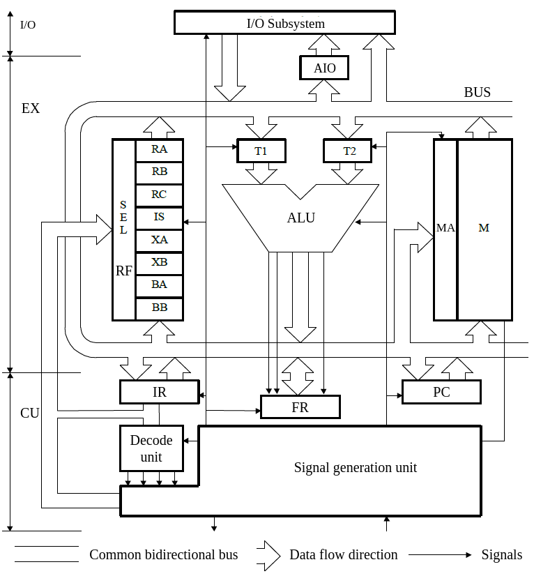
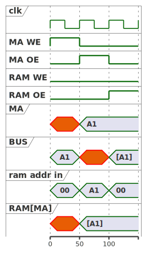
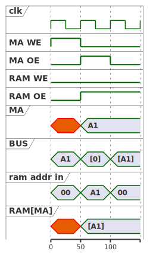

# Arhitectura Calculatorului Didactic

## Caracteristici ale calculatorului didactic


  - Arhitectura bazată pe Registre Generale
    - Calculatorul dispune de 8 Registre Generale

  - Arhitectura pe 16 biţi:
    - Registrele generale au dimensiunea de 16 biţi
    - Unitatea aritmetico-logică (UAL) prelucrează operanzi pe 16 biţi
    - Magistrala procesorului (MAG) este pe 16 biţi
    - Spaţiul de adresare este de $2^{10}$ Cuvinte, adică 1024 cuvinte

  - UAL pentru întregi reprezentaţi în cod complementar
    - Procesorul dispune de o singură unitate aritmetică-logică ce operează cu întregi cu semn pe 16 biţi

  - Moduri de adresare complexe
    - Setul de instrucţiuni şi modurile de adresare derivă din arhitectura x86
    - Modurile de adresare sunt specifice procesoarelor CISC
      - Lucrul cu operanzi din memorie, fără încărcare prealabilă în registrele generale
      - Modurile de adresare sunt numeroase şi foarte flexibile

**Arhitectura setului de instrucţiuni (ISA - Instruction Set Architecture)** este folosită pentru a abstractiza funcţionarea internă a unui procesor. ISA defineşte “personalitatea” unui procesor: cum funcţionează procesorul d.p.d.v. al programatorului, ce fel de instrucţiuni execută, care este semantica acestora. ISA este cea mai importantă parte a design-ului unui procesor; alte aspecte cum sunt componentele de calcul și stocare, interacţiunea cu memoriile, pipeline-ul, fluxul de date în procesor putând fi schimbate de la o versiune la alta a procesorului.
La ora actuală există două filozofii de design pentru un procesor: _Complex Instruction Set Computer (CISC)_ şi _Reduced Instruction Set Computer (RISC)_. În afară de acestea există şi ISA-uri pentru procesoare specializate, cum sunt GPU-urile pentru plăci grafice si DSP-urile pentru procesare de semnal.

Principalele categorii de instrucțiuni sunt cele aritmetico-logice, de control secvențial, și respectiv de acces la memorie. Formatul instrucțiunilor RISC are o lungime fixă, cu lungimea unei instrucțiuni în general egală cu lungimea cuvantului de memorie; în cazul CISC, lungimea unei instrucțiuni variază în funcție de formatul instrucțiunii. RISC are un număr mic de moduri de adresare, spre deosebire de CISC, care are un număr mare de moduri de adresare (dar care nu sunt totdeauna utilizate).

Setul de instrucțiuni RISC este orientat pe registre (peste 32 de registre). Pentru că accesul la memorie e mult mai lent decât lucrul cu registrele, RISC încurajează lucrul cu aceștia. Face acest lucru prin creșterea numărului de registreși prin limitarea explicită a acceselor la memorie. În general instrucțiunile au 2 operanzi (registre) și un registru destinație. Ca principiu, arhitectura RISC are mai multe registre generale, în timp ce CISC are mai mulți speciali. Practic toate procesoarele moderne împrumută atât caracteristici CISC, cât și RISC. 

În cadrul arhitecturilor RISC există o limitare explicită, și anume: singurul mod de acces la memorie este prin _load_ și _store_. Aceasta se deosebește fundamental de CISC care are instrucțiuni cu operanzi locații de memorie. Totuși, deși RISC impune această disciplină de lucru cu memoria, doar 20-25% din codul unui program e reprezentat de loads & stores. 

**Observaţii**

  - **Procesorul didactic este consistent din punctul de vedere al dimensiunii: 16 biţi**. Procesoarele reale, în marea lor majoritate, nu respectă aceasta regulă. Spre exemplu, Pentium 4 cu arhitectura pe 32 de biţi (IA-32) include registre pe 128 de biţi şi dispune de o magistrală de adrese pe 36 de biţi (spaţiul total de adresare este de 64 TB). În consecinţă părerile sunt impărţite în legătură cu care ar fi o definiţie corectă pentru dimensiunea procesorului. Cea mai frecventă definiţie spune că dimensiunea unui procesor este dată de dimensiunea registrelor şi a unităţilor aritmetico-logice.
  - **Spaţiul de adresare pentru un procesor pe N biţi este de 2<sup>N</sup> locaţii de memorie**. În funcţie de organizarea acesteia însă, aceste locaţii pot fi octeţi sau cuvinte de mai multi octeţi. Memoria calculatorului didactic este organizată ca un **spaţiu contiguu de 1024 cuvinte de 16 biţi fiecare**. Aşadar spaţiul total de adresare  pentru calculatorul didactic este de 2 Kbytes. Memoria din calculatoarele voastre însă este adresabilă la nivel de octet. Dacă calculatorul didactic ar fi fost echipat cu o astfel de memorie, spaţiul de adresare ar fi fost de 64 KB, deoarece la fiecare locaţie se poate stoca fix un byte.
  - Prin faptul ca procesorul permite lucrul cu operanzi direct din memorie se înţelege că ei nu trebuie aduşi în prealabil de către programator într-un registru general. Cu toate acestea **nu se poate lucra cu ambii operanzi direct din memorie**. Acest tip de procesare specific arhitecturilor CISC poartă numele de procesare Registru-Memorie. Spre deosebire de aceasta, arhitecturile RISC tipice necesită încărcarea prealabilă a operanzilor în registrele generale. De aceea, aceste procesoare se mai numesc Registru-Registru sau Load/Store. Arhitecturile Memorie-Memorie sunt foarte rare, datorită complexităţii hardware-ului şi performanţelor scăzute.


## Resursele calculatorului didactic



_Figure: Arhitectura calculatorului didactic_

### Magistrala (BUS)


Interconectarea tuturor resurselor se realizează prin intermediul unei magistrale, BUS, care constituie suportul fizic de comunicație între aceste resurse. Dimensiunea magistralei este de 16 linii. Deoarece magistrala este în totalitate pasivă (este un set de conductori), **un singur cuvânt de informație poate exista pe magistrală la un moment dat**.


### Registrele Generale (RF)


Deoarece timpul de acces la memoria M este relativ mare, procesorul dispune de 8 registre generale de câte 16 biți, fiecare ce lucrează la frecvența de ceas a procesorului. În tabelul de mai jos sunt sumarizate funcțiile acestora:

| Registrul | Funcția |
|-----------|---------|
| RA, RB, RC | La dispoziția programatorului pentru stocarea operanzilor. RA este folosit în lucrul cu porturile. |
| SP        | Stack pointer. |
| XA, XB    | Se pot folosi pentru stocarea operanzilor. Sunt folosiți pentru adresarea memoriei ca și registre index. |
| BA, BB    | Se pot folosi pentru stocarea operanzilor. Sunt folosiți pentru adresarea memoriei ca și registre de bază. |


### Unitatea aritmetică logică (ALU)


Unitatea aritmetică logică (ALU) realizează operațiile aritmetice și logice ale calculatorului didactic. Ea este utilizată pentru prelucrarea datelor și pentru calculul adresei efective. Unitatea aritmetică logică prelucrează operanzi pe 16 biți reprezentați în cod complementar. Caracteristicile rezultatului (zero, par, carry, overflow, semn) sunt depuse într-un registru de indicatori FR, în urma execuției oricărei instrucțiuni aritmetice-logice.

### Memoria (RAM)


Memoria este utilizată pentru a păstra informații reprezentând date sau instrucțiuni. Memoria M este un SyncBRAM organizat într-un spațiu de adresare unic de 1024 cuvinte a câte 16 biți fiecare. Astfel, capacitatea memoriei este de 1024 cuvinte x 2 octeti = 2048 B.


### Memory Address (MA)


Registrul de adresare a memoriei, MA, păstrează adresa celulei de memorie la care se face acces la un moment dat. Când se dorește realizarea unei operații de citire din memorie, adresa solicitată va fi depusă în acest registru, iar unitatea de comandă va lansa comanda «Memory Read». După un anumit timp, memoria va furniza pe magistrală cuvantul de la adresa solicitată. Analog, când se dorește să se scrie la o anumită adresă din memorie un cuvant, aceasta este depusă în registrul AM, datele de scris sunt activate pe magistrală, iar unitatea de comandă va lansa comanda «Memory Write».



_Figure: RAM read timing_


_Figure: RAM read with early ram oe_

:::danger
Dupa cum se poate vedea in figura de mai sus, daca noi dam ram_oe la momentul la care facem ma_oe, o sa ne folosim de adresa din memorie anterioara. De aceea vrem intotdeauna sa dam ram_oe la ciclul
care urmeaza dupa ma_oe
:::


_Figure: RAM write timing_

:::note
Se observa ca scrierea se face urmatorul ciclu de ceas, dar semnalul de ram_we trebuie dat in paralel cu ma_oe, iar pe bus trebuie sa existe valoarea pe care vrem sa o setam in RAM, comportament analog
unui registru
:::
### Program Counter (PC)

Registrul contor program PC este utilizat pentru păstrarea adresei instrucțiunii ce urmează să se execute după terminarea execuției instrucțiunii curente. Registrul PC va fi inițializat cu o valoare dată la pornirea sau resetarea sistemului. După încărcarea fiecarei instrucțiuni, el se va incrementa pentru a marca avansul la următoarea instrucțiune. În cazul în care instrucțiunea executată este una de salt, adresa de salt va fi încărcata în PC în urma execuției instrucțiunii.


### Instructuin Register (IR)


Registrul de instrucțiuni IR păstrează instrucțiunea în curs de execuție. Conținutul său este folosit de unitatea de comandă în vederea generării semnalelor de comandă pentru toate resursele.

Prin activarea ieșirii lui IR, cu ir_oe, doar displacementul este pus pe bus pentru a putea fi folosit în calcule (biții 8:15 sunt inversați și extinși la 16 biți prin multiplicarea bitului de semn pentru calculul adresei în instrucțiunile de salt condiționat).

### Flags Register (FR)


Registrul de indicatori constituie o grupare a unor flag-uri provenite din rezultatele instrucțiunilor de tip aritmetico-logic. Registrul IND permite unei instrucțiuni să folosească informații rezultate în urma execuției unei instrucțiuni anterioare.

Spre exemplu, dacă se dorește efectuarea unei sume cu operanzi pe 32 de biți, din moment ce dimensiunea procesorului este 16 biți, este nevoie să se prelucreze pe rând octeții inferiori, apoi octeții superiori. Cei doi operanzi vor ocupa două adrese consecutive de memorie, fie ele 0xA16, 0xA17 pentru primul, respectiv 0xA18, 0xA19 pentru cel de-al doilea. Suma va fi depusă la adresele 0xA20, 0xA21. 

Iată programul în assembler pentru situația prezentată anterior:

```asm
MOV RA, [0xA16]
MOV RB, [0xA18]
ADD RA, RB
MOV [0xA20],RA
MOV RA, [0xA17]
MOV RB, [0xA19]
ADC RA, RB
MOV [0xA21],RA
```

După cum se poate observa, cea de-a doua operație aritmetică este ADC, adică adunare cu transport (carry). Semnificația este următoarea: dacă de la operația anterioară de adunare a apărut transport, acest transport va trebui propagat în octeții superiori. Astfel, operația ADD, în cazul în care a apărut transport, setează bitul T din registrul IND. Operația ADC realizează suma între operanzi, dar include în calcul și acest bit de transport. 

Un alt exemplu este saltul condiționat. O instrucțiune de tip «if (a==2)» se va implementa astfel:

```asm
CMP RA,2
JNE etichetă
```

Prima instrucțiune are ca efect scăderea conținutului registrului RA cu 2. Rezultatul acestei operații nu se stochează, însă, ca orice operație aritmetico-logică, **va afecta registrul de indicatori**. Astfel, dacă rezultatul a fost zero (continutul lui RA a fost 2), se va seta flagul Z (zero) din registrul IND. Următoarea instrucțiune, JNE (jump if not equal) **va testa acest flag** și în functie de valoarea sa va realiza sau nu saltul.


### Registrele temporare T1,T2


Registrele temporare T1 și T2 sunt utilizate pentru a păstra operanzii unei operații executate în unitatea aritmetică logică, precum și rezultate intermediare la calcularea adresei efective. Ele nu sunt accesibile în mod explicit programatorului.

Pentru a explica necesitatea existenței acestor registre, să consideram că ele nu ar fi existat. În acest caz, am fi obținut următoarea schemă:


_Figure: UAL fără registre temporare_

În acest caz, ambii operanzi precum și rezultatul operației ar trebui să se găsească simultan pe magistrală, ceea ce este imposibil.


### Subsistemul de Intrări/Ieșiri

Subsistemul de intrări și ieșiri permite procesorului comunicația cu mediul extern prin intermediul dispozitivelor periferice. Subsistemul este format din interfețe (spre exemplu interfațele serială, paralelă, IDE, USB, etc.) capabile să comunice cu dispozitivele periferice în conformitate cu un standard. Aceste interfețe includ un set de registre (de date/stări/comenzi) pentru comunicația cu procesorul. De exemplu, când procesorul dorește să transmită un cuvânt de date prin interfața USB, el va depune în registrul de date asociat interfeței USB cuvântul respectiv, apoi va scrie în registrul de comenzi comanda de transmisie. Fiecare astfel de registru este identificat printr-o adresă unică în sistem și poartă numele de port de intrare/ieșire. Așadar, totalitatea registrelor asociate interfețelor din sistem (porturilor) este echivalentă cu o memorie în care fiecare adresă este asociată unei interfețe.


### Registrul de adrese de intrare/ieșire AIO

Întrucât subsistemul de intrări/ieșiri apare procesorului ca o memorie în care fiecare locație reprezintă un port asociat unei interfețe, ca și în cazul memoriei este nevoie de un registru de adrese. Acesta va fi folosit pentru a stoca adresa portului cu care se dorește să se comunice. Spre exemplu, atunci când procesorul vrea să transmită ceva pe interfața paralelă, el va depune în registrul AIE valoarea 0x378 (ce identifică portul asociat interfeței paralele), va activa pe magistrală cuvantul de date ce se dorește a fi transmis, iar unitatea de comandă va lansa semnalul «I/O Write» ce va determina încărcarea cuvântului în registrul interfeței paralele.


### Unitatea de comandă

Toate resursele prezentate până în acest punct formează unitatea de execuție. Unitatea de comandă dirijează aceste resurse pentru a executa o instrucțiune sau o alta. Spre exemplu, în cazul instrucțiunii ADD RA, RB unitatea de comandă va genera urmatoarea secvență de semnale:
  - Semnal către blocul de registre generale pentru a determina activarea conținutului lui RA pe magistrală.
  - Semnal către T1 pentru a încărca valoarea aflata în acest moment pe magistrală.
  - Semnal către blocul de registre generale pentru a determina activarea conținutului lui RB pe magistrală.
  - Semnal către T2 pentru a încărca valoarea aflată în acest moment pe magistrală.
  - Semnal către UAL ce indică operația de adunare.
  - Semnal către IND pentru a seta flag-urile Z, S, D, T, P.
  - Semnal către blocul de registre generale pentru a încărca în RA valoarea de pe magistrală.

Cu alte cuvinte, unitatea de comandă este cea care controlează funcționarea procesorului. Ea dirijează întreg procesul de citire-interpretare-execuție a instrucțiunilor.

