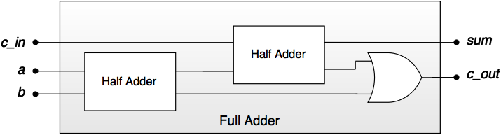
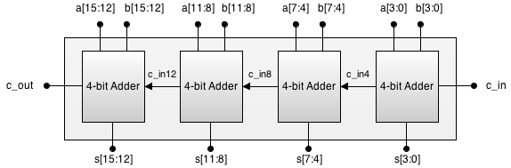

# Sumatoare

## Sumatorul elementar

Sumatoarele (_adders_), folosite cel mai mult în unitățile aritmetice logice ale procesoarelor, realizează adunări pe un număr dat de biți, furnizând la ieșirea circuitului suma și transportul (_carry_) rezultat în urma operației.

Există mai multe tipuri de sumatoare pentru adunarea numerelor pe _n_ biți, iar acestea se bazează pe sumatoare simple de 1 bit, care pot fi de două tipuri:
  - sumatorul elementar parțial (_Half adder_) - însumează doi operanzi pe 1 bit și oferă la ieșire suma acestora și transportul.
  - sumatorul elementar complet (_Full adder_) - însumează doi operanzi pe 1 bit și un transport și oferă la ieșire suma acestora și transportul. 


_Figure: Diagrama bloc pentru half adder_


_Figure: Diagrama bloc pentru full adder_


_Figure: Diagrama semnale pentru full adder_

## Sumatorul elementar parțial

Acest sumator este în continuare descris prin expresiile booleene, tabelul de adevăr și schema logică.


| a | b | sum | c_out |
|---|---|-----|-------|
| 0 | 0 | 0   | 0     |
| 0 | 1 | 1   | 0     |
| 1 | 0 | 1   | 0     |
| 1 | 1 | 0   | 1     |
_Table: Tabelul de adevăr pentru sumatorul elementar parțial_

Din tabelul de adevăr se pot deduce următoarele formule:

```
sum   = a ^  b
c_out = a && b
```

Conform acestor formule putem exprima circuitul prin porți logice, ca în imaginea de mai jos:


_Figure: Schema logică pentru half adder_


Dintr-un tabel de adevăr, pentru fiecare output se va deduce o funcție/expresie aplicând următoarele reguli:
  - fiecare rând din tabel pentru care funcția are valoarea 1 va genera un termen
  - termenii sunt formați din parametrii funcției legați prin ȘI
    - dacă parametrul are valoarea 1 se consideră în formă directă
    - dacă parametrul are valoarea 0 se consideră în formă negată 
  - se aplică SAU între toți termenii deduși

Pentru sumatorului elementar parțial avem:

$sum\ =\ \bar a\ \cdotp\ b\ +\ a\ \cdotp\ \bar b$

$carry\ =\ a\ \cdotp \ b$

```C++
void half_adder(const int a, const int b, int &sum, int &carry) {
    sum = a ^ b;       // Sum is the XOR of the inputs
    carry = a & b;     // Carry is the AND of the inputs
}
```

În multe cazuri aceste formule sunt prea complexe, conținând multe operații și necesitând multe porți logice pentru a fi implementate. Pentru a reduce complexitatea formulelor rezultate se poate aplica un procedeu de **minimizare**, care va reduce dimensiunea termenilor sau chiar îi va elimina. Minimizarea se poate realiza folosind teoremele algebrei booleene sau grafic, prin diagrame [Karnaugh](http://www.ee.surrey.ac.uk/Projects/Labview/minimisation/karnaugh.html).


## Sumatorul elementar complet

|  a  |  b  |  c_in  |  sum  |  c_out  |
|----|----|--------|------|--------|
|  0  |  0  |  0     |  0    |  0      | 
|  0  |  1  |  0     |  1    |  0      | 
|  1  |  0  |  0     |  1    |  0      |  
|  1  |  1  |  0     |  0    |  1      |
|  0  |  0  |  1     |  1    |  0      |  
|  0  |  1  |  1     |  0    |  1      |
|  1  |  0  |  1     |  0    |  1      |
|  1  |  1  |  1     |  1    |  1      |
_Table: Tabelul de adevăr pentru full adder_


Din tabelul de adevăr se pot deduce următoarele formule:

```
sum   =   a ^ b  ^  c_in
c_out = ((a ^ b) && c_in) || (a && b)
```

Conform acestor formule putem exprima circuitul prin porți logice sau putem folosi sumatoare elementare parțiale, ca în imaginea de mai jos:




_Figure: Schema logică pentru full adder_

```C++
void full_adder(const int a, const int b, const int cin, int &sum, int &carry)
{
    sum   =   a ^ b  ^  c_in;
    carry = ((a ^ b) && c_in) || (a && b);
}
```

Sau utilizand sumatoare elementare partiale:
```C++
void full_adder(const int a, const int b, const int cin, int &sum, int &carry) {
    int sum1, carry1, carry2;

    // First half adder
    half_adder(a, b, sum1, carry1);

    // Second half adder
    half_adder(sum1, cin, sum, carry2);

    // Final carry
    carry = carry1 | carry2;
}
```


## Sumatorul cu transport succesiv

Cel mai intuitiv mod de a forma un sumator este de a lega în cascadă mai multe sumatoare elementare complete pe 1 bit. În acest fel se formează un sumator cu transport succesiv (eng. _ripple-carry adder_), cum este cel pe 4 biți din imaginea de mai jos, care primește la intrare ```a[3:0]```, ```b[3:0]```, ```c_in``` și are ca ieșiri suma ```s[3:0]``` și transportul ```c_out```. În cazul sumatoarelor pe mai mulți biți nu mai este indicat de pornit întâi de la o tabelă de adevăr deoarece aceasta ajunge la dimensiuni prea mari.


_Figure: Schema sumatorului cu transport succesiv, pe 4 biți_

```C++
template <int N>
void ripple_adder(const int (&a)[N], const int (&b)[N], int (&sum)[N], const int carry_in, int &carry_out) {
    // Initialize carry to 0
    int carry_tmp[N+1];
    carry_tmp[0] = carry_in;

    // Iterate over each bit
    for (int i = 0; i < N; ++i) {
        // Calculate the sum and carry for the current bit
        full_adder(a[i], b[i], carry_tmp[i], sum[i], carry_tmp[i+1]);
    }

    // Set the final carry
    carry_out = carry_tmp[N];
}
```

Un alt avantaj al acestui design simplu, este că se pot forma sumatoare pe mai mulți biți din înlănțuirea oricâtor sumatoare. De exemplu, pentru a însuma numere pe 16 biți se poate crea un sumator ripple-carry din legarea în cascadă a 4 sumatoare pe 4 biți, ca în imaginea de mai jos.




_Figure: Schema sumatorului cu transport succesiv, pe 16 biți_
 
Deși are un design simplu, dezavantajul acestui sumator este că este **lent**, fiecare sumator elementar necesitând transportul de la sumatorul precedent. Există alte sumatoare, cum ar fi cel cu transport anticipat (eng. [Carry-lookahead adder](http://www.eng.ucy.ac.cy/theocharides/Courses/ECE210/Carrylookahead_supp4.pdf)
), care oferă o funcționare mai rapidă, eliminând așteptarea propagării transportului.

```C++
// Example for 16-bit ripple adder using four 4-bit ripple adders
const int M = 16;
int a16[M] = {1, 0, 1, 1, 1, 1, 0, 0, 1, 0, 1, 1, 1, 1, 0, 0}; // Example 16-bit binary number
int b16[M] = {1, 1, 0, 1, 0, 0, 1, 1, 1, 1, 0, 1, 0, 0, 1, 1}; // Example 16-bit binary number
int sum16[M];
int carry16[5] = {0}; // Carry array for each 4-bit adder

for (int i = 0; i < M; i += 4) {
    ripple_adder<4>(*(int(*)[4])(a16 + i), *(int(*)[4])(b16 + i), *(int(*)[4])(sum16 + i), carry16[i / 4], carry16[i / 4 + 1]);
}
```
