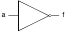
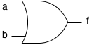
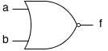
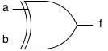
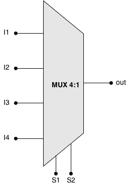

# Porți logice

Porțile logice reprezintă componentele de bază disponibile în realizarea circuitelor combinaționale. Ele oglindesc operațiile din algebra booleană, algebră care stă la baza teoriei circuitelor combinaționale. În sunt prezentate cele mai întâlnite porți logice împreună cu operația booleană pe care o implementează.


| Denumire                  | Simbol                                      | Operator     | a | b | f |
|---------------------------|---------------------------------------------|--------------|---|---|---|
| Inversor (NOT)            |           | f = !a       | 0 |   | 1 |
|                           |                                             |              | 1 |   | 0 |
| Poarta SAU (OR)           |             | f = a \|\| b | 0 | 0 | 0 |
|                           |                                             |              | 0 | 1 | 1 |
|                           |                                             |              | 1 | 0 | 1 |
|                           |                                             |              | 1 | 1 | 1 |
| Poarta ŞI (AND)           |           | f = a && b   | 0 | 0 | 0 |
|                           |                                             |              | 0 | 1 | 0 |
|                           |                                             |              | 1 | 0 | 0 |
|                           |                                             |              | 1 | 1 | 1 |
| Poarta SAU-NU (NOR)       |           | f = !(a \|\| b) | 0 | 0 | 1 |
|                           |                                             |              | 0 | 1 | 0 |
|                           |                                             |              | 1 | 0 | 0 |
|                           |                                             |              | 1 | 1 | 0 |
| Poarta ŞI-NU (NAND)       |         | f = !(a && b) | 0 | 0 | 1 |
|                           |                                             |              | 0 | 1 | 1 |
|                           |                                             |              | 1 | 0 | 1 |
|                           |                                             |              | 1 | 1 | 0 |
| Poarta SAU EXCLUSIV (XOR) |           | f = a ^ b    | 0 | 0 | 0 |
|                           |                                             |              | 0 | 1 | 1 |
|                           |                                             |              | 1 | 0 | 1 |
|                           |                                             |              | 1 | 1 | 0 |
| Poarta SAU EXCLUSIV NU (XNOR) |     | f = !(a ^ b) | 0 | 0 | 1 |
|                           |                                             |              | 0 | 1 | 0 |
|                           |                                             |              | 1 | 0 | 0 |
|                           |                                             |              | 1 | 1 | 1 |
_Table: Tabel de adevăr pentru porti logice elementare_

## Multiplexorul 4:1

Un multiplexor digital este un circuit combinațional care implementează o funcție de selecție a uneia dintre intrările sale.
  - $2^n$ intrări
  - $n$ intrări de selecție
  - o ieșire

<div align="center">



_Figure: Diagrama bloc a multiplexorului 4:1_

</div>

<div align="center">


_Figure: Schema logică a multiplexorului 4:1_

</div>

Alegerea semnalului de ieșire se face pe baza intrărilor de selecție, care reprezintă în baza 2 numărul intrării ce trebuie selectate. În exemplul din imaginea de mai sus avem schema bloc a unui multiplexor cu 4 intrări, iar acesta are nevoie de două intrări de selecție.

Funcția inversă a multiplexorului este realizată de către circuitele de demultiplexare, care preiau un semnal de intrare și folosesc intrările de selecție pentru a-l transmite pe una din ieșirile posibile.


| S2 | S1 | out |
|----|----|-----|
| 0  | 0  | I1  |
| 0  | 1  | I2  |
| 1  | 0  | I3  |
| 1  | 1  | I4  |
_Table: Tabel de adevăr pentru multiplexorul 4:1_

Deoarece multiplexorul 4:1 are 6 intrări, tabelul de adevăr devine destul de mare și nu mai este indicat de pornit de la acesta pentru obținerea funcției logice. Din descrierea funcționării circuitului și proprietățile porții AND, putem deduce termenii formulei:

$$f = \bar s_1\ \cdotp\ \bar s_2\ \cdotp\ I_1\ +\ s_1\ \cdotp \bar s_2\ \cdotp\ I_2\ +\ \bar s_1\ \cdotp\ s_2\ \cdotp\ I_3\ +\ s_1\ \cdotp\ s_2\ \cdotp\ I_4$$ 

Conform formulei se poate realiza circuitul cu porți logice din imaginea de mai sus.

```C++
int mux4to1(int s0, int s1, int i0, int i1, int i2, int i3) {
    // Use the select value to choose the appropriate input
    switch ((s1 << 1) | s0) {  // Combine s0 and s1 into a 2-bit value
        case 0:
            return i0; // If s1 and s0 are both 0, return input i0
        case 1:
            return i1;
        case 2:
            return i2;
        case 3:
            return i3;
        default:
            return 0; // Default case (should never be reached)
    }
}
```
[Codul sursa pentru functia mux4to1](https://github.com/cs-pub-ro/computer-architecture/tree/main/chapters/combinational-circuits/logic-gates/demos/mux4to1)

