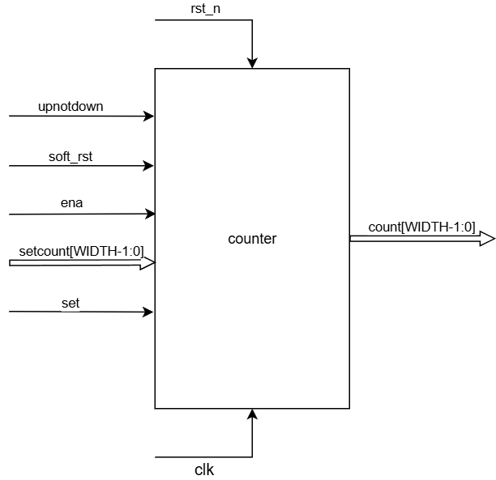
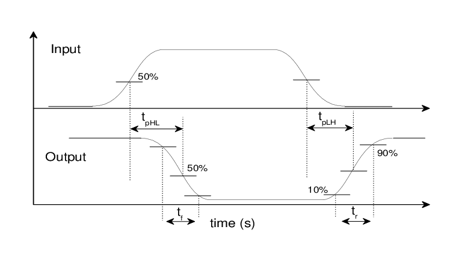
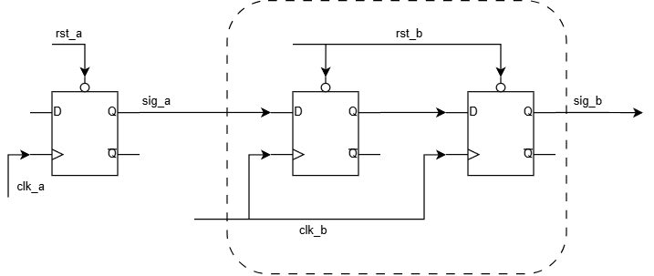

# Design reportat la descriere hardware

  

Domeniul cu care se ocupă materia Arhitectura Calculatoarelor este una din ramurile importante aferente Computer Science-ului, mai exact este cel mai de jos nivel, de unde pleacă partea de descriere a hardware-ului care mai târziu ajunge să fie programat: CPU, GPU, microcontrolere, și alte circuite dedicate unei aplicații specifice (ASIC).

În general, această muncă se împarte în mai multe echipe, fiecare cu responsabilitățile ei și expertiza ei:

- arhitect de specificații (cel care se ocupă de descrierea tehnică a produsului);
- inginer de design/descriere (cel care implementează arhitectura descrisă de mai sus);
- inginer de verificare (cel care se ocupă ca acel design respectă specificațiile).

În continuare, vom discuta despre responsabilitățile inginerului de design și ce ar trebui să știe acesta.

### La ce ne referim prin design?

Lecțiile de până acum s-au folosit de 2 tipuri de fișiere ca să putem compila și observa efectele modulelor descrise:

- **RTL** (register-transfer layer): sunt tipurile de fișiere ce conțin descrierea hardware a circuitului dorit, la nivel de logică combinațională (porți logice, multiplexoare, demultiplexoare și decodoare) și secvențială (registrii, celule de memorie și latch-uri);
- **Test-bench**: fișierele care descriu cum acele module construite anterior sunt stimulate pentru a testa toată funcționalitatea acestora.


Inginerul de design este responsabil de scrierea RTL-ului, dar implementează și test-bench-uri cu care poate verifica funcționalitatea de bază a hardware-ului.


### Cum descriem hardware-ul?

HDL-urile sunt limbaje care se diferențiază de cele de programare precum C, Java, Python, etc. prin faptul că acestea au fost concepute cu scopul de a le fi ușor inginerilor să poată transpune circuitele electronice în text, sau într-un cod ce mai târziu poate fi compilat în porți logice.

> Prin **RTL** înțelegem codul sintetizabil care este compus din totalitatea registriilor și logica ce le leagă pentru a descrie circuitul dorit.

> **Sintetizabilitatea** se referă la abilitatea codului HDL de a putea fi tradus sub forma unor porți logice, elemente de memorie și legăturile dintre acestea.

În Verilog nu toate elementele de cod sunt sintetizabile (de exemplu ``initial``), așa că trebuie să avem grijă de modul în care scriem codul în RTL.

Scopul final al codului RTL este traducerea sa sub forma unor construcții fizice (bistabili, porți logice) care se regăsesc în bibliotecile tehnologiei foloste (prin tehnologie, se referă aici la mărimea nodului, ex. 14nm ca Intel Coffee Lake sau 800 microni ca Intel Pentium).

În test bench, nu se pune problema asta, căci are un alt scop și nu va fi present în procesul de fabricație.

Există câteva reguli de bază după care ne putem ghida în acest caz:

> 1. Orice primitivă sau operator se poate sintetiza. Totuși, trebuie menționat că aceste operații nu vor fi neapărat direct traduse în unități care funcționează la nivel general, ci compilatorul va încerca să simplifice funcția logică.

> 2. În HDL, există în general 2 tipuri de variabile care se suprapun cu concepte din electronică: fire sau semnale de legătură și structuri ce pot memora valori. În Verilog, acestea sunt descrise de `wire`, respectiv `reg`. A nu se confunda `reg` cu registrul 🤔.

> 3. Construcția `always@(*)` se referă la o grupare de logică combinațională, în general folosită pentru a descrie automatele pe stări definite (sau FSM-uri) sau pentru gruparea a mai multor semnale schimbate asincron. În general, acestea se comportă similar cu semnalele ce sunt atribuite cu constructul `assign`, diferența o face faptul că `always@(*)` cere folosirea variabilelor de tip `reg`. Această diferență este importantă, întrucât structurile `always@(*)` se pot sintetiza în celule de tip latch:

```verilog
 reg[1:0] a;
 always@(*) begin: latch
	 if (a == 2'b01)
		 a = 2b'00;
	 else if (a == 2'b10)
		 a = 2'b01;
	 else if(a == 2'b00)
		 a == 2'b11;
 // La un moment dat ceva ajunge 2'b11 și valoarea va rămâne blocată
 // până la un reset hardware.
 end: latch
```

> 4. În general nu este de dorit a avea latch-uri în RTL, pentru că este greu de verificat starea acestei variabile pe durata funcționării circuitului.

> 5. Circuitele secvențiale sunt cele de tip `always@(posedge clk or negedge rst)`, care sunt structurile principale de memorie într-un circuit, și pot fi asociate cu bistabilii (flip-flops). Ele rețin valoarea din interior până la "căderea" reset-ului sau stimularea intrărilor bistabilului. Aceștia, în cele din urmă, pot fi asociați cu registrii, dar `reg` are sens de variabilă ce reține valoarea dată.

### Exemplu de descriere de circuit

În cadrul laboratorului de astăzi, vom implementa un modul des întâlnit în circuite integrate, acesta fiind numărătorul (sau counter). Acesta este des întâlnit în procesoare pentru a crea tick-ul de milisecundă în watchdog-uri, sau pentru generarea semnalelor de PWM (pulse width modulation).

Prima etapă în elaborarea RTL-ului este de a citi și înțelege arhitectura pe care inginerul de arhitectură a gândit-o pentru acesta:

<div  align="center">



_Figure: Diagrama împreună cu I/O pentru modulul counter_

</div>

Pe lângă diagramă, există și un tabel cu semnificația semnalelor și cum ar trebui să funcționeze modulul (care e practic specificația arhitecturii).

| **Nume semnal** | **Direcție** | **Mărime**    | **Descriere**                                                                                                            |
|-----------------|--------------|---------------|---------------------------------------------------------------------------------------------------------------------------|
| WIDTH           | parameter    | -             | Lățimea de bandă a datelor din numărător                                                                                   |
| RESET_VAL       | parameter    | [WIDTH-1:0]   | Valoarea cu care numărătorul poate fi instanțiat la `soft_rst`                                                             |
| clk             | input        | 1             | Ceasul numărătorului                                                                                                      |
| rst_n           | input        | 1             | Reset asincron (activ pe low)                                                                                             |
| soft_rst        | input        | 1             | Reset soft (activ pe high), resetează la `RESET_VAL` doar starea internă a numărătorului; are prioritate față de `ena` și `set` |
| set             | input        | 1             | Setează valoarea numărătorului cu cea provenită din `setcount`; are prioritate față de `ena`                               |
| setcount        | input        | [WIDTH-1:0]   | Valoarea ce poate fi atribuită numărătorului prin semnalul de `set`                                                        |
| ena             | input        | 1             | Actualizează valoarea numărătorului în funcție de `upnotdown` la fiecare ciclu de ceas                                     |
| count           | output       | [WIDTH-1:0]   | Valoarea memorată a numărătorului                                                                                          |


Cu ajutorul tabelului și a diagramei, putem implementa modulul counter care se poate regăsi în `counter.v`.

## Bonus: sincronizări de ceas

Un aspect destul de important al descrierii hardware, mai ales când vine vorba de sisteme complexe precum CPU-uri, microcontrolere sau SoC-uri ([System on a Chip](https://en.wikipedia.org/wiki/System_on_a_chip)), este problema sincronizării datelor dintr-un domeniu de ceas în altul, în momentul în care diferite porțiuni folosesc ceasuri cu frecvențe diferite (fie pentru economisire de energie, fie din alte motive).

> Dacă vă amintiți de la Electronică Digitală, circuitele digitale sunt compuse din **tranzistori** care, din construcția lor, se comportă asemenea unor circuite de tip RC.

Acestea nu comută instantaneu, ci au un timp de creștere și de cădere ce, la frecvențe foarte mari, pot ridica probleme vis-a-vis de transmisia datelor.

Când 2 circuite la frecvențe diferite vor să comunice, acestea trebuie să respecte timpul de propagare a semnalului, astfel încât datele să nu se modifice în circuitul sincron undeva pe muchia ceasului pe care aceste date vor să fie scrise.

<div  align="center">





_Figure: Grafic propagare a schimbării unui semnal pe tranzistor, cu rise și fall time_


</div>

Regula generală este că aceste date trebuie să se stabilizeze undeva după muchia ascendentă a ceasului, în cazul cel mai bun chiar la jumătatea perioadei ceasului (sau muchia descendentă).

Tehnica folosită pentru a reuși acest lucru este folosirea unor sincronizatoare în 2 etape, care arată asa.

<div  align="center">




_Figure: Diagrama unui sincronizator în 2 etape folosind bistabili D_


</div>


Sunt de precizat câteva reguli legat de sincronizările de date:


> 1. În general, aceste sincronizări funcționează pentru semnale de 1 bit. La mai mulți biți, pentru că [nu știm cu certitudine](https://en.wikipedia.org/wiki/Metastability_(electronics)) cum primul bistabil din circuit va interpreta semnalul incert (a cărui schimbare pică fix pe muchia ascendentă a ceasului domeniului B), este foarte posibil ca datele sincronizate să nu aibă valoarea la care ne-am așteptat.

> 2. Pentru a sincroniza magistrale, se merge pe principiul sincronizării unui semnal auxiliar care lasă datele să schimbe registrul din domeniul B odată ce acesta este sincronizat cu succes.

> 3. De asemenea, nu se pot sincroniza cu certitudine semnalele de tip puls între domenii de ceasuri diferite, deoarece un puls provenit dintr-un ceas mai rapid nu îi poate fi detectată schimbarea în domeniul mai lent. Pentru asta, se folosesc module de tip [sincropuls](https://fpgacpu.ca/fpga/CDC_Pulse_Synchronizer_2phase.html).

Puteți să accesați link-urile date în acest material pentru a aprofunda subiectul. Acesta nu intră în programa materiei, dar este deseori important în munca de design și vă poate util in cadrul interviurilor.