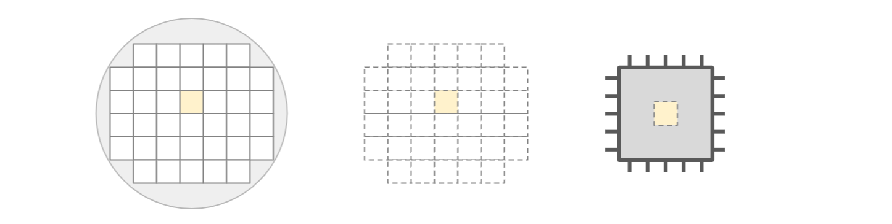

# Verificarea circuitelor digitale

În urma procesului de ``design`` descris anterior, circuitul este „printat” pe o plăcuță subțire, realizată din siliciu, un material semiconductor. Ulterior, acest ``wafer`` rezultat va trece prin mai multe etape succesive de prelucrare, modelul final fiind decupat din material și integrat în dispozitivul țintă.

<div  align="center">


_Figure: Procesul fabricării circuitelor integrate_

</div>

Totuși, realizarea design-ului circuitului nu este suficientă, deoarece orice eroare sau abatere de la specificațiile inițiale poate avea consecințe majore asupra funcționării finale a dispozitivului. În plus, fabricarea acestor ``die``-uri (componentele utile obținute din wafer) este un proces ce implică costuri  foarte ridicate, iar corectarea unei erori după etapa de fabricare ar conduce la o pierdere financiară majoră.

Prin urmare, etapa de ``verificare`` a devenit critică, având scopul de a valida **funcționalitatea** și **conformitatea circuitului cu specificațiile de proiectare**, contribuind la asigurarea performanței, fiabilității și integrității sistemului înainte de implementarea sa fizică. 

## Ce presupune verificarea?

Verificarea sistemului se poate efectua la toate nivelurile ierarhice, de la blocuri individuale până la cipul integral și implică testarea acestora într-un ``mediu controlat``, acoperind ``toate scenariile operaționale posibile``. Erorile identificate sunt raportate echipei de proiectare, iar procesul este repetat iterativ până la validarea deplină a design-ului.

Inginerii de verificare utilizează ``SystemVerilog``, un limbaj de descriere și verificare hardware, ce extinde standardul Verilog prin integrarea conceptelor de programare orientată pe obiect. Prin intermediul acestuia se realizează un mediu de verificare bazat pe framework-ul [``UVM``](https://en.wikipedia.org/wiki/Universal_Verification_Methodology) (Universal Verification Methodology), format din componente ce au rolul de a stimula, monitoriza și verifica comportamentul design-ului.

<div  align="center">


_Figure: Structura unui mediu UVM_

</div>

Tabelul de mai jos prezintă principalele componente ale unui astfel de framework și relațiile dintre acestea. Totul incepe de la un test, prin intermediul căruia generăm stimuli încapsulați sub formă de tranzacții.


| Componentă  | Rol 	 | 
|-----------------|--------------|
| Sequencer       | Rutează tranzacțiile către Driver pentru a fi executate. |
| Driver          | Preia tranzacțiile și le transmite către DUT (Design Under Test) prin intermediul interfeței, respectând protocolul specific acesteia. |
| Interfața       | Acționează ca un mediator care transformă tranzacțiile primite de la Driver (la un nivel de abstractizare mai ridicat) în semnale concrete, pe care DUT-ul le poate înțelege. |
| Monitor         | Captează modificările semnalelor de pe interfață și le transmite către Scoreboard sub formă de informație utilă.  |
| Scoreboard      | Pe baza valorilor primite de la Monitor, se construiește un model de referință care este ulterior comparat cu rezultatele obținute din DUT. În acest mod se poate verifica dacă sistemul funcționează conform așteptărilor. |

### Teste

Fiecărei specificații de sistem îi este asociat un ``test``, prin care **design-ului îi sunt aplicate suite de stimuli**, cu scopul de a observa și valida un comportament țintă predeterminat.

Totuși, nu este suficientă simpla conturare a scenariului. Pentru a asigura robustețea acestuia, este esențială aplicarea unei game largi de valori de intrare. Acest lucru se realizează eficient prin tehnici de ``randomizare``, iar gradul de testare este cuantificat printr-o metrică de acoperire, denumită ``coverage``.

Există mai multe modalități de a randomiza stimulii. Mai jos puteți observa câteva exemple:

```systemverilog
// Randomizare simplă
var = $urandom();

// Randomizare cu constrângeri
randomize(obj) with {
    var inside {[1:5]};
}

// Randomizare cu distribuție probabilistică
var = $dist_poisson(seed, 100);
```

### Coverage
După cum am menționat anterior, ``coverage``-ul reprezintă o metodă prin care verificăm **în ce măsură un set de valori posibile a fost atribuit unei variabile**. Scopul este să obținem o acoperire cât mai ridicată, ideal completă, pentru variabilele relevante testului nostru.

Această măsurare se realizează prin eșantionarea unor obiecte de tip ``covergroup`` în momentul detectării tranzacțiilor. În cadrul acestora, fiecare variabilă cuantizată este declarată printr-un ``coverpoint`` și analizată pe baza unor intervale specificate de noi, numite ``bins``. Mai jos este prezentat un exemplu de astfel de structură:

```systemverilog
covergroup cg;
    cp: coverpoint var {
        bins interval_1 = {1, 2};
        bins interval_2 = {3, 4};
    }
endgroup
```

### Aserții
Pe durata rulării testelor, funcționalitatea design-ului este monitorizată continuu prin intermediul ``aserțiilor``.

Aserțiile sunt construcții specializate care **verifică automat respectarea unor proprietăți și condiții predefinite**. Acestea oferă o alertă instantanee asupra comportamentelor defectuoase și permit identificarea precisă a problemelor.

Aserția de mai jos va eșua dacă la orice front crescător al semnalului de ceas *clk*, detectarea variabilei *var_1* ca având valoarea 1, nu va fi urmată la 3 cicli de ceas distanță de detectarea variabilei *var_2* ca având valoarea 1.
```systemverilog
assert property(@posdege (clk) disable iff (rst) 
    (var_1 == 1'b1) |-> ##3 var_2);
```