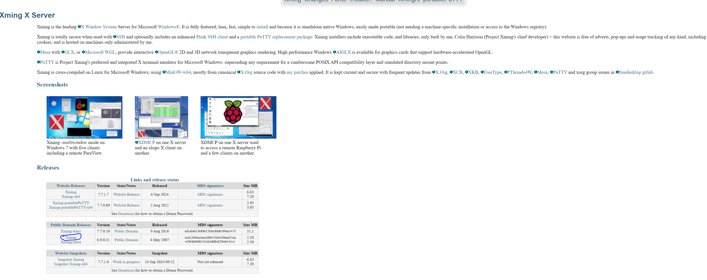
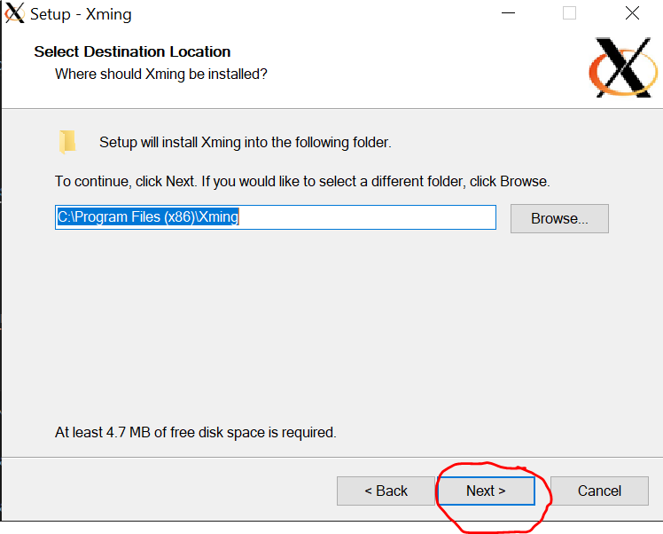
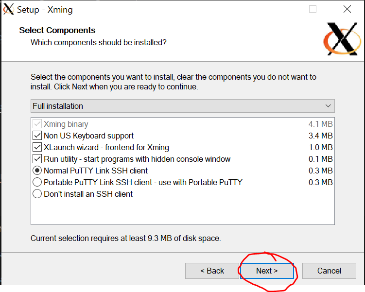
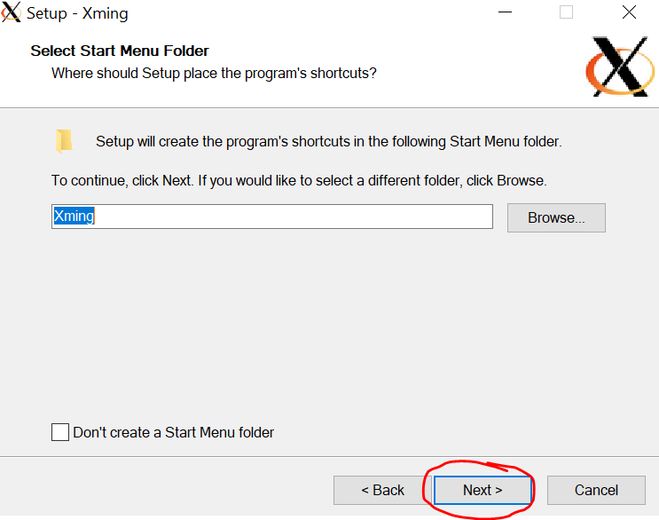
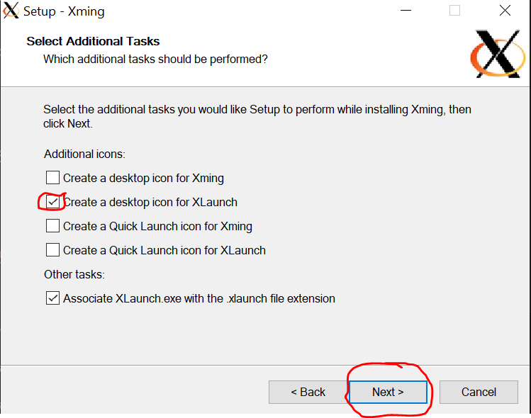
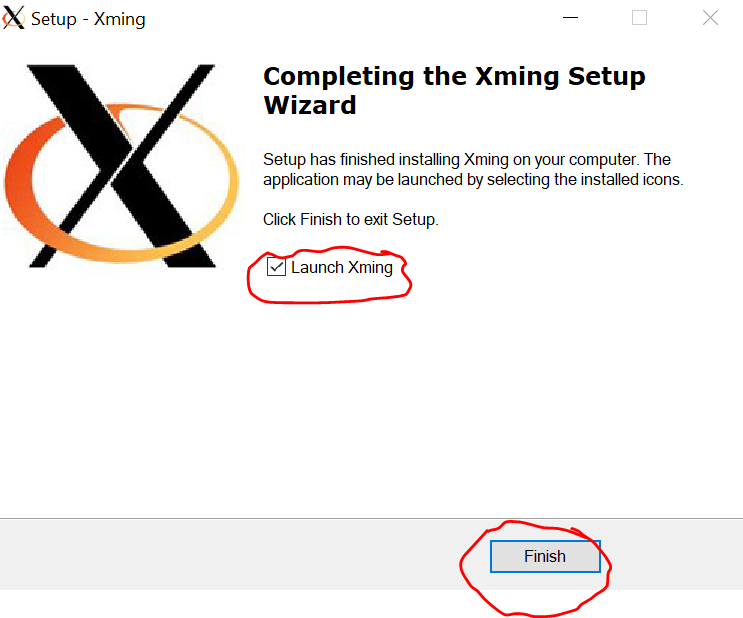
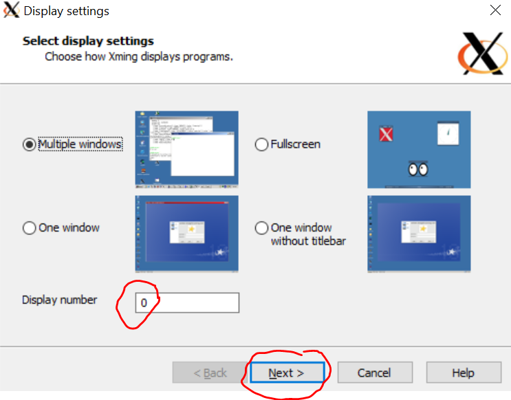
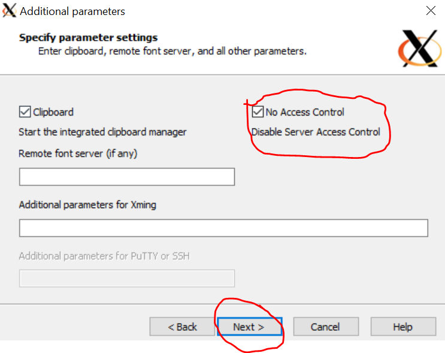

# Utilizare imagine docker Windows

## Cerințe necesare

### WSL

1. Deschideți meniul Start și tastați "Windows features" în bara de căutare și faceți clic pe "Turn Windows Features On or Off".

2. Bifați casetele "Windows Subsystem for Linux" și "Virtual Machine Platform" și apăsați butonul "OK".

3. Când operațiunea este completă, vi se va cere să reporniți computerul.

4. Instalați distribuția dorită din command prompt:
```bash
wsl --install -d Ubuntu-22.04
```

Alt tutorial [Ubuntu](https://linuxconfig.org/ubuntu-22-04-on-wsl-windows-subsystem-for-linux)

### Docker Desktop

Instalare [Docker Desktop](https://www.docker.com/products/docker-desktop/).

### Instalre XLaunch

1. Descărcați [Xming X Server](http://www.straightrunning.com/XmingNotes/) - Public Domain Releases



2. Deschideți installer-ul și apăsați butonul "Next".


3. Apăsați butonul "Next".



4. Apăsați butonul "Next".



5. Apăsați butonul "Next".



6. Selectați "Create a desktop icon for XLaunch" și apăsați butonul "Next".



7. Apăsați butonul "Install".


8. Apăsați butonul "Finish".



### Visual Studio Code

Descărcați și instalați [Visual Studio Code](https://code.visualstudio.com/download)

### Clonați repo-ul materiei

```bash
git clone https://github.com/cs-pub-ro/computer-architecture.git
```

## Rulare

### Porniți XLaunch
1. Deschideți XLaunch (Desktop sau Start Menu)

2. Selectați opțiunile pentru Disaply și apăsați butonul "Next".



3. Selectați "Start no client" și apăsați butonul "Next".


4. Selectați "No access control" și apăsați butonul "Next".



5. Apăsați butonul "Finish".


### Opțiunea 1 din Visual Studio Code

1. Deschideți directorul repo-ului în Visual Studio Code.
```bash
code computer-architecture
```

2. Instalați extensia [Dev Containers](https://marketplace.visualstudio.com/items?itemName=ms-vscode-remote.remote-containers).

3. După veți avea opțiunea "Dev Containers: Reopen in container" (`CTRL+SHIFT+P`).

### Opțiunea 2 prin docker

1. Descărcați imaginea cu docker
```bash
docker pull gitlab.cs.pub.ro:5050/ac/ac-public/vivado-slim:1.0.0
```

2. Rulați un container cu imaginea
```bash
docker run --rm -it -v /dev:/dev gitlab.cs.pub.ro:5050/ac/ac-public/vivado-slim:1.0.0 /bin/bash
```

3. Rulați vivado din imagine
```bash
vivado
```
