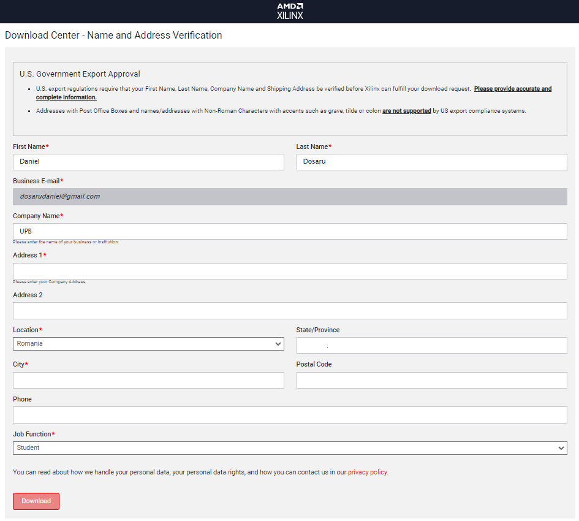
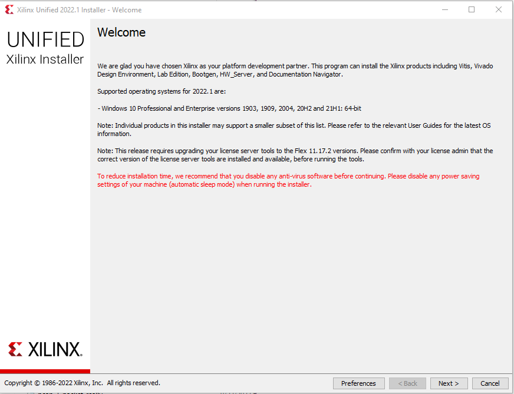
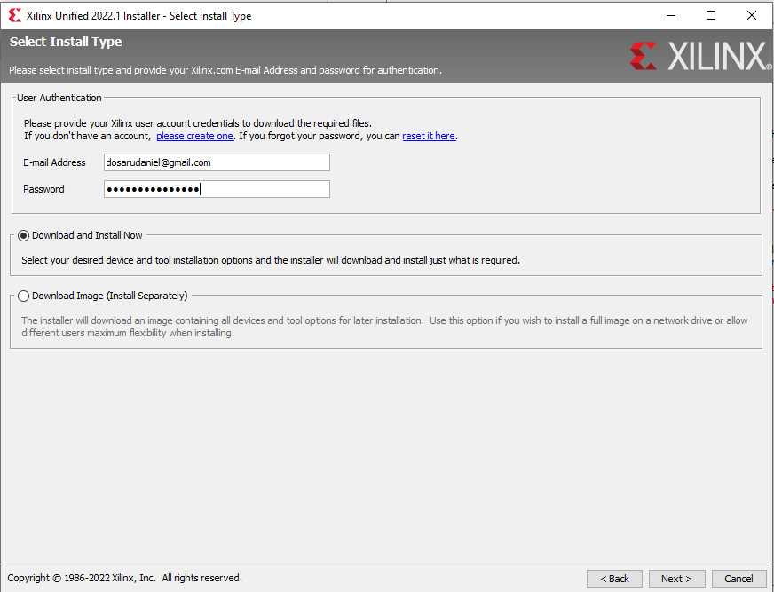
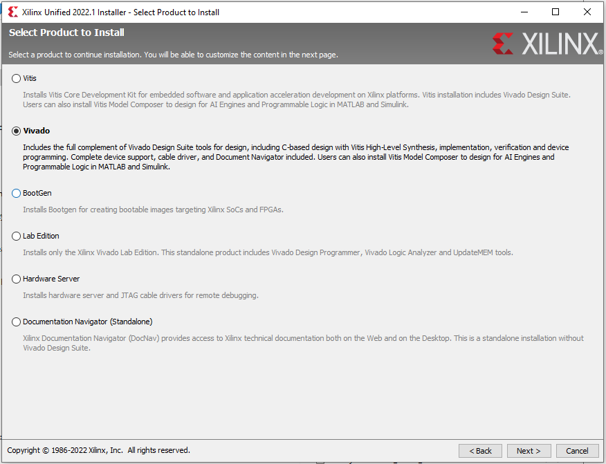
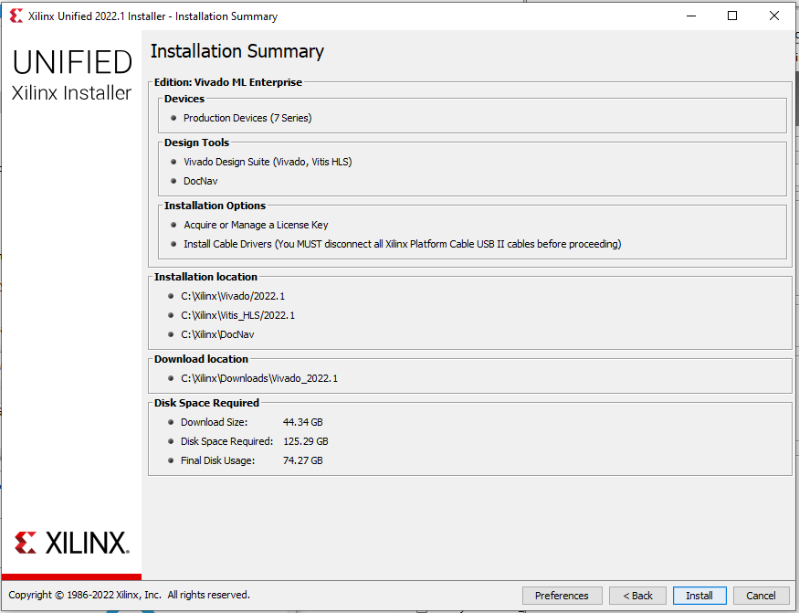
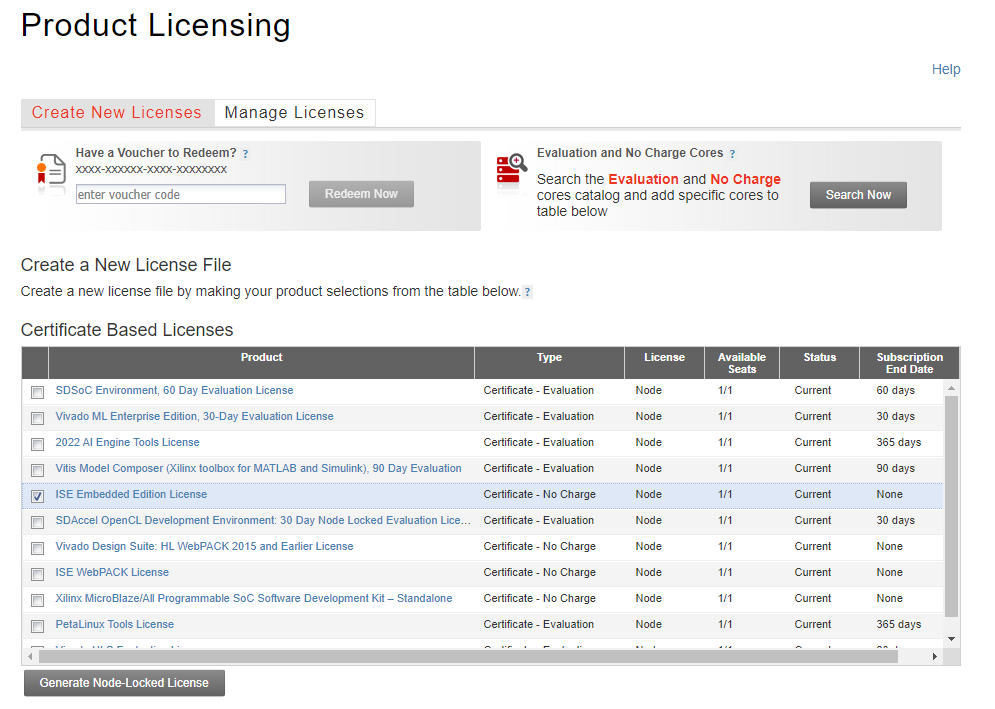
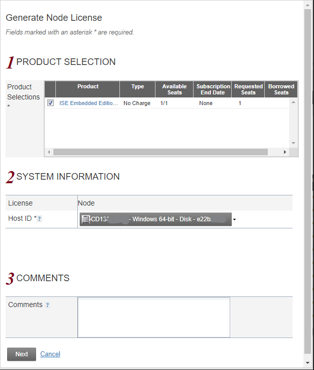
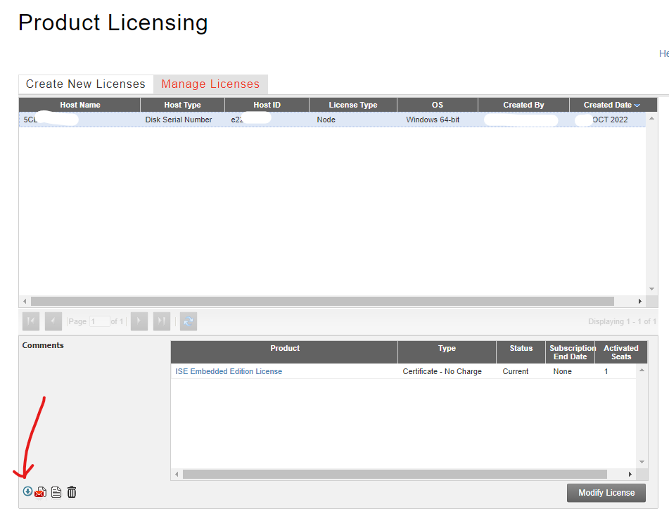
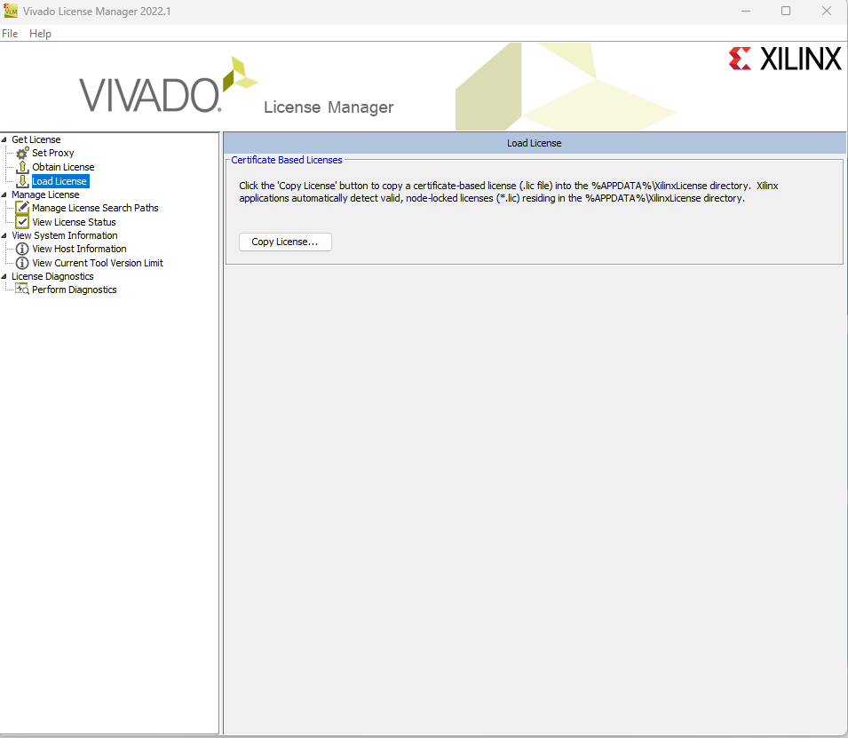

# Instalare Vivado

## Pașii de instalare

**Atenție:** Acest program necesită 130GB spațiu liber în timpul instalării și 75GB după ce ați finalizat instalarea.

1. Creați-vă un cont [aici](https://www.amd.com/en/registration/create-account.html?custtarg=aHR0cHM6Ly9sb2dpbi54aWxpbnguY29tL2FwcC94aWxpbnhpbmNfZjVhd3Nwcm9kXzEvZXhrbnY4bXM5NTBsbTBMZGgweDcvc3NvL3NhbWw/U0FNTFJlcXVlc3Q9UEhOaGJXeHdPa0YxZEdodVVtVnhkV1Z6ZENCNGJXeHVjenB6WVcxc2NEMGlkWEp1T205aGMybHpPbTVoYldWek9uUmpPbE5CVFV3Nk1pNHdPbkJ5YjNSdlkyOXNJaUJCYzNObGNuUnBiMjVEYjI1emRXMWxjbE5sY25acFkyVlZVa3c5SW1oMGRIQnpPaTh2ZDNkM0xuaHBiR2x1ZUM1amIyMHZjMkZ0YkM5emNDOXdjbTltYVd4bEwzQnZjM1F2WVdOeklpQkVaWE4wYVc1aGRHbHZiajBpYUhSMGNITTZMeTlzYjJkcGJpNTRhV3hwYm5ndVkyOXRMMkZ3Y0M5NGFXeHBibmhwYm1OZlpqVmhkM053Y205a1h6RXZaWGhyYm5ZNGJYTTVOVEJzYlRCTVpHZ3dlRGN2YzNOdkwzTmhiV3dpSUVsRVBTSmZabU13WTJVMU1EWmxOams1T1RjeVltSmxZbUZqTkRReVlUYzROamhoTjJVNVlqUmlaR01pSUVsemMzVmxTVzV6ZEdGdWREMGlNakF5TWkweE1DMHdPRlF3Tnpvek16bzBNUzR3TURKYUlpQkdiM0pqWlVGMWRHaHVQU0ptWVd4elpTSWdVSEp2ZEc5amIyeENhVzVrYVc1blBTSjFjbTQ2YjJGemFYTTZibUZ0WlhNNmRHTTZVMEZOVERveUxqQTZZbWx1WkdsdVozTTZTRlJVVUMxUVQxTlVJaUJXWlhKemFXOXVQU0l5TGpBaVBqeHpZVzFzT2tsemMzVmxjaUI0Yld4dWN6cHpZVzFzUFNKMWNtNDZiMkZ6YVhNNmJtRnRaWE02ZEdNNlUwRk5URG95TGpBNllYTnpaWEowYVc5dUlqNW9kSFJ3Y3pvdkwzZDNkeTU0YVd4cGJuZ3VZMjl0TDNocGJHbHVlSEJ5YjJROEwzTmhiV3c2U1hOemRXVnlQanh6WVcxc2NEcE9ZVzFsU1VSUWIyeHBZM2tnUVd4c2IzZERjbVZoZEdVOUluUnlkV1VpTHo0OEwzTmhiV3h3T2tGMWRHaHVVbVZ4ZFdWemRENCUzRCZSZWxheVN0YXRlPWh0dHBzJTNBJTJGJTJGd3d3LnhpbGlueC5jb20lMkZteXByb2ZpbGUuaHRtbCZPS1RBX0lOVkFMSURfU0VTU0lPTl9SRVBPU1Q9dHJ1ZQ==) și activați contul folosind codul primit pe email.
2. Accesați [Pagina de download](https://www.xilinx.com/support/download.html) a produselor software Xilinx și selectați din Vivado Archive versiunea ([2022.1](https://www.xilinx.com/support/download/index.html/content/xilinx/en/downloadNav/vivado-design-tools/2022-1.html)) a programului Vivado.
3. În funcție de sistemul de operare folosit, descărcați Web Installer-ul pentru [Windows](https://www.xilinx.com/member/forms/download/xef.html?filename=Xilinx_Unified_2022.1_0420_0327_Win64.exe) sau [Linux](https://www.xilinx.com/member/forms/download/xef.html?filename=Xilinx_Unified_2022.1_0420_0327_Lin64.bin). Va fi necesar să vă autentificați cu contul creat la pasul 1 și să completați formularul.

4. Deschideți installer-ul și apăsați `Next` pe prima pagină de Welcome.

5. Completați-vă credențialele folosite la pasul 1 și selectați "Download and Install Now" la pagina Select Install Type.

6. Selectați produsul Vivado la pagina Select Product to Install.

7. Selectați Vivado ML Enterprise la pagina Select Edition to Install.

8. Selectați **doar** următoarele item-uri: "Vivado Design Suite", "Artix 7", "Install Cable Drivers" și "Acquire or Manage a License Key" conform acestui exemplu.

9. Acceptați acordul de utilizare a licențelor.

10. Selectați directorul de instalare (exemplu).

11. Dacă directorul selectat anterior nu există, veți confirma crearea acestuia (exemplu).

12. Verificați opțiunile selectate anterior și apăsați Install (exemplu).

13. După instalare în Vivado License Manager selectați: "Get Free ISE WebPACK, ISE/Vivado IP or PetaLinux Licenses" și apăsați "Connect Now" (exemplu).

14. Conectați-vă cu contul de la pasul 1, completați formularul de cerere a unei licențe, selectați ISE Embedded Edition License și apoi apăsați pe "Generate Node-Locked License".

15. Selectați un Host ID, apăsați Next (exemplu), apăsați din nou Next.

16. Descărcați licența folosind butonul indicat aici.

17. Licența descărcată trebuie încarcată în Vivado: în acest sens, după ce deschidem Vivado, mergem în bara de sus pe Help -> Manage License.

18. Din meniul vertical din partea stângă selectăm load license.

18. Apăsăm pe Copy License și navigăm către directorul unde am descărcat la punctul 16 licența. O selectăm, iar apoi apăsăm pe Open pentru a o încărca (exemplu).

19. În final, pentru a verifica încărcarea corectă a licenței, alegem tot din meniul vertical, opțiunea View License Status și ar trebui să avem o pagină similară cu aceasta.

20. Pentru **Linux**, e necesară și instalarea separată a Cable Drivers - detalii [aici](https://docs.xilinx.com/r/en-US/ug973-vivado-release-notes-install-license/Install-Cable-Drivers).

Dacă aveți sugestii de îmbunătățire a acestei pagini vă rog să trimiteți sugestiile pe mail la [dosarudaniel@gmail.com](mailto:dosarudaniel@gmail.com).

Lista colaboratorilor:
 - Bloțiu Mihnea-Andrei (333CA, 2022) - Pașii necesari încărcării licenței în Vivado