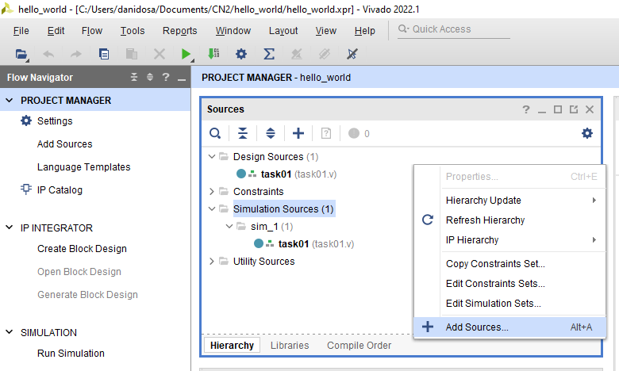
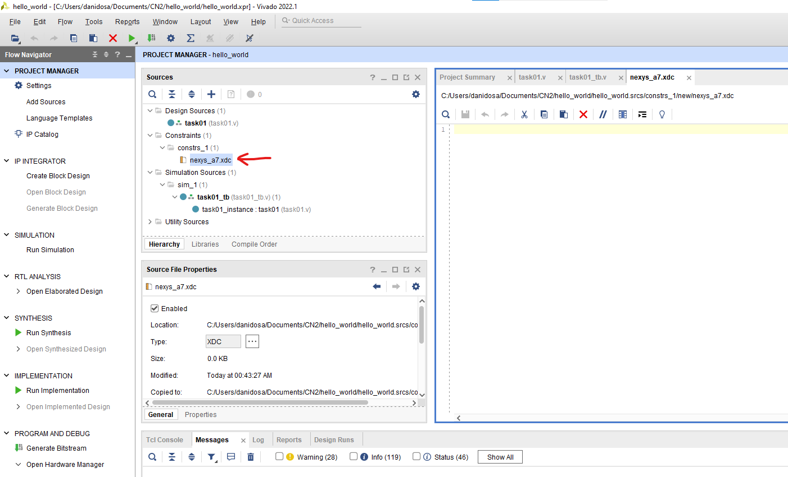
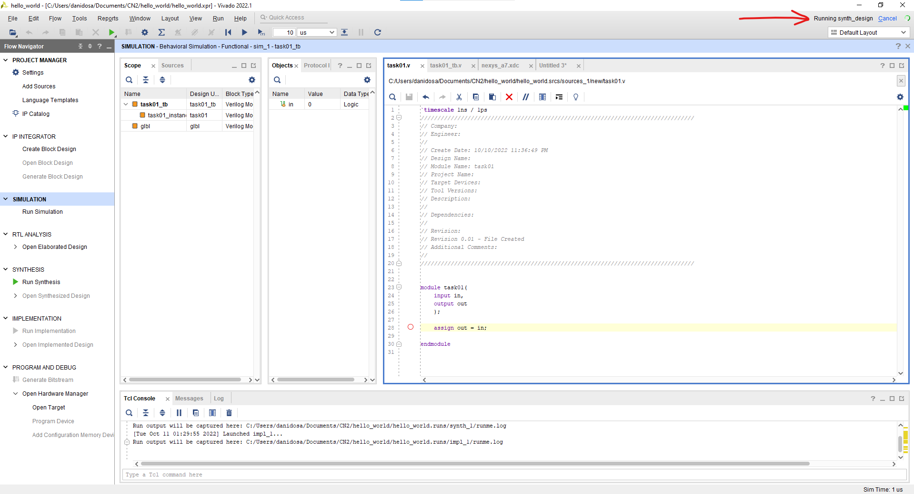
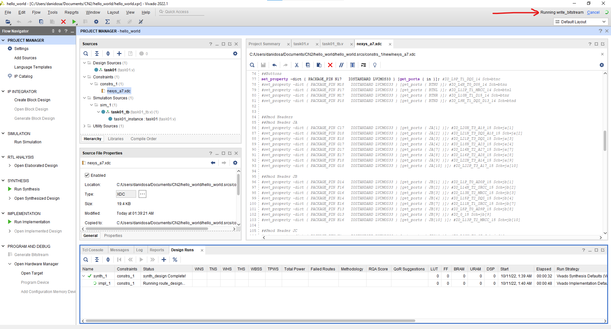
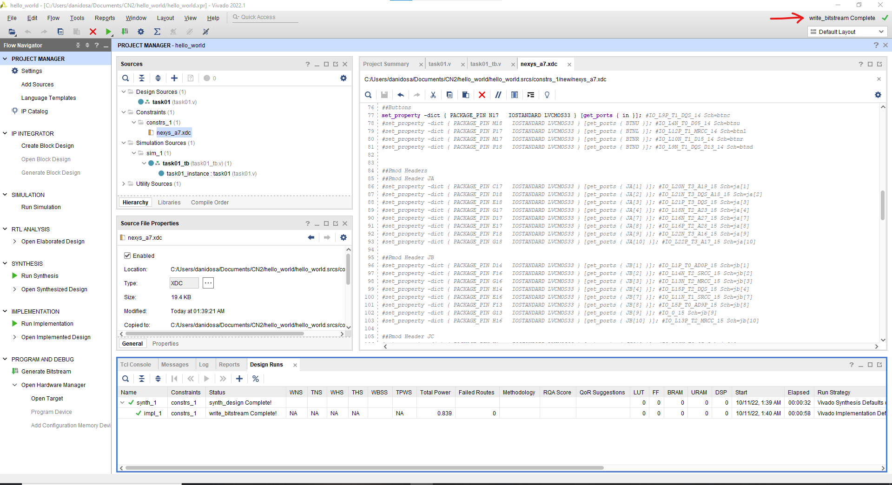
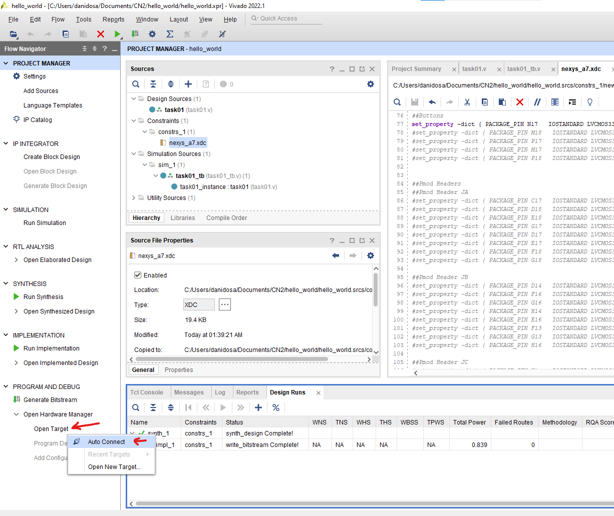
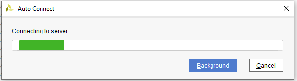
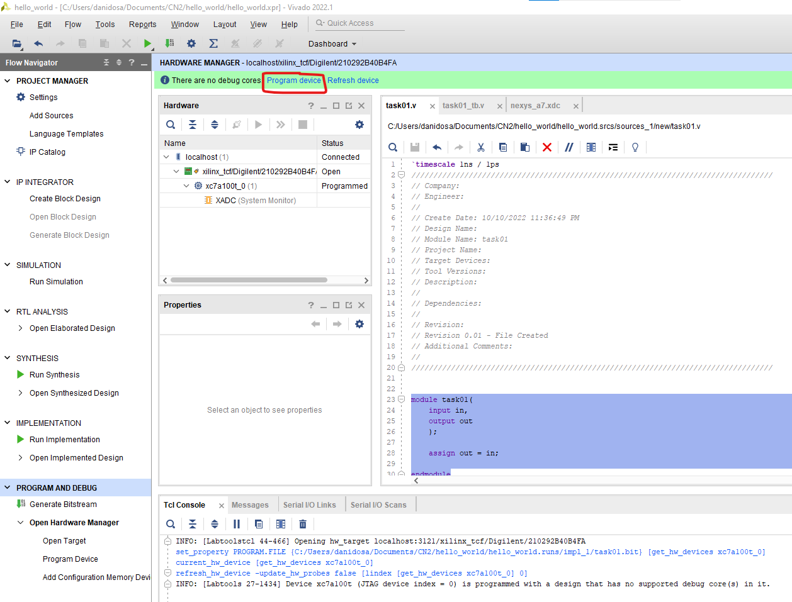
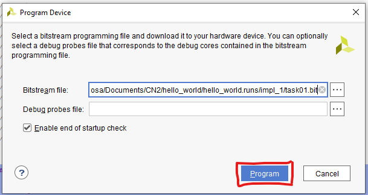

# Programarea FPGA-ului în Vivado

Pentru acest tutorial vom presupune că ați parcurs deja tutorialele: Creare proiect Vivado și Simulare Vivado fără **nicio eroare** în timpul simulării la tabul Messages (ignorați warning-urile momentan).
 

Pentru a programa FPGA-ul în Vivado trebuie să adăugăm un Constraint File:
1. Click fie la Add Sources

Fie click dreapta în fereastra Sources

Sau folosim **Alt+A**.
2. Selectăm Add or create constraints, apoi Next.

3. Click pe "Create File", alegem un nume, de exemplu "nexys_a7", Ok, apoi Finish.

4. Ar trebui să vedem acum un fișier gol cu numele nexys_a7.xdc la Sources.
.
5. Vom scrie în acest fișier gol tot conținutul acestui fișier de pe GitHub: [Nexys-A7-100T-Master.xdc](https://github.com/Digilent/digilent-xdc/blob/77d88001d51ba54b33ed0b4b34bcc19c979be5ff/Nexys-A7-100T-Master.xdc). Cu ajutorul acestuia vom lega fiecare port al top modulului nostru (task01.v) la locații fizice de pe FPGA. Având la dispoziție următorul modul Verilog:
```verilog
module task01(
    input in,
    output out
    );
    
    assign out = in;
    
endmodule
```
6. Ne propunem să legăm intrarea **in** la push-button-ul **N17** (cel din centru), iar ieșirea **out** la ledul H17 (cel mai din dreapta).
Pentru acest lucru vom analiza fișierul [Nexys-A7-100T-Master.xdc](https://github.com/Digilent/digilent-xdc/blob/77d88001d51ba54b33ed0b4b34bcc19c979be5ff/Nexys-A7-100T-Master.xdc): toate liniile sunt comentate. Există grupuri de linii comentate pentru semnalul de ceas, switches, LEDs, RGB LEDs, push-buttons, 7 segments, CPU Reset Button, Buttons etc. Ne vom concentra acum doar pe LEDs și Buttons. Vom decomenta linia 30:
```tcl
set_property -dict { PACKAGE_PIN H17   IOSTANDARD LVCMOS33 } [get_ports { LED[0] }]; #IO_L18P_T2_A24_15 Sch=led[0]
```
și linia 77:
```tcl
set_property -dict { PACKAGE_PIN N17   IOSTANDARD LVCMOS33 } [get_ports { BTNC }]; #IO_L9P_T1_DQS_14 Sch=btnc
```
apoi vom schimba parametrul primit de "get_ports" din **LED[0]** în **out** și din **BTNC** în **in**.
Cele două linii vor deveni astfel:
```tcl
set_property -dict { PACKAGE_PIN H17   IOSTANDARD LVCMOS33 } [get_ports { out }]; #IO_L18P_T2_A24_15 Sch=led[0]
```
respectiv,
```tcl
set_property -dict { PACKAGE_PIN N17   IOSTANDARD LVCMOS33 } [get_ports { in }]; #IO_L9P_T1_DQS_14 Sch=btnc
```
Putem lăsa celelalte linii comentate așa cum sunt le vom folosi în viitor pentru alte module. Salvați fișierul .xdc.

7. În fereastra Flow Manager, în partea de jos apăsați pe Generate bitstream

8. În colțul din dreapta sus putem verifica progresul.




În final ar trebui să vedem write_bitstream Complete



9. Fișierul .bit a fost scris cu succes, dar se află încă în memoria calculatorului, acesta trebuie transferat pe FPGA.
10. Conectați plăcuța la computer prin cablul USB-microUSB din cutie, porniți plăcuța folosind switch-ul lângă care scrie POWER. 
11. Apăsați "Open Target" și apoi "Auto Connect"

12. Procesul de auto conectare nu ar trebui să dureze mult

13. Ar trebui să vedem opțiunea Program device sub Hardware Manager.

14. Apoi să apăsăm Program dacă avem deja locația fișierului .bit la Bitstream file. 

15. În final ar trebui să avem un mesaj în consolă și ledul "Done" aprins pe plăcuță.

16. Dacă toți pașii au fost parcurși în mod corespunzător, ledul H17 ar trebui să se aprindă cât timp butonul N17 este apăsat. 

Dacă aveți sugestii de îmbunătățire a acestei pagini vă rog să trimiteți sugestiile pe mail la [dosarudaniel@gmail.com](mailto:dosarudaniel@gmail.com). Sugestiile bune vor fi recompensate cu puncte bonus.