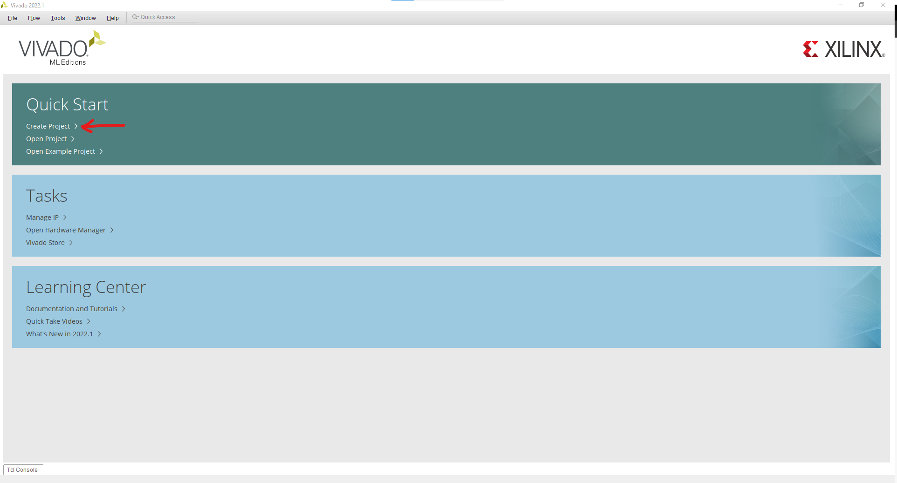
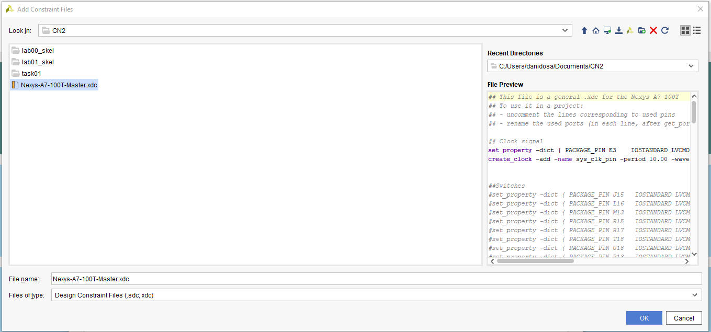
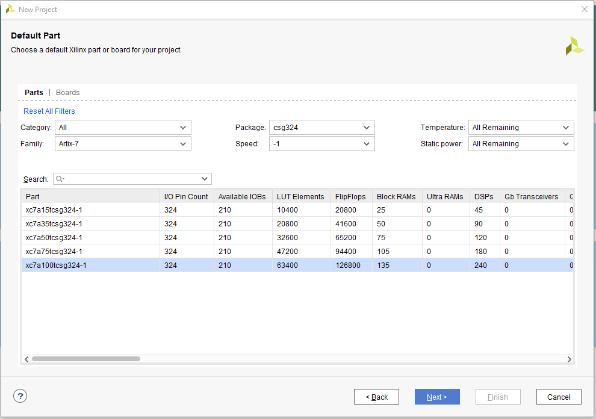

# Tutorial creare proiect Vivado

Pentru a crea un proiect în Vivado cu ajutorul căruia puteți sintetiza cod pe FPGA urmați pașii de mai jos:

1. Deschideți programul Vivado și selectați Create Project

2. Apasați Next

3. Scrieți numele proiectului și selectați locația acestuia.

4. Selectați [RTL](https://en.wikipedia.org/wiki/Register-transfer_level) Project, deselectați "Do not specify sources at this time" și apăsați Next

5. Apăsați "Create File" și alegeți un nume pentru fisierul sursă. Asigurați-vă că Target Language este "Verilog" și apăsați Next.

6. [Opțional - doar pentru programarea unui FPGA - puteți apăsa pe Next pentru a sări peste acest pas] Adăugați un constraint file ([Ce reprezintă un astfel de fișier?](https://digilent.com/reference/programmable-logic/guides/vivado-xdc-file)) pentru placa FPGA pe care o folosiți (De exemplu [Nexys-A7-100T-Master.xdc](https://github.com/Digilent/digilent-xdc/blob/77d88001d51ba54b33ed0b4b34bcc19c979be5ff/Nexys-A7-100T-Master.xdc) - descarcați acest fisier!) (Add Files -> Cautati si selectati fisierul "Nexys-A7-100T-Master.xdc" -> Next)

7. Selectați caracteristicile plăcii FPGA: Category, Familiy, Package, Speed (Le veți găsi pe cutia plăcuței sau în [reference manual](https://digilent.com/reference/_media/reference/programmable-logic/nexys-a7/nexys-a7_rm.pdf)) - Exemplu pentru 

8. Revizuiți informațiile proiectului

9. La acest pas puteți defini numele modulului și porturile acestuia:

10. În final, în Vivado veți putea vizualiza proiectul astfel
.

În stânga ecranului putem vedea pașii de simulare, sintetizare, implementare și generare a bitstream-ului ce va fi folosit pentru configurarea interna a FPGA-ului.

Dacă aveți sugestii de îmbunătățire a acestei pagini vă rog să trimiteți sugestiile pe mail la [dosarudaniel@gmail.com](mailto:dosarudaniel@gmail.com).