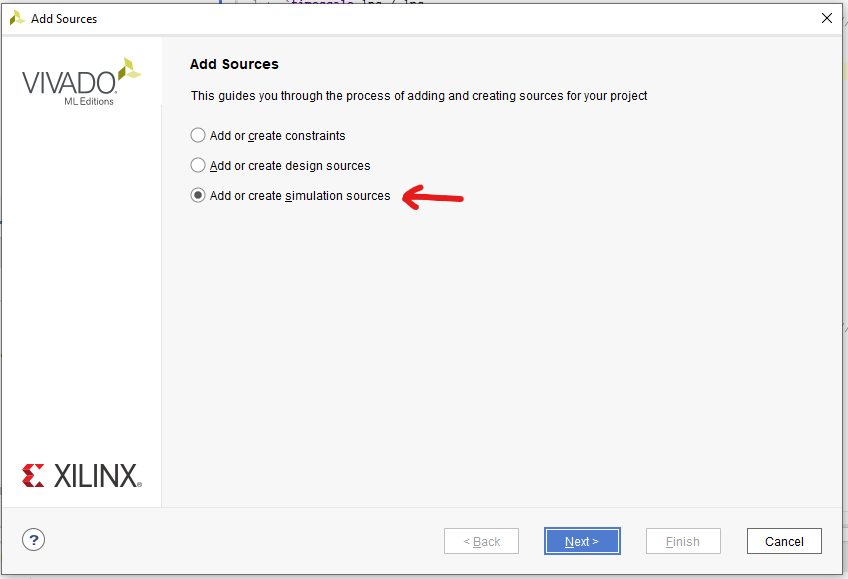
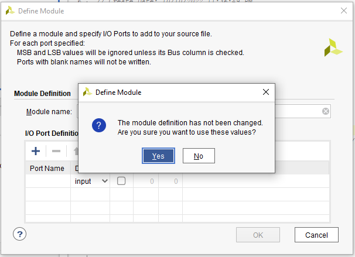
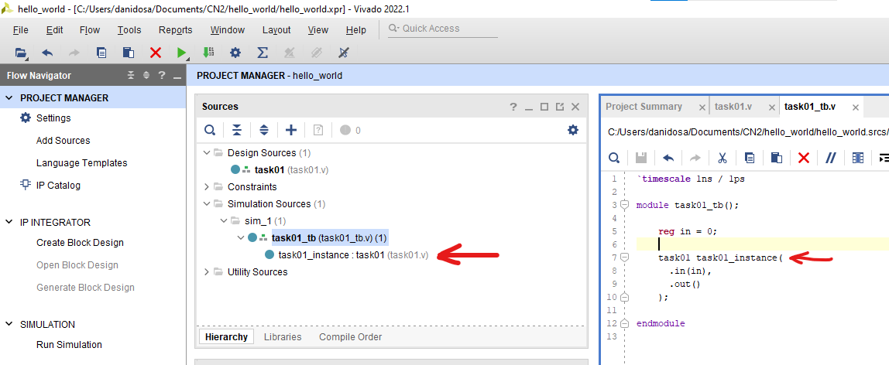
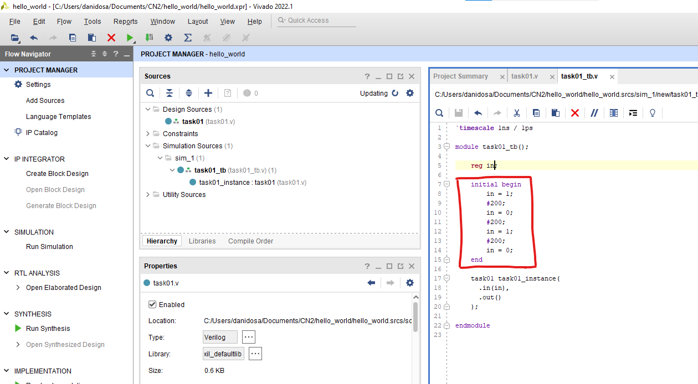
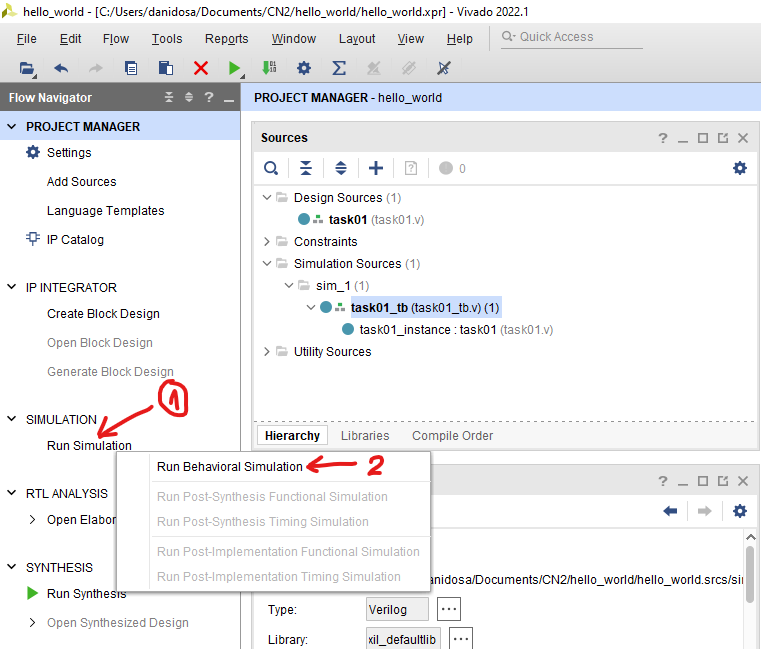
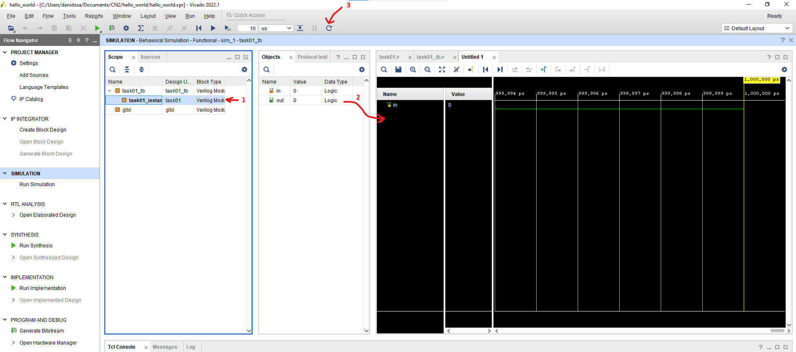
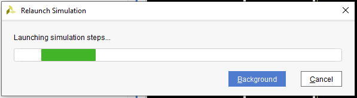
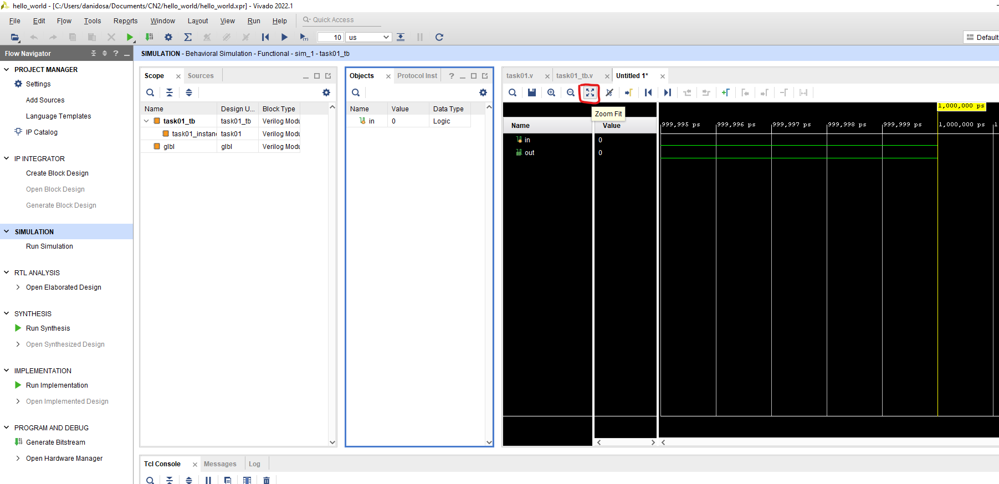
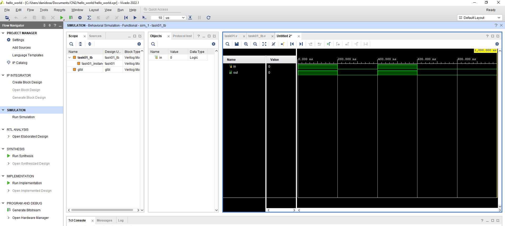

# Simulare modul în Vivado

Pentru acest tutorial vom presupune că ați creat un modul cu numele "task01" într-un fișier cu numele "task01.v". Pentru a simula acest modul urmăriți următorii pași:

1. Din fereastra **Flow Navigator** apăsați pe Add Sources 

sau apăsați click dreapta oriunde în fereastra **Sources** și apoi Add Sources 
.
Același rezultat poate fi obținut și prin apăsarea combinației de taste **Alt+A**.
2. După ce fereastra de Add Sources s-a deschis, selectați "Add or create simulation sources" și apăsați Next.

3. Apăsați apoi Create File și alegeți un nume pentru fișierul vostru de test, de exemplu: task01_tb.v (**tb** de la **testbench**), apăsați "Ok" și apoi Finish
.
4. Dacă se va deschide o nouă fereastră "Define Module" apăsați "Ok" 

5. Apoi "Yes" - pentru că e vorba de un fișier de simulare nu avem nevoie de porturi de intrare/ieșire.

6. Ar trebui să observați în fereastra **Sources** un nou fișier: task01_tb.v
.
7. Ștergeți conținutul predefinit al fișierului task01_tb.v și înlocuiți-l cu cel din această imagine:
.
8. Prima linie **`timescale 1ns/1ps** specifică unitatea de măsură și precizia simulării. În interiorul modulului de test regăsim variabilele (**in**) de tip **reg** ce se vor lega la porturile de intrare pentru modulul pe care îl testăm. Mai jos regăsim instanțierea modului. Numai după ce adăugăm această instanțiere, structura ierarhică din fereastra Sources se schimbă ca:
.
9. În continuare vom adăuga diverse valori de test pentru variabilele legate la porturile de intrare ale modulului pe care îl vom testa. De exemplu: pornim cu **in** setat la **1**, așteptăm 200 de unități de timp (200ns în cazul nostru) și apoi setăm **in** la **0** ș.a.m.d.
.
10. Salvăm fișierul task01_tb.v (**Ctrl+S**).
11. Pentru a rula simularea: click pe "Run Simulation" și apoi pe "Run Behavioral Simulation"
().
12. Se va deschide o nouă fereastră de simulare împărțită în 3: **Scope & Sources**, **Objects & Protocol Instances** și fișier "Untitled 1" de tip Waveform configuration file (.wcfg) unde vom vedea valorile porturilor. Pentru a adăuga și portul "out" în fișierul .wcfg vom da click la "Scope" pe "task01_instance" (1), apoi vom apăsa și menține pe obiectul "out" mutându-l în dreapta (2), iar în final vom relansa simularea cu cele două semnale de interes. Vedeți pașii descriși.

13. Simularea se va reîncărca.

14. Rezultatul final se poate vedea dacă apăsăm pe Zoom Fit.
.
15. În final putem verifica vizual dacă semnalele au valorile pe care le așteptăm:
.

Dacă aveți sugestii de îmbunătățire a acestei pagini vă rog să trimiteți sugestiile pe mail la [dosarudaniel@gmail.com](mailto:dosarudaniel@gmail.com). Studenții implicați vor fi recomensați cu puncte bonus.