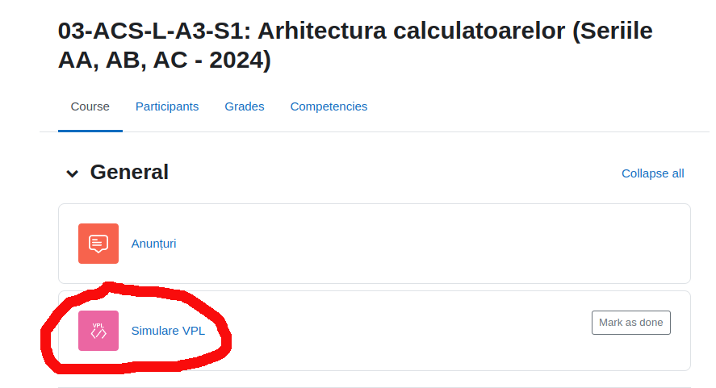
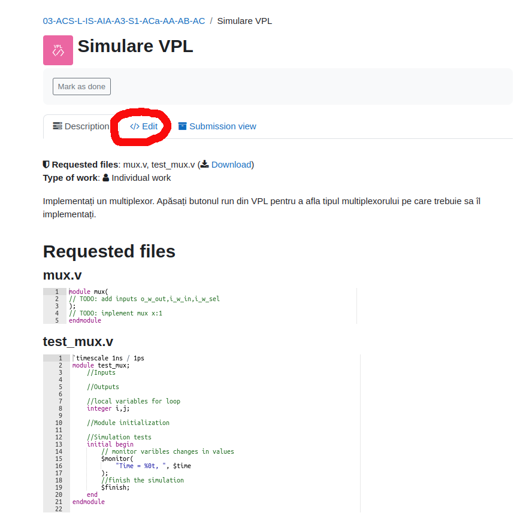
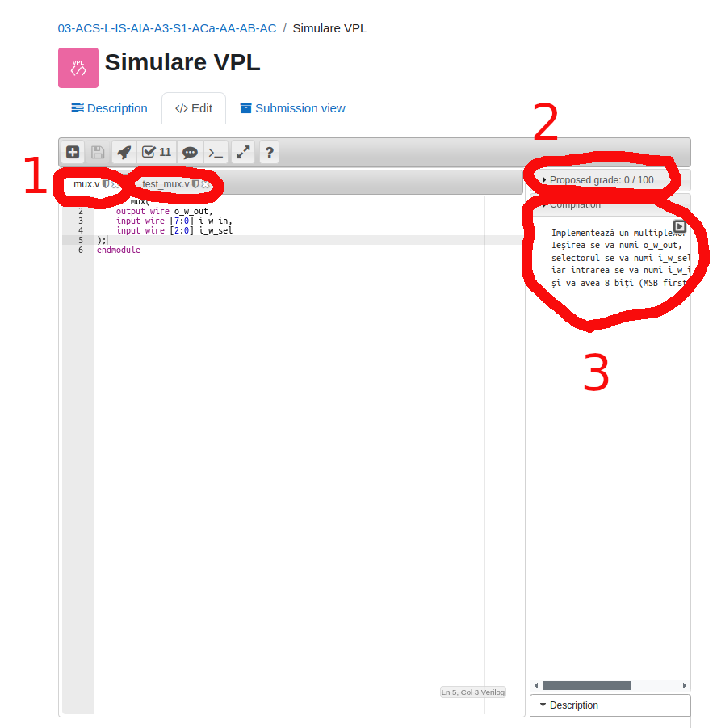
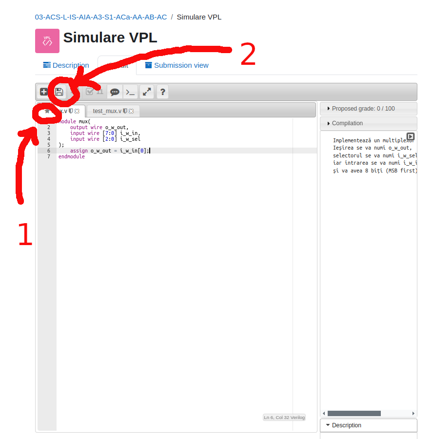
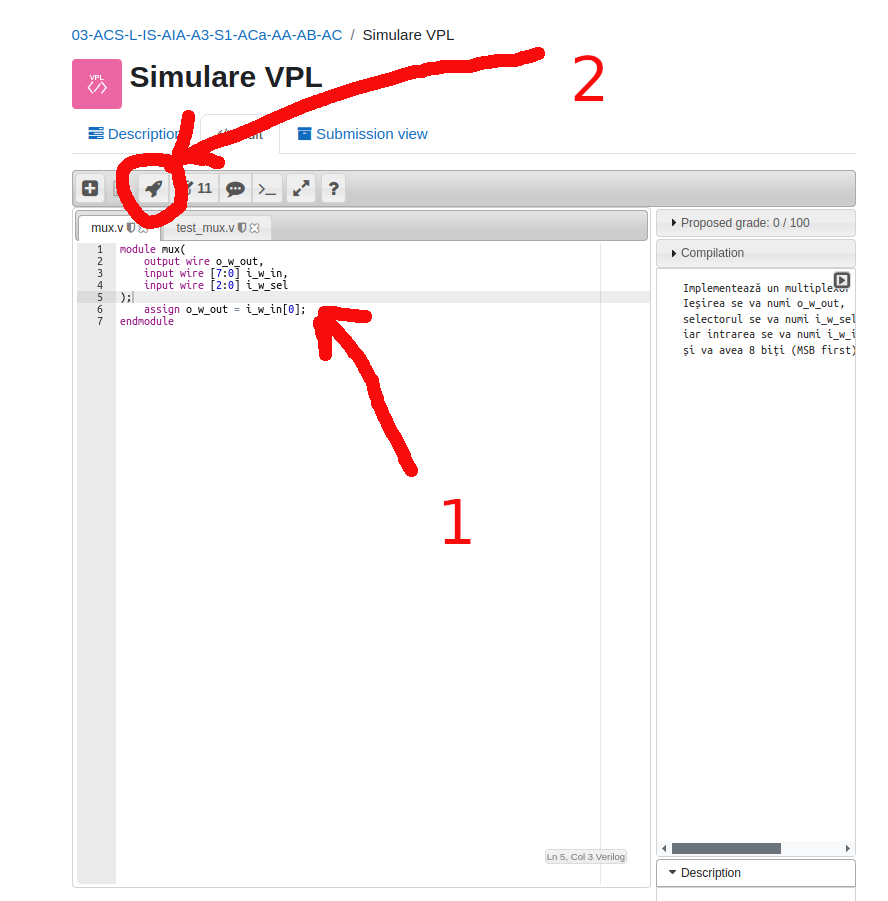
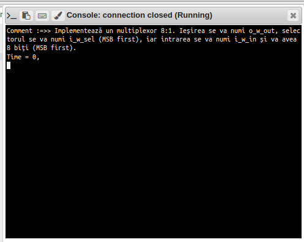
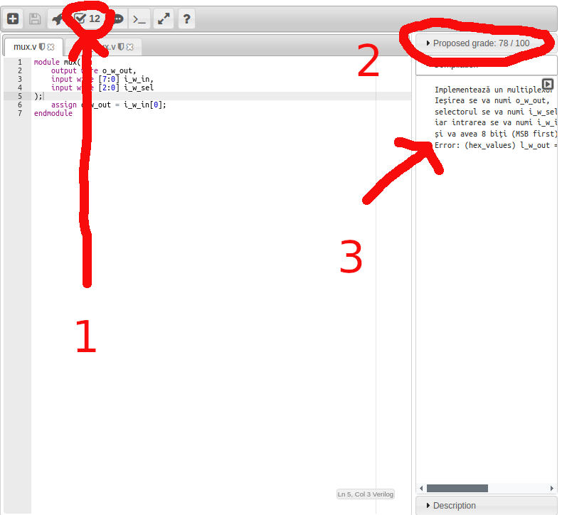
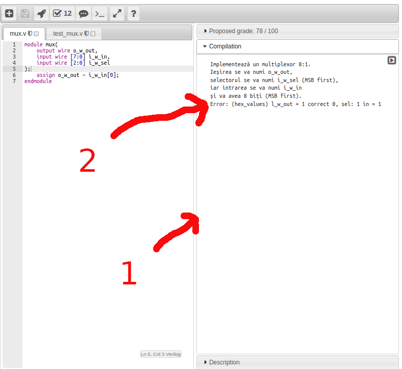
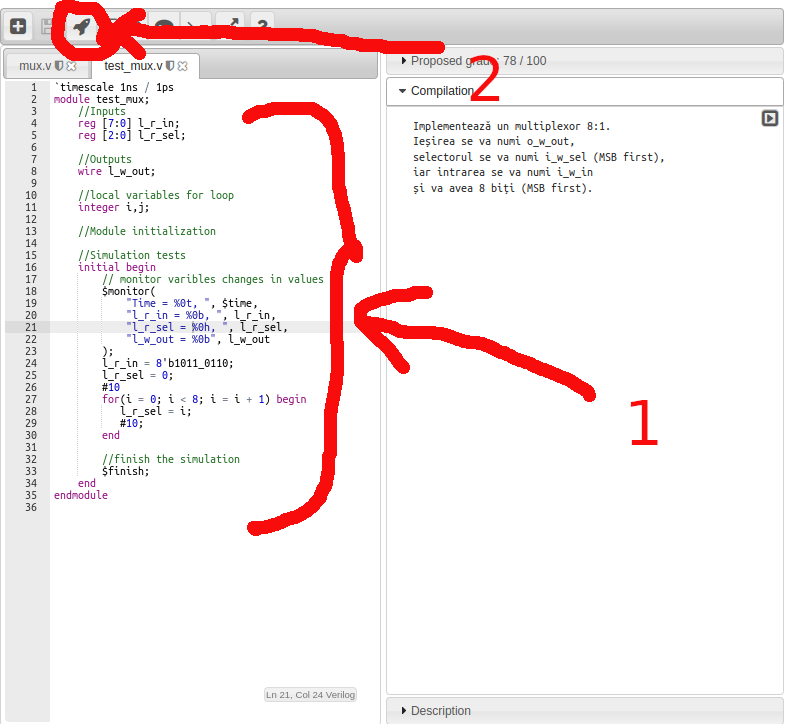
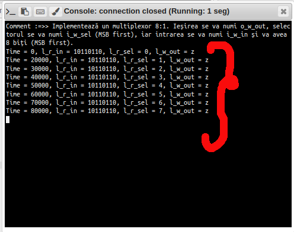

# Moodle VPL

1. Din cadrul cursului vom selecta "SIMULARE VPL"

2. Veți avea următoarea fereastră care va conține descrierea exercițiului și fișierele pe care le puteți modifica. Pentru a le edita apăsați butonul "EDIT".

3. În cadrul IDE-ului VPL veți avea un tab cu fiecare fișier (mux.v, test_mux.v), punctajul în dreapta, rezultatele compilării sau evaluării.

4. Puteți modifica fișierul "mux.v". Atât timp cât fișierele nu sunt salvate veți avea o stea în dreptul numelui fișierului. Pentru a salva apăsați butonul "Save".

5. O dată salvat fișierul steaua va dispărea. Acum puteți apăsa pe butonul "Run" pentru a vedea enunțul.

6. Se va porni o consolă ca în imaginea următoare. Veți avea detalii despre implementarea pe care o aveți de făcut și rezultatele rulării modului nostru de test/simulare.

7. Pentru a evalua soluția voastră puteți apăsa butonul "Evaluate". Nota va fi modificată în dreapta și vom avea descrierea implementării și primul test eșuat.

8. Pentru a vedea mai bine detaliile testului puteți modifica mărimea ferestrelor.

9. Daca doriți să rulați testele voastre pentru a face debug, puteți modifica fișierul "test_mux.v".

10. Folosim butonul "Run" și vom vedea rezultatele simulării.

