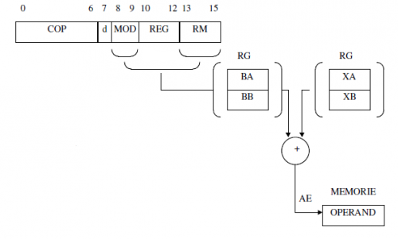

# Moduri de adresare


Modurile de adresare reprezintă modalitatea prin care se poate specifica adresa efectivă a operanzilor. Instrucțiunile calculatorului didactic pot prelucra maxim doi operanzi ce se pot găsi:
  - Ambii în registrele generale RG;
  - Unul în registrele generale RG și altul în memorie;
  - Unul în registrele generale RG și altul în cadrul instrucțiunii respective (numit operand imediat);
  - Unul în memorie și altul imediat.

Modurile de adresare permise de calculatorul didactic sunt tipice arhitecturilor CISC, fiind derivate din arhitectura standard x86. În total, procesorul permite 11 moduri de adresare, ceea ce îi conferă o foarte bună flexibilitate în programare. Pentru o mai ușoară înțelegere, le vom structura astfel:

| **Specificarea operandului** | **Moduri de adresare** |
|------------------------------|------------------------|
| Operandul nu se găseşte în memorie | Adresare directă la registru, Adresare imediată |
| Operandul e specificat doar prin deplasament | Adresare directă, Adresare indirectă |
| Operandul e specificat doar prin registre | Adresare indirectă prin registru, Adresare indirectă prin suma de registre, Adresare indirectă prin suma de registre cu autoincrementare, Adresare indirectă prin suma de registre cu autodecrementare |
| Operandul e specificat prin registre și deplasament | Adresare Bazată, Adresare Indexată, Adresare Bazată Indexată |

În continuare vor fi prezentate și discutate aceste moduri de adresare.


## Operandul nu se găsește în memorie


### 1. Adresare directă la registru


Operandul se găseşte în RG.

Exemplu: ```asm MOV RA, RB```

Instrucțiunea are ca efect încărcarea în registrul RA a valorii din registrul RB.


### 2. Adresare imediată


Operandul este specificat în instrucțiune.

Exemplu: ```asm MOV RA, 7```

Instrucțiunea va avea ca efect încarcarea valorii "7" în registrul RA. "7" poartă numele de operand imediat.


###= Operandul e specificat doar prin deplasament ###=


### 3. Adresare directă


Adresa efectivă este specificată în instrucțiune.

Exemplu: ```asm MOV RA, [12]```

Instrucțiunea va încărca valorea aflată în memorie la adresa "12" în registrul RA. "12" poarta numele de deplasament.


### 4. Adresare indirectă


Adresa efectivă se citește din memorie, din locația a cărei adresă este specificată în instrucțiune.

Exemplu: ```asm MOV RA, [[12]]```

Instrucțiunea are ca efect încărcarea valorii aflată la adresa ce se găsește în memorie la adresa "12". Acest mod de adresare seamană foarte bine cu pointerii din C. La adresa "12" se găsește pointer-ul către operand.

## Operandul e specificat doar prin registre

### 5. Adresare indirectă prin registru

Adresa efectivă se găsește în unul din registrele XA, XB, BA, BB.

Exemplu: ```asm MOV RA, [BA]```

Instrucțiunea va încărca în RA valoarea aflată în memorie la adresa conținută în BA.

### 6. Adresare indirectă prin sumă de registre

Adresa efectivă se obține ca sumă a conținutului unui registru de bază cu conținutul unui registru index.

Exemplu: ```asm MOV RA, [BA][XA]``` sau ```asm MOV RA, [BA+XA]```

Instrucțiunile încarcă în RA valoarea aflată în memorie la adresa obținută prin adunarea conținutului registrelor BA și XA. BA, BB poartă numele de registre de bază, iar XA, XB poartă numele de registre index. Întotdeauna suma se va face între un registru bază și unul index.

### 7. Adresare indirectă prin sumă de registre cu autoincrementare

Față de modul precedent de adresare apare deosebirea că registrele index se incrementează după generarea adresei efective. Incrementarea registrului index (XA sau XB) are deci loc după participarea la calculul adresei efective.

Exemplu: ```asm MOV RA, [BA][XA+]``` sau ```asm MOV RA, [BA+XA+]```

Aceste instrucțiuni sunt echivalente cu:
```asm
MOV RA, [BA][XA]
INC XA
```

### 8. Adresare indirectă prin sumă de registre cu autodecrementare

Adresa efectivă se obține prin suma unui registru de bază cu continutul registrului XA. Înaintea generării adresei, registrul XA este decrementat.

Exemplu: ```asm MOV RA, [BA][XA-]``` sau ```asm MOV RA, [BA+XA-]```

Aceste instrucțiuni sunt echivalente cu:
```asm
DEC XA
MOV RA, [BA][XA]
```

Observații: Motivul pentru care XB nu poate fi utilizat în acest mod de adresare nu este unul logic, ci unul tehnic: biții din codul de instrucțiune nu au fost suficienți pentru a se putea codifica și acest mod.

## Operandul e specificat prin registre și deplasament

### 9. Adresare bazată

Adresa efectivă se obține prin adunarea unui registru de bază cu un deplasament.

Exemplu: ```asm MOV RA, [BA]+7``` sau ```asm MOV RA, [BA+7]```

Instrucțiunea încarcă în registrul RA valoarea aflată în memorie la adresa rezultată în urma adunării conținutului registrului de bază cu deplasamentul (7).

### 10. Adresare indexată

Adresa efectivă se obține prin adunarea unui registru index cu un deplasament.

Exemplu: ```asm MOV RA, [XA]+7``` sau ```asm MOV RA, [XA+7]```

Instrucțiunea încarcă în registrul RA valoarea aflată în memorie la adresa rezultată în urma adunării conținutului registrului de index cu deplasamentul (7).

### 11. Adresare bazată indexată

Adresa efectivă se obține prin adunarea unui registru de bază cu un registru index și cu un deplasament.

Exemplu: ```asm MOV RA, [BA][XA]+7``` sau ```asm MOV RA, [BA+XA+7]```

Instrucțiunea încarcă în registrul RA valoarea aflată în memorie la adresa rezultată în urma adunării conținutului registrului de bază (BA) cu registrul index (XA) și cu deplasamentul (7).


## Calculatorul didactic

Procesorul calculatorului didactic suportă mai multe moduri de adresare a operanzilor. Până acum am tratat doar cazul operanzilor aflați în registre (adresare directă la registru), identificat prin câmpul _MOD_ având valoarea _11_. Cu acest mod de adresare suntem însă limitați la a lucra numai cu cele 8 registre generale. Pentru a putea lucra și cu date aflate în memoria RAM, procesorul calculatorului didactic oferă o serie de alte moduri de încărcare a operanzilor.

Încărcarea unui operand din memoria RAM necesită determinarea adresei la care se află stocat acel operand. Aceasta poate fi stocată direct în instrucțiune, cum se întâmplă în cazul adresării directe, unde instrucțiunea este formată din 2 cuvinte (pe 16 biți), iar al doilea cuvânt conține valoarea adresei (numită și deplasament), sau poate fi calculată folosind diferite combinații de registre cu/fără deplasament. Calculul se face prin adunarea valorilor curente ale unor registre (nu toate combinațiile sunt suportate) și folosirea valorii rezultate ca o adresă pentru memorie.


### Adresarea indirectă prin registru


Adresa efectivă se găsește într-unul din registrele _XA_, _XB_, _BA_ sau _BB_. Modul de determinare a acesteia este prezentat în imaginea de mai jos.

Ex: ```asm mov RA, [BA]```


_Figure: Adresare indirectă prin registru_


### Adresarea indirectă prin sumă de registre


Adresa efectivă se obține prin sumarea conținutului unui registru de bază (_BA_ sau _BB_) cu conținutul unui registru index (_XA_ sau _XB_). Modul de determinare a acesteia este prezentat în imaginea de mai jos. 

Ex: ```asm mov RA, [BA + XA]```




_Figure: Adresare indirectă prin sumă de registre_

### Implementare


Automatul care trebuie implementat în UC este descris în diagrama de stări din figura de mai jos.


_Figure: Diagrama de stări a unității de comandă_

După cum puteți observa, la stările deja implementate în laboratoarele anterioare au fost adăugate o serie de stări noi, necesare pentru adresarea indirectă prin registru sau sumă de registre. În cadrul acestui laborator va trebui să implementați aceste noi stări și să completați condițiile corecte pentru decodificarea noilor moduri de adresare.

Memoria calculatorului didactic este implementată cu ajutorul unui IP Core Xilinx de tipul Block Memory. Parametrii unui core sunt stocați într-un fișier _.xco_. Acest fișier este folosit de utilitarul de generare a IP Core-urilor pentru a genera o instanță a core-ului selectat. Core-ul de tip Block Memory oferă o serie de parametri care pot fi configurați, precum dimensiunea cuvântului, numărul de cuvinte și semnalele disponibile. Block Memory oferă și posibilitatea inițializării memoriei în momentul generării. Conținutul memoriei poate fi specificat într-un fișier _.coe_ referențiat apoi de fișierul _.xco_. În figura de mai jos puteți observa formatul fișierul _.coe_. Valorile din fișier sunt mapate în memoria generată începând de la adresa 0.


_Figure: Fișierul ram.coe_

Conținutul inițial al memoriei calculatorului didactic se găsește în cadrul acestui fișier. După fiecare modificare a fișierului _.coe_, memoria care folosește acel fișier trebuie regenerată. În cazul nostru, după modificarea fișierului _ram.coe_ trebuie regenerat modulul _ram_ pentru ca modificările să aibă efect. Pentru aceasta, se selectează din fereastra _Sources_ modulul _ram_, iar din fereastra _Processes_ se inițiază regenerarea, cu opțiunea _Regenerate Core_.