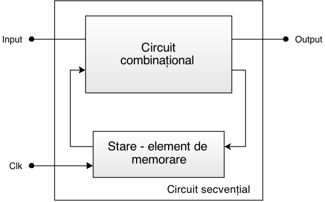

# RHDL

În cadrul laboratorului de Arhitectura Calculatoarelor vom studia un limbaj de descriere a hardware-ului (_eng. Hardware Description Language - **HDL**_) numit **RHDL**, bazat pe **Rust**. Cu ajutorul acestuia vom putea implementa concepte legate de arhitectura calculatoarelor. 

Limbajele de descriere a hardware-ului sunt folosite în industrie pentru proiectarea și implementarea circuitelor digitale. Cele mai folosite limbaje de descriere a hardware-ului sunt **Verilog** și **VHDL**.

## De ce RHDL?

Deși limbaje precum Verilog și VHDL sunt utilizate pe scară largă în industrie și reprezintă standardele consacrate pentru descrierea hardware-ului, în cadrul acestui laborator vom folosi RHDL. Alegerea nu este întâmplătoare. RHDL este un limbaj de descriere a hardware-ului modern, construit pe fundamentele limbajului Rust. El îmbină rigoarea necesară proiectării circuitelor digitale cu expresivitatea și siguranța oferite de Rust.

RHDL ne oferă mijloacele prin care putem descrie și experimenta arhitecturi hardware, însă adevărata lui putere se vede atunci când aceste descrieri sunt puse în practică pe un FPGA. Spre deosebire de un procesor clasic, unde rulăm instrucțiuni prestabilite, un FPGA ne permite să modelăm direct logica hardware.

Însă apare întrebarea naturală: Ce aș putea face cu un FPGA și nu aș putea face cu un procesor? Pe scurt, există trei răspunsuri: 
  - Un FPGA poate fi reconfigurat într-un timp foarte scurt. Asta înseamnă că, dacă am greșit ceva în design-ul nostru, dacă dorim să-l modificăm sau să-l extindem, timpul și costul acestei acțiuni sunt foarte mici; 
  - Un FPGA, prin construcția lui, oferă un grad extrem de ridicat de paralelism, lucru pe care codul scris pentru un procesor (deci cod secvențial) îl oferă într-o măsură mai redusă și mai greu de controlat;
  - Un FPGA este de preferat oricând se dorește interfațarea unui dispozitiv (un senzor, un dispozitiv de afișare, etc.) care are nevoie de timpi foarte stricți în protocolul de comunicatie (exemplu: așteaptă 15 nanosecunde înainte să schimbi linia de ceas, apoi activează linia de enable pentru 25 de nanosecunde, apoi pune datele pe linia de date și ține-le cel puțin 50 de nanosecunde, etc). Pe un procesor acest lucru este iarăși dificil de controlat, fiindcă majoritatea instrucțiunilor se execută într-un număr diferit de cicli de ceas.

Întrucât au fost puse în discuție atât proiectarea prin porți logice a unui circuit cât și descrierea lui la un nivel mai abstract, putem clasifica alternative de descriere a unui circuit:
  - **descrierea structurală** - mai puțin folosită, ea reprezintă o implementare asemănătoare cu o schemă logică a unui circuit, folosind primitive și module pentru implementarea funcționalității
  - **descrierea comportamentală** - divizată în descriere la nivel de flux de date și descriere la nivel procedural, folosește construcții de nivel înalt, întâlnite și în alte limbaje de programare.

## Ce tipuri de circuite putem construi?

**Circuitele logice combinaționale** aplică funcții logice pe intrări pentru a obține ieșirile. Valorile de ieșire depind astfel doar de valorile curente de intrare, iar când starea unei intrări se schimbă, se reflectă imediat asupra ieșiri.

_Figure: Diagrama bloc pentru un circuit combinațional cu n intrări și m ieșiri_

Logica combinațională poate fi reprezentată prin:
  - diagrame structurale la nivel de porți logice, 
  - tabele de adevăr,
  - expresii booleene (funcții logice).

Spre deosebire de **circuitele** logice combinaționale, cele **secvențiale** (eng: sequential logic) nu mai depind exclusiv de valoarea curentă a intrărilor, ci și de stările anterioare ale circuitului. Logica secvențială poate fi de două tipuri: sincronă și asincronă.

_Figure: Schema bloc a unui circuit secvențial sincron_

În primul caz, cel cu care vom lucra și la laborator, este folosit un semnal de ceas care comandă elementul/elementele de memorare, acestea schimbându-și starea doar la impulsurile de ceas. În al doilea caz, ieșirile se modifică atunci când se modifică și intrările, neexistând un semnal de ceas pentru elementele de memorare. Circuitele secvențiale asincrone sunt mai greu de proiectat, pot apărea probleme de sincronizare și sunt folosite mai rar. În continuare ne vom referi doar la circuitele secvențiale sincrone.