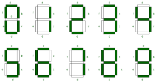

# Structura limbajului RHDL


În laboratorul curent ne vom concentra asupra asimilării limbajului **RHDL**, începând cu **descrierea structurală a unui circuit combinațional**.

Atunci când proiectăm un circuit digital folosind un HDL, începem prin a face o descriere textuală a circuitului, adică scriem cod. Acesta este compilat, iar în urma procesului va rezulta un model al circuitului care poate fi apoi rulat într-un simulator cu scopul de a verifica funcționalitatea descrierii. O alternativă la simulare este folosirea unui utilitar de sintetizare, care preia codul HDL și generează fișiere de configurare pentru FPGA.

Însă proiectarea circuitelor poate deveni complexă. Datorită acestui motiv, se preferă proiectarea de tip top-down, o modalitate de partiționare sistematică și repetată a unui sistem complex în unități funcționale mai simple, a căror implementare poate fi făcută mai facil. O partiționare și organizare la nivel înalt a unui sistem reprezintă arhitectura acestuia. Unitățile funcționale individuale ce rezultă în urma partiționării sunt mai ușor de proiectat și de testat decât întregul sistem. Strategia divide-et-impera a proiectării top-down ne permite proiectarea de circuite care conțin milioane de porți.


## Descrierea unui circuit

Pentru a descrie un circuit este nevoie să fim familiari cu framework-ul **RHDL**, pe care vom începe să îl cunoaștem în cele ce urmează.
### Descrierea unui modul
Numim un modul un circuit reutilizabil care este descris în mod textual printr-un limbaj HDL (în cazul nostru RHDL). Pentru a putea descrie un astfel de modul, sunt esențiale cel puțin:
- Inputurile/Outputurile modulului; acestea se fac prin tipuri de date `I` și `O` care implementează traitul `Digital`
- Descrierea logicii modulului; aceasta se face printr-o funcție pe care o numim `kernel`

În cadrul acestui laborator, funcția `kernel` are următoarea semnătură:
```rust 
#[kernel]
fn my_circuit(_cr: ClockReset, i: I) -> O {
    // your logic here
}
```
unde:
- `i` reprezintă intrarea circuitului  
- `o` reprezintă ieșirea circuitului  
- `cr` oferă acces la ceasul și reset-ul circuitului (în cazul de față rămâne nefolosit, fiind vorba de circuite combinaționale – din acest motiv vom semnala faptul că nu o folosim cu '_')

### Tipul Func
Pentru a putea instanția funcția `kernel`, vom declara un obiect de tip `Func`. Acest tip
este un wrapper folosit pentru modulele care au o funcție `kernel` numai cu inputuri și outputuri.

Funcția `new()` este folosită pentru a crea această instanță runtime pentru aliasul definit mai sus.  
Vom crea, de asemenea, un alias pentru `Func<I, O>` pentru a ușura scrierea.  
Astfel, vom defini următoarele:

``` rust
pub type MyCircuit = Func<Bits<U1>, Bits<U1>>;

pub fn new() -> Result<MyCircuit, RHDLError> {
    Func::try_new::<my_circuit>()
}
```


### Structuri ca input-uri

În realitate, ne putem aștepta la faptul că multe dintre circuitele noastre vor avea o complexitate mai mare, pornind de la intrările și ieșirile acestora ajungând la logica efectivă a circuitului.
Astfel, cum a fost menționat mai sus putem folosi tupluri ca input pentru un modul.

#### Exemplu circuit cu intrări și ieșiri tupluri
```rust
#[kernel]
fn my_circuit(
    _cr: ClockReset,
    i: (Bits<U1>, Bits<U2>, Bits<U3>, Bits<U4>),
) -> (Bits<U4>, Bits<U3>, Bits<U2>, Bits<U1>) {
    (i.3, i.2, i.1, i.0)
}

type MyCircuit = Func<
    (Bits<U1>, Bits<U2>, Bits<U3>, Bits<U4>),
    (Bits<U4>, Bits<U3>, Bits<U2>, Bits<U1>),
>;

fn new() -> Result<MyCircuit, RHDLError> {
    Func::try_new::<my_circuit>()
}
```
Totuși observăm că codul deja începe să devină mai greu de înteles.
Pentru a evita această problemă putem defini structuri, cu câmpuri clare, de exemplu, codul de mai sus devine:

```rust
pub struct MyCircuitInput {
    pub a: Bits<U1>,
    pub b: Bits<U2>,
    pub c: Bits<U3>,
    pub d: Bits<U4>,
}

#[derive(Digital, PartialEq, Eq)]
pub struct MyCircuitOutput {
    pub w: Bits<U4>,
    pub x: Bits<U3>,
    pub y: Bits<U2>,
    pub z: Bits<U1>,
}

#[kernel]
fn my_circuit(_cr: ClockReset, i: MyCircuitInput) -> MyCircuitOutput {
    MyCircuitOutput {
        w: i.d,
        x: i.c,
        y: i.b,
        z: i.a,
    }
}

type MyCircuit = Func<MyCircuitInput, MyCircuitOutput>;

fn new() -> Result<MyCircuit, RHDLError> {
    Func::try_new::<my_circuit>()
}
```

Fiecare structură definită trebuie să implementeze trait-urile `Digital`, `PartialEq` și `Eq`.

### Trait-ul `Digital`

Trait-ul Digital este fundamental în RHDL.
El marchează tipurile care pot fi reprezentate hardware.
Tipurile uzuale pentru Digital sunt:

- `Bits<Ux>` pentru valori pe un număr fix de biți,
- `SignedBits<Ux>` pentru valori cu semn,
- tupluri sau structuri marcate cu `#[derive(Digital)]` care grupează semnale.
- `bool` (singurul tip primitiv suportat)

### Bits și SignedBits

Aceste două structuri ne pun la dispoziție mai multe funcții pentru a lucra cu ele. Momentan, amintim de următoarele:

#### Funcția ```.resize()```

În practică, este des întâlnit cazul în care dimensiunea unui semnal nu se potrivește direct cu dimensiunea așteptată de o altă componentă. Pentru aceste situații, RHDL pune la dispoziție funcția ```.resize()```, care permite conversia sigură între semnale cu număr de biți diferit.

```rust
let x = Bits::<U3>::from(5);    // valoarea 5 pe 3 biti: 101 
let y: Bits<U5> = x.resize();   // valoarea 5 pe 5 biti: 00101
```

#### Funcția ```.as_signed()```

Această funcție ne ajută să facem conversia din `Bits` în `SignedBits`. Atenție la faptul că numerele cu semn sunt reprezentate în complement față de 2.

```rust
let x: Bits<U3> = Bits::<U3>::from(3);
let z = x.as_signed();
```

#### Funcția ```signed()```
Returnează un SignedBits de lungimea specificată al valorii date.
```rust
let y: SignedBits<U5> = signed(-5);
```
## Operatori

Pentru a putea descrie circuitele dorite va fi nevoie să cunoaștem, nu doar operatorii cu care vom lucra, ci și precedeța lor.
Mai jos regăsim operatorii pe care îi putem folosi, ordonați după precedența acestora, de sus în jos.

| Simbol                              | Funcție                        |
|-------------------------------------|--------------------------------|
| `! ~ -` (unari)                     | Complement, Negare             |
| `*`                                 | Înmulțire                      |
| `+ -` (binari)                      | Adunare, Scădere               |
| `<< >> `                            | Shiftare                       |
| ` & `                               | Bitwise AND                    |
| `\^`                                | Bitwise XOR                    |
| `\|`                                | Bitwise OR                     |
| `< <= > >= == !=`                   | Relaționali                    |
| `&&`                                | AND logic                      |
| `\|\|`                              | OR logic                       |
| .all()                              | Reduction AND                  |
| .any()                              | Reduction OR                   |
| .xor()                              | Reduction XOR                  |

Shiftarea va fi mereu logică pentru `Bits` și aritmetică (bitul de semn se păstrează) pentru `SignedBits`.

# Exerciții

:::tip
Se recomandă folosirea environmentului `open-toolchain` pentru a rezolva acest laborator. Scheletul de laborator se găsește la [chapters/rhdl/comb-skel](https://github.com/cs-pub-ro/computer-architecture/tree/main/chapters/rhdl/comb-skel)
:::

1. Completați modulele de porți logice din helper.rs  
2. Creați un Full Adder descris structural (prin porți logice sau folosind combinații de alte module)  
3. Creați un Ripple Carry Adder pe 4 biți pe baza Full Adder-ului făcut mai devreme  
4. Creați un Comparator  
5. Creați un Mux  
6. Creați un SevenSegmentDisplay

<div align="center">



_Figure: Seven Segment Display_

</div>

7. Creați și simulați un adder pe 4 biți fără a vă folosi de module create anterior  
