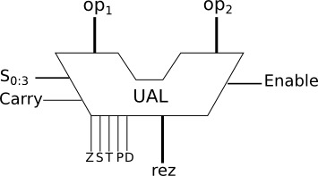

# Exercitiul 1 - Unitatea aritmetică-logică parametrizată (UAL)

Mai jos, avem figura cu UAL-ul ce trebuie implementat. op1, op2 si rez vor fi parametrizati cu T, iar selectia operatiilor + flagurile vor fi numar static de biti.

<div align="center">



_Figure: Unitatea aritmetică-logică_

</div>

## Descrierea detaliată a indicatorilor de condiții (flags)

* **T/C** (*transport, eng: carry*): Este setat (poziționat în "1") dacă în urma unei adunări rezultă un transport dinspre rangul cel mai semnificativ, altfel **T** este șters (trecut în "0").
  * Este setat dacă în urma unei scăderi rezultă un împrumut în cel mai semnificativ bit al rezultatului, altfel este șters.
  * Poate fi interpretat ca depășire în instrucțiunile cu numere întregi fără semn. Poate fi utilizat în instrucțiunile **ADC** și **SBB** pentru a efectua operații aritmetice în precizie multiplă. Poate fi testat cu instrucțiuni de salt condiționat.
* **S** (*semn*):
  * La execuția operațiilor aritmetice și logice, indicatorul **S** este setat la valoarea bitului cel mai semnificativ al rezultatului (bitul de semn).
    * Pentru numere cu semn (în absența depășirii) **S**=0 indică rezultat pozitiv iar **S**=1 indică rezultat negativ.
    * În cazul operațiilor cu numere fără semn **S** poate fi ignorat deoarece în acest caz specifică cel mai semnificativ bit al rezultatului.
  * Poate fi testat cu instrucțiuni de salt condiționat.
* **Z** (*zero*):
  * Este setat dacă în urma unei operații aritmetice sau logice se obține rezultat egal cu 0, altfel **Z** este șters.
  * Poate fi testat cu instrucțiuni de salt condiționat pentru a dirija secvența de execuție a instrucțiunilor în funcție de valoarea rezultatului.
* **P** (*paritate*):
  * Indicatorul de paritate **P** este setat dacă în urma execuției unei operații aritmetice sau logice rezultatul conține un număr par de biți egali cu 1, altfel **P** este șters.
  * Poate fi testat cu instrucțiuni de salt condiționat.
* **D/O** (*depașire, eng: overflow*):
  * Indicatorul de depășire **D** (eng. *overflow*) este setat dacă în urma execuției unei operații aritmetice rezultatul este un număr pozitiv prea mare sau un număr negativ prea mic pentru a putea fi reprezentat în operandul destinație (exclusiv bitul de semn); altfel **D** este șters.
  * Poate fi interpretat ca depășire în instrucțiunile cu numere întregi cu semn și poate fi testat cu instrucțiuni de salt condiționat.
  * Poate fi ignorat în operațiile aritmetice cu numere întregi fără semn.
  * Exemple:
    * În cazul unei operații cu semn, pe 4 biți: 0100 + 0100 = 1000 (indicatorul de depășire e setat)
    * 1000 + 1000 = 0000 (indicatorul de depășire e setat)
    * 0110 + 1001 = 1111 (indicatorul de depășire este șters)
    * 0100 + 0110 = 1010 (indicatorul de depășire este setat, iar cel de transport este șters)
  * Detalii despre situații în care apare depășirea și cum se detectează găsiți [aici](http://teaching.idallen.com/dat2343/10f/notes/040_overflow.txt) și [aici](http://www.allaboutcircuits.com/vol_4/chpt_2/5.html).
:::tip
* pentru operații între numere întregi fără semn contează *indicatorul de transport/carry* (**T/C**), pentru cele cu semn contează *indicatorul de depășire/overflow* (**D/O**).
* *indicatorul de paritate* (**P**) este 1 în caz ca avem un număr par de biți, altfel este 0 (deci paritate impară, altfel se numea paritate pară - 0 pentru număr par de biți, 1 pentru număr impar). Metoda de determinare a acestuia constă în aplicarea unui *xor negat* între biții cuvântului (dacă era paritate pară aplicam **xor** simplu).
* unele operații au efect asupra tutoror indicatorilor de condiție (exemplu **ADD**), altele însă afectează doar o parte dintre aceștia.
:::
## Descriere operații

* **ADC**:
  * **ADC** este un Full Adder, în care intrările sunt cei doi operanzi și carry-ul.
  * Flag-uri setate: T/C, S, Z, P, D/O.
* **SBB1**:
  * **SBB1** scade operandul *op2* și bitul *Carry* din operandul *op1*.
  * Flag-uri setate: T/C, S, Z, P, D/O.
* **SBB2**:
  * **SBB2** scade operandul *op1* și bitul *Carry* din operandul *op2*.
  * Flag-uri setate: T/C, S, Z, P, D/O.
* **NOT**:
  * **NOT** inversează individual fiecare bit al operandului.
  * Flag-uri setate: S, Z, P (T/C și D/O sunt întotdeauna 0 în cazul operațiilor logice).
* **AND**:
  * **AND** efectuează "ȘI" logic între biții celor doi operanzi.
  * Flag-uri setate: S, Z, P (T/C și D/O sunt întotdeauna 0 în cazul operațiilor logice).
* **OR**:
  * **OR** efectuează "SAU" logic între biții celor doi operanzi.
  * Flag-uri setate: S, Z, P (T și D sunt întotdeauna 0 în cazul operațiilor logice).
* **XOR**:
  * **XOR** efectuează "SAU-exclusiv" între biții celor doi operanzi.
  * Flag-uri setate: S, Z, P (T și D sunt întotdeauna 0 în cazul operațiilor logice).
* **SHL/SAL**:
  * **SHL/SAL** realizează deplasarea la stânga cu o poziție a operandului op1.
  * În bitul cel mai puțin semnificativ se introduce zero. Deplasarea logică și aritmetică la stânga cu o poziție produc același rezultat.
  * Flag-uri setate: S, Z, P, T (conține întotdeauna bitul deplasat în afară), D (e setat pe **1** doar dacă în urma operației bitul cel mai semnificativ - de semn - și-a schimbat valoarea, altfel e 0)
* **SHR**:
  * **SHR** deplasează la dreapta cu 1 biții operandului op1, introducând zero în bitul cel mai semnificativ.
  * Flag-uri setate: S, Z, P, T (conține întotdeauna bitul deplasat în afară), D (e setat pe **1** doar dacă în urma operației bitul cel mai semnificativ - de semn - și-a schimbat valoarea, altfel e 0)
* **SAR**:
  * **SAR** deplasează aritmetic la dreapta cu 1 biții operandului op1.
  * Deplasarea se face cu extensia bitului de semn (bitul de semn rămâne neschimbat iar bitul cel mai semnificativ de date preia conținutul bitului de semn).
  * Flag-uri setate: S, Z, P, T (conține întotdeauna bitul deplasat în afară), D (e setat pe **1** doar dacă în urma operației bitul cel mai semnificativ - de semn - și-a schimbat valoarea, altfel e 0)

## Operațiile de shiftare

Operațiile de shiftare se împart în: shiftare logică, shiftare aritmetică, shiftare circulară fără carry, shiftare circulară cu carry. În acest laborator vom trata primele două tipuri de operații.

### Shiftare logică

O shiftare logică nu ține cont de semnul operandului. În cazul shiftării logice se ține cont doar de ordinea biților, iar pozițiile care rămân libere sunt umplute cu zerouri.

În imaginile de mai jos se poate observa modul de execuție a shiftărilor logice.

<div align="center">


_Figure: Shiftare logică la stânga_


_Figure: Shiftare logică la dreapta_

</div>

Iar în figurile de mai jos găsiți un exemplu practic de efectuare a shiftărilor logice spre stânga (*SHL*) și spre dreapta (*SHR*).

<div align="center">


_Figure: Exemplu de shiftare logică la stânga_


_Figure: Exemplu de shiftare logică la dreapta_

</div>

În RHDL, operatorii de shiftare logică sunt `<<` și `>>`, dar *doar pe Bits*.

### Shiftare aritmetică

Spre deosebire de shiftarea logică spre dreapta (*SHR*), shiftarea aritmetică spre dreapta (*SAR*) nu umple spațiile rămase libere cu zerouri. În cazul *SAR*, spațiile rămase libere se umplu cu valoarea bitului cel mai semnificativ, care se replică de câte ori este nevoie (vezi imaginea de mai jos).

<div align="center">


_Figure: Exemplu de shiftare aritmetică la dreapta_


_Figure: Exemplu de shiftare aritmetică la dreapta_

</div>

În RDHL, operatorii de shiftare aritmetică sunt `<<` și `>>`, dar *doar pe SignedBits*. Puteti da cast la `SignedBits`, doar ca recomandam sa incercati solutia sa fie cu Bits

# Exercitiul 2 - FSM regex
Se da o expresie regulata care are alfabetul $\Sigma = \{a,b,c\}$ de catre asistentul de laborator. Un exemplu ar fi sa recunoasca(sa se termine in) c(ab|ca)*.

Reguli de sintaxa:
- `a` sau `b` sau `c`: match la litera
- `a*` sau `b*` sau `c*`: match de oricate ori litera respectiva
- `(<expr>)*`: match de oricate ori la expresia respectiva
- `(<expr1>|<expr2>)`: match ori la `<expr1>` ori la `<expr2>`

Exemple de siruri:
```"abbac"``` - 00001
```"cacbabcab``` - 101000101
```"cababca``` - 1010111

# Punctaje
1. Implementati operatiile de baza (adc, sbb1, sbb2 ...) 3p
2. Implementati flagurile (C,S,Z,P,O) 3p
3. Rezolvati pe foaie automatul 1p
4. Rezolvati automatul in rhdl 3p (3. se pune ca si facut daca ati rezolvat 4.)