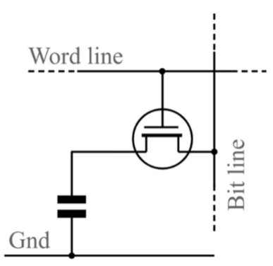
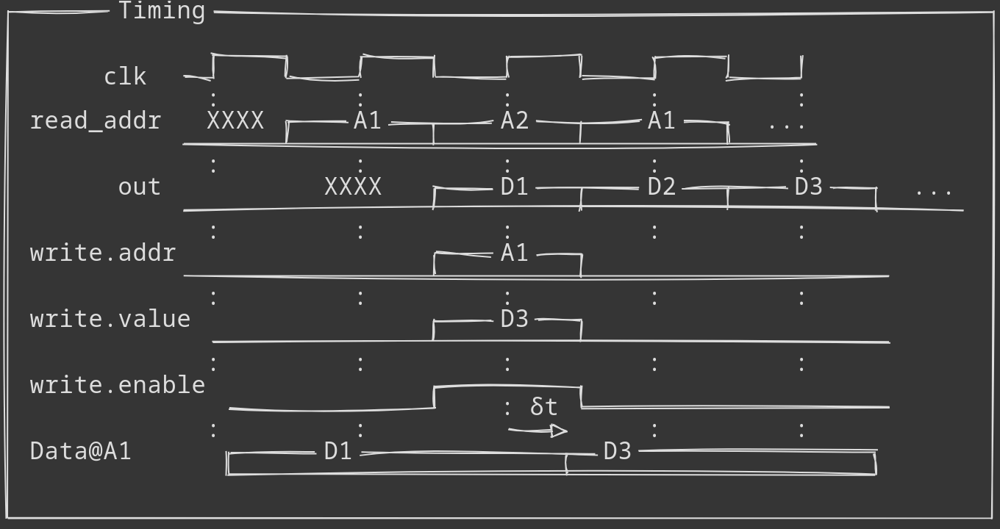

# Memorii

Pentru a putea pastra o stare interna, ne folosim de *memorii* ca sa stocheze valori pentru a putea fi utilizate mai tarziu.
Memoriile pot fi clasificate in mai multe modalitati

- Viteza
<div align="center">


_Figure: Ierarhia memoriilor_

</div>

Observam ca exista mai multe viteze la memorii, registrii sunt cei mai rapizi, unde spre deosebire memoria RAM sau Disk sunt foarte lente

- Volatilitate: Non-volatila contine disk, ssd, banda magnetica, eeprom, acestea isi mentin starea dupa inchidere, in schimb memoriile volatile precum ram/registri se reseteaza dupa fiecare inchidere

## Tipuri de memorii RAM
<div align="center">


_Figure: Celula SRAM_

</div>
Celulele de Static RAM folosesc mai multi tranzistori per celula. 

<div align="center">



_Figure: Celula DRAM_

</div>

Celulele de Dynamic RAM folosesc doar un tranzistor si un condensator per celula, facandule astfel mai eficiente spatial si cu densitate mai mare, doar ca au ca dezavantaj faptul ca condensatorul se descarca pasiv, si trebuie un circuit care face refresh la celule pentru a pastra valorile intacte.

## Data transfer
Pentru a putea transfera datele de la o memorie la cealalta, exista cateva strategii. Cea mai comuna este o magistrala(bus) comuna tuturor memoriilor, dar pentru a putea face asta trebuie o interfata specifica, aceea continand 2 semnale: out_enable si write_enable.

out_enable semnifica daca memoria va trimite mai departe la output starea interna ceruta, sau daca nu trimite nimic (ori lasa outputul "in aer", stare cunoscuta si ca impedanta inalta, notata cu Z, ori 0 cum o sa vedem la laborator)

:::tip
Daca sunt mai multe registre care vor sa scrie in acelasi ciclu de ceas pe magistrala, o sa existe conflicte si magistrala o sa intre intr-o stare nedefinita. De aceea, dorim ca mereu sa nu existe mai mult de 1 out_enable activ per ciclu per magistrala
:::

write_enable semnifica daca memoria se va folosi de inputul primit de pe magistrala sau nu pentru actualizarea starii interne selectata. In cazul in care write_enable e pe 0, starea interna ramane nemodificata, altfel se foloseste de intrare. 

:::tip
Daca intrarea e in starea de impedanta inalta, se va face pull-down la 0 automat intrarii respective in implementarile fizice pentru a evita intrarile nedefinite
:::


## RHDL
In RHDL, avem 2 tipuri de baza de memorii:
- ```DFF<T: Digital>```, care reprezinta un registru generic care incapsuleaza un T

la citire feedbackul este aproape instant, scrierea se va intampla abia ciclul urmator
- ```SyncBRAM<T: Digital, N: BitWidth>```, care reprezinta o memorie SRAM generica cu unitatea de baza T si adresa pe N biti
Ca inputuri acesta primeste o structura care contine un `read_addr`, care e adresa de read si e ```Bits<N>```, si un `write` care e un ```Write<T,N>```, acesta contine adresa de write, data de scris si daca dai enable la write
<div align="center">



_Figure: Bram timing diagram_

</div>
Aici se observa ca si la scriere si la citire totul este decalat cu un ciclu de ceas
