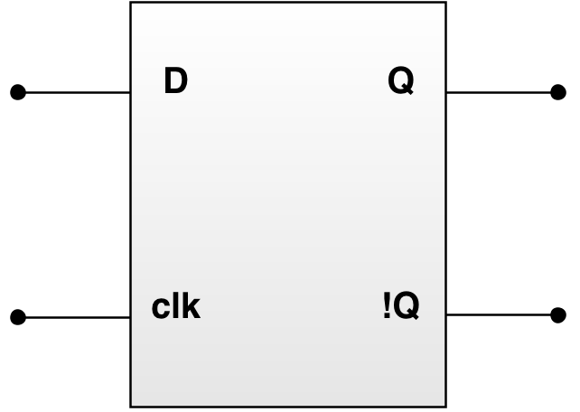
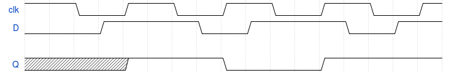

# Bistabilul D

Elementele de memorare din circuitele secvențiale pot fi implementate prin bistabile (eng. _flip-flops_). Acestea stochează valori în funcție de valoarea de la intrare și de semnalul de ceas. Valoarea stocată poate fi schimbată doar atunci când ceasul realizează o tranziție activă (un semnal de ceas poate fi "activ" pe front crescător (eng. _rising edge_) sau pe front descrescător (eng. _falling edge_)).

Există 4 tipuri principale de bistabile: D, T, SR și JK, iar în acest laborator ne vom axa pe bistabilul D. Acesta are un design simplu și este folosit în general pentru implementarea registrelor din procesoare (cea mai mică și mai rapidă unitate de stocare din ierarhia de memorie).

_Figure: Diagrama bloc pentru bistabilul D_

Intrările și ieșirile circuitului sunt:
  - ''D'' - valoarea (_data_) de stocat
  - ''clk'' - semnalul de ceas, considerat activ pe front crescător în descrierile următoare
  - ''Q'' - starea curentă
  - ''!Q'' - starea curentă negată

Ca mod de funcționare, ecuația caracteristică a sa este ''Qnext = D'', adică starea următoare (''Qnext'') a bistabilului depinde doar de intrarea ''D'', fiind independentă de starea curentă (''Q''), după cum se observă și din tabelul de mai jos. 

| D | Q | Qnext |
|---|---|-------|
| 0 | 0 | 0     |
| 0 | 1 | 0     |
| 1 | 0 | 1     |
| 1 | 1 | 1     |

_Table: Tabelul de tranziții pentru bistabilul D_

Pentru a înțelege mai ușor comportamentul bistabilelor, pe lângă tabelele de tranziții mai sunt utile și diagramele de semnale (eng. _timing diagrams_), cum este cea din figura de mai jos, unde se poate observa cum ieșirea ''Q'' se schimbă doar pe frontul crescător de ceas și devine egală cu intrarea ''D'' în momentul tranziției ceasului.

_Figure: Diagrama de semnale pentru bistabilul D_

