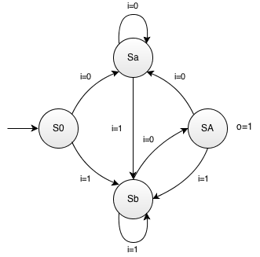

# Automate finite

Prin automate finite (eng. _Finite-state machine - FSM_) înțelegem de fapt un circuit secvențial sincron așa cum a fost el descris anterior. De obicei, proiectarea unui automat finit pornește de la o descriere informală a modului în care automatul trebuie să funcționeze. Primul pas în realizarea automatului este descrierea formală a funcționării acestuia. Două dintre metodele prin care un automat finit poate fi descris sistematic sunt:
  - **Diagrama de stări** prezintă într-un mod grafic funcționarea unui automat finit. Stările automatului sunt reprezentate prin noduri, iar tranzițiile sunt reprezentate prin arce între starea sursă și starea destinație. Fiecare arc este marcat cu condiția necesară pentru a fi efectuată o tranziție. De asemenea, eventualele semnale de ieșire ale automatului sunt marcate în dreptul stărilor care generează acele ieșiri.


_Figure: Exemplu de diagramă de stări_

  - **Tabelul de tranziții** prezintă funcționarea unui automat finit sub formă de tabel. Fiecare rând al tabelului reprezintă o tranziție a automatului și conține starea curentă, starea următoare și intrările necesare pentru a activa tranziția.

| Starea curentă | x | Starea următoare |
|----------------|---|------------------|
| S0             | 1 | S1               |
| S1             | 0 | S0               |

_Table: Exemplu de tabel de tranziții_

În continuare vom proiecta două automate finite simple:

## Recunoaşterea secvenței "ba"

Se dorește proiectarea unui automat finit capabil să recunoască secvența "ba". Automatul primește la intrare în mod continuu caractere codificate printr-un semnal de un bit (caracterele posibile sunt "a" și "b"). Ieșirea automatului va consta dintr-un semnal care va fi activat (valoarea 1) atunci când ultimele două caractere introduse vor fi "b" urmat de "a". Semnalul de ieșire va rămâne activ până la introducerea unui nou caracter, după care automatul va continua operația de recunoaștere.


Vom începe proiectarea automatului prin identificarea intrărilor și ieșirilor. Din descriere observăm că intrarea este formată dintr-un singur semnal de 1 bit (automatul va avea și o intrare de ceas, însă aceasta nu este considerată intrare propriu zisă de date). Deoarece codificarea caracterelor nu este specificată vom presupune că valoarea 0 indică un caracter "a", iar valoarea 1 indică un caracter "b". Ieșirea este formată deasemenea dintr-un semnal de 1 bit cu valoarea 1 atunci când secvența căutată a fost găsită și 0 în rest.

Vom realiza în continuare diagrama de stări a automatului. La pornire, vom inițializa automatul într-o stare pe care o vom numi ''S0''. Dacă la prima tranziție de ceas intrarea are valoarea:
  - 0 (caracterul "a") - vom avansa într-o stare pe care o vom numi ''Sa'' care ne spune că intrarea precedentă a fost "a"
  - 1 (caracterul "b") - vom avansa într-o stare pe care o vom numi ''Sb'' care ne spune că intrarea precedentă a fost "b"
În continuare vom analiza ce se întâmplă atunci când automatul este în starea ''Sa''. Dacă la intrare avem valoarea:
  - 0 (caracterul "a") - automatul va rămâne în acestă stare, care ne spune că intrarea precedentă a fost "a"
  - 1 (caracterul "b") - automatul va trece în ''Sb'', care ne spune că intrarea precedentă a fost "b"
Dacă ne aflăm în starea ''Sb'' și automatul primește la intrare valoarea:
  - 0 (caracterul "a") - automatul a întâlnit secvența dorită "ba" (fiind în starea ''Sb'' intrarea precedentă a fost "b", iar intrarea curentă este "a"); vom avansa într-o stare pe care o vom numi ''SA'' în care vom activa ieșirea automatului; de asemenea, această stare ne spune și că intrarea precedentă a fost "a", lucru folosit pentru a putea recunoaște și următoarele secvențe "ba" care vor mai fi întâlnite la intrare
  - 1 (caracterul "b") - automatul va rămâne în această stare, care ne spune că intrarea precedentă a fost "b"
Dacă ne aflăm în starea ''SA'' și automatul primește la intrare valoarea:
  - 0 (caracterul "a") - automatul va trece în starea ''Sa'' care ne spune că intrarea precedentă a fost "a", însă nu vom activa ieșirea automatului deoarece automatul nu a văzut și caracterul "b"
  - 1 (caracterul "b") - automatul va trece în starea ''Sb'' care ne spune că intrarea precedentă a fost "b"

În momentul de față comportamentul automatului a fost descris complet, toate cele 4 stări identificate având definite tranzițiile pentru toate combinațiile semnalelor de intrare. Figura de mai jos prezintă diagrama de stări a automatului.




_Figure: Automatul de recunoaștere a secvenței "ba"_

O dată determinată diagrama de stări a automatului, putem trece la implementarea acestuia într-un limbaj cunoscut (C/C++/C#/Java):

```C++
void FSM_ba() {  
  // FSM input: 0 - a, 1 - b, other - exit
  // FSM output: 0 - not found, 1 - found
  // FSM state: 0 - S0, 1 - Sa, 2 - Sb, 3 - SA
  int state = 0;
  int in, out;
  out = 0;
  in = 0;

  while(1) {
      switch(state) {
          case 0:
              out = 0;
              break;

          case 1:
              out = 0;
              break;

          case 2:
              out = 0;
              break;

          case 3:
              out = 1;
              break;
      }
    std::cout << "Output: " << out << std::endl;
      
    // Read input
    std::cout << "Please input a number (0 for a, 1 for b, other exit ): ";
    std::cin >> in;
    if (in > 1) {
        break;
    }

      switch(state) {
          case 0:
              if(in == 0)
                  state = 1;
              else
                  state = 2;
              break;

          case 1:
              if(in == 0)
                  state = 1;
              else
                  state = 2;
              break;

          case 2:
              if(in == 0)
                  state = 3;
              else
                  state = 2;
              break;

          case 3:
              if(in == 0)
                  state = 1;
              else
                  state = 2;
              break;
      }
  }
}
```


## Intersecție semaforizată

Se dorește modelarea prin intermediul unui automat de stări a unei intersecții semaforizate în care mașinile pot intra din nord (N), est (E), sud(S) sau vest (W). Semaforul din nord este sincronizat cu semaforul din sud, iar cel din est este sincronizat cu cel din vest. Duratele de timp pentru cele două direcții vor fi: Nord - Sud: roșu - 40 sec, galben - 10sec, verde - 50sec; Est-Vest: roșu - 60 sec, galben - 10 sec, verde - 30 sec.

Vom începe proiectarea automatului prin identificarea intrărilor și ieșirilor. Deoarece descrierea informală nu conține informații despre intrările și ieșirile necesare vom folosi oricâte intrări și ieșiri avem nevoie pentru implementarea comportamentului. Un minim de ieșiri pentru automat reprezintă semnalele de comandă pentru culorile semaforului pentru pietoni și pentru mașini. Cele 5 semnale vor fi:
  - N_rosu- aprindere culoare roșie pentru mașinile din Nord
  - N_galben - aprindere culoare galbenă pentru mașinile din Nord
  - N_verde - aprindere culoare verde pentru mașinile din Nord
  - E_rosu- aprindere culoare roșie pentru mașinile din Est
  - E_galben - aprindere culoare galbenă pentru mașinile din Est
  - E_verde - aprindere culoare verde pentru mașinile din Est
  - S_rosu- aprindere culoare roșie pentru mașinile din Sud
  - S_galben - aprindere culoare galbenă pentru mașinile din Sud
  - S_verde - aprindere culoare verde pentru mașinile din Sud
  - W_rosu- aprindere culoare roșie pentru mașinile din Vest
  - W_galben - aprindere culoare galbenă pentru mașinile din Vest
  - W_verde - aprindere culoare verde pentru mașinile din Vest
Pentru a măsura duratele de timp am putea folosi semnalul de ceas al automatului, introducând multiple stări cu tranziții necondiționate, în care o culoare a semaforului este ținută aprinsă. Având în vedere însă că semnalul de ceas pentru un automat are o perioadă de ceas mică (%%<<%% 1 sec) am avea nevoie de multe stări pentru a realiza o durată de 30 sec. O soluție mult mai bună este să folosim un numărător pentru a realiza întârzierile necesare. Numărătorul este un circuit secvențial (automat finit) care poate număra crescător sau descrescător tranzițiile unui semnal, având un semnal de ieșire care este activat atunci când indexul ajunge la 0 sau la o valoare care poate fi controlată. Concret, pentru măsurarea duratelor de timp în automatul nostru vom folosi un numărător crescător a cărui valoare maximă o vom configura pentru a obține duratele de timp necesare, în funcție de perioada de ceas a automatului.
Vom adăuga astfel o ieșire (''T''), care va controla valoarea maximă a numărătorului și o intrare (''done'') care va primi semnalul de terminare de la numărător.

Diagrama de stări a automatului va urmări tranziția celor 3 culori ale semaforului pentru mașini: verde -> galben -> roșu -> verde . 


_Figure: Automatul intersecției_

Odată determinată diagrama de stări a automatului, putem trece la implementarea acestuia într-un limbaj cunoscut (C/C++/C#/Java): 


```C++
void FSM_intersectie() {
    int state = 0; // FSM state: 0 - N/S_verde, 1 - N/S_galben, 2 - N/S_rosu, 3 - E/W_galben
    int N_rosu;
    int N_galben;
    int N_verde;
    int S_rosu;
    int S_galben;
    int S_verde;
    int W_rosu;
    int W_galben;
    int W_verde;
    int E_rosu;
    int E_galben;
    int E_verde;
    int done;
    int T;
    done = 0;
    T = 0;

    while(1) {
        N_rosu = 0;
        N_galben = 0;
        N_verde = 0;
        S_rosu = 0;
        S_galben = 0;
        S_verde = 0;
        W_rosu = 0;
        W_galben = 0;
        W_verde = 0;
        E_rosu = 0;
        E_galben = 0;
        E_verde = 0;
        switch(state) {
            case 0:
                E_rosu = 1;
                W_rosu = 1;
                N_verde = 1;
                S_verde = 1;
                T = 50;
                if(done == 1)
                    state = 1;
                else
                    state = 0;
                break;
            case 1:
                N_galben = 1;
                S_galben = 1;
                E_rosu = 1;
                W_rosu = 1;
                T = 10;
                if(done == 1)
                    state = 2;
                else
                    state = 1;
                break;
            case 2:
                N_rosu = 1;
                S_rosu = 1;
                E_verde = 1;
                W_verde = 1;
                T = 30;
                if(done == 1)
                    state = 3;
                else
                    state = 2;
                break;
            case 3:
                N_rosu = 1;
                S_rosu = 1;
                E_galben = 1;
                W_galben = 1;
                T = 10;
                if(done == 1)
                    state = 0;
                else
                    state = 3;
                break;
        }

        std::cout << "Stare: " << state << std::endl;
        std::cout << "Done: " << done << std::endl;
        std::cout << "N: " << N_rosu << N_galben << N_verde << std::endl;
        std::cout << "S: " << S_rosu << S_galben << S_verde << std::endl;
        std::cout << "W: " << W_rosu << W_galben << W_verde << std::endl;
        std::cout << "E: " << E_rosu << E_galben << E_verde << std::endl;
        std::cout << "Timp: " << T << std::endl;
        std::cin >> done;
        if (done > 1) {
            break;
        }
    }
}
```
