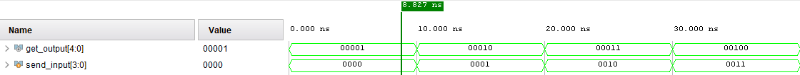
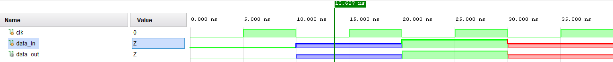

# Simularea circuitelor digitale

În urma ``compilării`` unui fișier Verilog, se poate confirma doar **corectitudinea sintactică** a codului, fără a se putea garanta și conformitatea funcțională a design-ului.
Prin urmare, ``simularea`` are ca obiectiv **validarea comportamentului** implementării, verificând dacă pentru un set de stimuli bine definiți se obțin rezultatele așteptate.

| **Etapă** 			| **Flux** 		 | **Importanță**                                                                                                              |
|-----------------|--------------|---------------|
| Compilare       | Codul este analizat, erorile sunt raportate și <br /> sunt create fișierele intermediare.   | **Depistarea timpurie a erorilor:** <br /> Identifică erorile de sintaxă înainte de a rula simularea.             | 
| Elaborare       | Modulele sunt instanțiate, se realizează conexiunile <br /> și se generează structura design-ului.    | **Asigurarea unui model corect:** <br /> Garantează ca ierarhia design-ului este corectă.   |
| Simulare        | Se aplică semnale de intrare, se obțin semnale de <br /> ieșire, iar comportamentul este verificat.      | **Depistarea timpurie a erorilor:** <br /> Confirmă sau infirmă un comportament conform cu specificațiile.            | 

Pentru a realiza simularea, este necesară crearea unei platforme de test, denumita _testbench_. Aceasta presupune un modul Verilog compus din trei părți:

- **Generatorul de semnale**, cu ajutorul căruia vom aplica stimuli design-ului;
- **O instanță a design-ului**, care poate fi privită ca un ``blackbox`` prin care vor trece semnalele de intrare;
- **Conexiunea la monitor**, unde se va verifica corectitudinea valorilor de ieșire prin compararea acestora cu valorile așteptate;

<div  align="center">


_Figure: Structura testbench-ului_

</div>

Exemplul următor are rolul de a ne oferi o înțelegere mai clară asupra modului în care putem implementa un astfel de _testbench_ utilizând limbajul de descriere hardware **Verilog**.

Pentru început, trebuie să înțelegem care este **scopul design-ului** pe care dorim să îl testăm, astfel reușind să ne conturăm **așteptări** referitoare la ieșirile acestuia.

```verilog
 `timescale 1ns/1ps

 module incrementer ( 
            output	[4:0] out,
            input 	[3:0] in  );
      assign out = in + 1;
 endmodule
```


<div  align="center">


_Figure: Structura modulului incrementer_

</div>

Modulul _incrementer_ este un circut combinațional care primește la intrare o valoare reprezentată pe 4 biți și furnizează la ieșire aceeași valoare incrementată cu o unitate.

Pentru a testa daca modulul realizează într-adevar această operație, îi vom furniza 8 stimuli cărora le vom analiza ulterior rezultatul. Astfel, integrând cele trei componente menționate anterior, rezultă următorul testbench:

```verilog
 `timescale 1ns/1ps

 module testbench ();
      wire  [4:0] get_output;
      reg   [3:0] send_input;
      
      // Generatorul de semnale 
      initial begin
            send_input = 0;
            repeat (7) begin
                  #10 send_input = send_input + 1;
            end
            #10 $finish;
      end

      // Instanța modulului de testat
      // (denumit în industrie și "Device Under Test" sau "DUT")
      incrementer dut (
            .out(get_output),
            .in(send_input)
      );

      // Conexiunea la monitor
      initial begin
            $monitor("Time = %0t | input = %b (%0d) | output = %b (%0d)",
                        $time, send_input, send_input, get_output, get_output);
      end

      initial begin
            $dumpfile("waves.vcd");  
            $dumpvars(0, testbench);
      end
 endmodule
```
Astfel, în urma simulării, putem observa următorul rezultat:

```bash
 Time = 0     | input = 0000 (0) | output = 00001 (1)
 Time = 10000 | input = 0001 (1) | output = 00010 (2)
 Time = 20000 | input = 0010 (2) | output = 00011 (3)
 Time = 30000 | input = 0011 (3) | output = 00100 (4)
 Time = 40000 | input = 0100 (4) | output = 00101 (5)
 Time = 50000 | input = 0101 (5) | output = 00110 (6)
 Time = 60000 | input = 0110 (6) | output = 00111 (7)
 Time = 70000 | input = 0111 (7) | output = 01000 (8)
 ./example/testbench.v:13: $finish called at 80000 (1ps)
```

## Construcții de limbaj esențiale în procesul de simulare

În mod conceptual, circuitele descrise de noi în Verilog au un caracter "infinit", reacționând permanent la intrări. Testbench-ul introduce o **limitare temporală**, definind o perioadă finită de simulare și un set clar de stimuli. Astfel, pentru a realiza simularea în mod corect, este esențială înțelegerea mecanismelor de modelare temporală.

### Mecanisme de modelare temporală

1. **Delay** <br />
Descris de notația `` #n ``, acesta blochează execuția simulării pentru n unități de timp înainte să execute următoarea linie de cod.

```verilog
 `timescale 1ns/1ps

 module delay_example();
      reg a;

      initial begin 
            a = 0;      // la momentul de timp t = 0 ns a are valoarea 0
            #10 a = 1;  // la momentul de timp t = 10 ns a va avea valoarea 1
      end
 endmodule
```

Este necesar totuși să îi menționăm simulatorului și la ce ne unitate de măsură ne referim prin n:
- s (secunde)
- ms (milisecunde)
- us (microsecunde)
- ns (nanosecunde)
- ps (picosecunde)
altfel, acesta va utiliza unitatea sa implicită de măsură.

În acest sens devine foarte utilă directiva `` `timescale ``. Reprezentată prin notația `` `timescale <time_unit>/<time_precision> ``, aceasta setează doua proprietăți temporale pentru toate modulele din scope-ul curent.
- **time_unit**: Definește unitatea de măsură pentru delay-uri. 
> De exemplu, dacă _time_unit_ este setat la 1ns, atunci #5 vor însemna 5 nanosecunde.
- **time_precision**: Determină cel mai mic interval de timp care poate fi simulat și modul în care vor fi rotunjite delay-urile.
> De exemplu, dacă _time_precision_ este setat la 1ps, atunci simulatorul va lucra cu pași de 1 picosecundă, iar orice delay va fi rotunjit la cea mai apropiata picosecundă.

```verilog
 `timescale 10ns/1ns

 module timescale_example();
      reg val;

      initial begin
            val <= 0;
            #1 $display("Time = %0t at delay #1", $realtime);
            val <= 1;
            #0.49 $display("Time = %0t at delay #0.49", $realtime);
            val <= 0;
            #0.50 $display("Time = %0t at delay #0.50", $realtime);
            val <= 1;
            #0.51 $display("Time = %0t at delay #0.51", $realtime);
            val <= 0;
            #5 $display("Time = %0t End of simulation.", $realtime);
      end
 endmodule
```

Astfel, în urma simulării, putem observa următorul rezultat:

```bash
 Time = 10000 at delay #1
 Time = 15000 at delay #0.49
 Time = 20000 at delay #0.50
 Time = 25000 at delay #0.51
 Time = 75000 End of simulation.
```
2. **Wait** <br />
Descris de notația `` wait(condition); ``, acesta blochează execuția simulării, până când condiția este îndeplinită, înainte să execute următoarea linie de cod.

```verilog
 `timescale 1ns/1ps

 module wait_example();
      reg a, b;

      initial begin 
            a = 0;
            b = 0;      
            
            wait (a == 1);    // se așteaptă până când a devine 1

            b = 1;
      end
 endmodule
```
3. **Event** <br />
Un eveniment este un obiect static folosit pentru **sincronizarea între două sau mai multe procese concurente**. Un proces va declanșa evenimentul, iar un alt proces va aștepta acel eveniment.

Evenimentele sunt declanșate prin intermediul operatorului ``->`` sau ``->>``, iar procesele pot aștepta apariția acestora utilizând ``@`` sau ``.triggered``.


```verilog
 `timescale 1ns/1ps

 module event_example();
      event a;

      initial begin 
            #20 ->a;
      end

      initial begin
            @(a);
            $display("The event has been triggered!");
      end
 endmodule
```

### Blocul initial

Acum ca am înțeles și implementat mecanismul de modelare a timpului, următorul pas constă în **încapsularea codului** într-o structură care ne oferă control complet asupra momentului în care acesta incepe și se termină.

Cea mai potrivită construcție în acest sens este blocul ``initial``. Acesta:
- își începe execuția la **momentul de timp 0**;
- rulează **o singură dată**, finalizându-se automat atunci când toate instrucțiunile din interior s-au finalizat sau simularea a fost încheiată dintr-un alt bloc _initial_.

> 💡 Rețineți că blocurile _initial_ nu sunt sintetizabile, fiind destinate exclusiv simulării.

În cadrul unui modul pot exista mai multe astfel de construcții, acestea executându-se în paralel. Astfel putem executa concomitent **secvențe de stimuli**, **dinamica semnalului de ceas** și/sau **monitorizarea semnalelor**.


```verilog
 `timescale 1ns/1ps

 module initial_example();
      wire  [3:0] count;
      reg         clk, reset;

      counter dut (
            .count(count),
            .clk(clk),
            .reset(reset)
      );

      initial begin
            clk = 0;    // ceasul este inițializat
      end

      initial begin
            forever begin
                  #10 clk = ~clk;   // ceasul este activat periodic
            end
      end

      initial begin 
            reset <= 1'b1;    
            #200 reset <= 1'b0;     // este introdus un semnal de reset
            #200 $finish;           // se încheie simularea și implicit toate blocurile initial
      end

      initial begin
            $monitor("Time = %0t | reset = %b | clk = %b | count = %b (%0d)",
                              $time, reset, clk, count, count);   // se afișeaza valorile semnalelor
      end
 endmodule
```

### Funcții de sistem

Funcțiile de sistem reprezintă un **set de instrumente** menite să faciliteze procesul de simulare. Acestea se identifică prin prefixul `` $ `` și sunt interpretate direct de simulator, oferindu-ne o modalitate simplă de a:
- afișa mesaje și semnale;
- opri sau termina simularea;
- genera valori pseudo-aleatoare;
- obține timpul curent al simulării;
- genera fișiere VCD (Value Change Dump);

| **Funcție**     | **Descriere**                                           | **Exemplu**                                |
|-----------------|---------------------------------------------------------|------------------------------------------|
| `$time`         | Returnează timpul curent al simulării ca număr întreg pe 64 de biți | `current_time = $time;` |
| `$realtime`     | Returnează timpul curent al simulării ca număr real (floating-point) | `rt = $realtime;` |
| `$random`       | Generează un număr întreg aleator cu semn pe 32 de biți | `rand_val = $random % 100;` |
| `$urandom`      | Generează un număr întreg aleator fără semn pe 32 de biți | `rand_val = $urandom % 256;` |
| `$display()`    | Afișare formatată cu linie nouă la final | `$display("Value: %h", data);` |
| `$write()`      | Afișare formatată fără linie nouă | `$write("Loading...");` |
| `$monitor()`    | Afișare automată când se schimbă valorile monitorizate | `$monitor("Time=%t, Data=%h", $time, data);` |
| `$strobe()`     | Afișare la sfârșitul pasului de timp | `$strobe("Final value: %h", data);` |
| `$finish`       | Încheie definitiv simularea | `$finish;` |
| `$stop`         | Oprește temporar simularea (poate fi reluată) | `$stop;` |
| `$dumpfile`     | Specifică fișierul în care se salvează undele (de obicei `.vcd`) | `$dumpfile("waves.vcd");` |
| `$dumpvars`     | Specifică ce semnale și module să fie salvate în fișierul de undă | `$dumpvars(0, top_module);` |

## Vizualizarea grafică a semnalelor

Până în acest moment, rezultatele simulării au fost interpretate exclusiv în format text, prin afișări în consolă. Totuși, pe măsură ce design-ul devine mai complex, iar numărul semnalelor crește, această abordare poate fi completată de o vizualizare grafică.

``Formele de undă`` (_waveforms_) reprezintă o **ilustrare grfică a variației semnalelor digitale în timp**, permițând o analiză mai detaliată a evoluției acestora. 

Prin această metodă putem:
- urmări simultan mai multe semnale, observând relațiile dintre ele;
- identifica rapid anomalii sau comportamente neașteptate;
- valida sincronizarea între diverse componente ale design-ului;

Există mai multe simulatoare care facilitează generarea formelor de undă. Un ghid util care prezintă câteva dintre cele mai populare simulatoare poate fi găsit [aici](https://www.rickyspears.com/technology/mastering-hdl-simulation-a-comprehensive-guide-to-the-top-4-verilog-simulators-for-beginners/).

### Fișiere VCD

Formele de undă sunt create pe baza unor fișiere ``VCD`` (Value Change Dump), fie generate **manual** prin comenzi precum ``$dumpfile`` și ``$dumpvars``, fie generate și interpretate **automat** de simulatorul utilizat.

Aceste fișiere VCD nu sunt altceva decât fișiere text în format ASCII ce conțin:
- informații de antet;
- variabile predefinite;
- modificări ale valorilor variabilelor;

fiind echivalente cu înregistrarea întregii informații de simulare.

```vcd
$date
	Sun Sep 28 16:30:19 2025
$end
$version
	Icarus Verilog
$end
$timescale
	1ps
$end
$scope module vcd_example $end
$var wire 1 ! b $end
$var reg 1 " a $end
$scope module dut $end
$var wire 1 " a $end
$var wire 1 ! b $end
$upscope $end
$upscope $end
$enddefinitions $end
$comment Show the parameter values. $end
$dumpall
$end
#0
$dumpvars
0"
0!
$end
#1000
1!
1"
#2000
```

### Forme de undă

Urmărind pașii descrisi în cadrul acestui [tutorial](https://cs-pub-ro.github.io/computer-architecture/Tutoriale/Simulare%20Vivado/), putem vizualiza formele de undă asociate modulului _incrementer_, al carui testbench l-am implementat la începtul acestui laborator.

<div  align="center">



_Figure: Waveform-ul modulului incrementer_

</div>

Analizând waveform-ul, putem observa: **lista de variabile**, **axa timpului de simulare**, **valorile variabilelor la momentul de timp asociat** și **marker-ul de timp**.

> 💡 Ordinea undelor depinde de ``ordinea declarării`` variabilelor in modulul de test.

> 💡 Axa timpului este ilustrată pe baza unității de măsură precizată de noi prin `` `timescale ``.

> 💡 Putem vizualiza valorile în ce bază de numerație dorim prin modificarea setării ``radix`` din cadrul simulatorului.

> 💡 Marker-ii de timp permit măsurarea intervalului dintre două evenimente din simulare. Se selectează punctul de început și, ținând apăsată tasta ``Shift`` urmată de ``click``, punctul final. Simulatorul va calcula automat durata dintre acestea.

În timpul simulării, pentru a reproduce cât mai fidel comportamentul real al hardware-ului, pe lângă valorile logice standard (0 și 1), semnalele pot adopta și valori speciale:
- **``X``** (Unknown), stare necunoscută, folosită atunci când simulatorul nu poate determina dacă semnalul este 0 sau 1;
- **``Z``** (High Impedance), indică faptul că semnalul este deconectat, fără un driver activ;

În simulare, acestea se vor regăsi în următoarea formă:

<div  align="center">



_Figure: Ilustrarea valorilor X si Z_

</div>

## Tipuri de simulare

Până în acest punct, simularea efectuată a fost de tip **comportamental**, reprezentând etapa inițială a procesului de validare. Scopul acesteia este de a verifica ``corectitudinea algoritmică a implementării`` la nivel de descriere hardware (HDL).

<div  align="center">


_Figure: Simularea comportamentală_

</div>

În etapele ulterioare, procesul de simulare se apropie progresiv de comportamentul hardware-ului real, fiind clasificat în două categorii, în funcție de stadiul fluxului de proiectare în care se află design-ul.

1. Simularea **post-sinteză** <br />
Se realizează după etapa de sinteză, pe baza ``netlist``-ului rezultat. <br />
Aceasta se împarte in două categorii: 
   - simulare **funcțională**, confirmă că procesul de sinteză nu a introdus erori logice;
   - simulare **temporală**, adaugă un nivel suplimentar de precizie prin includerea unor timpi de întârziere estimați pentru operațiile logice;
   
> 💡 Netlist-ul este o descriere structurală a design-ului, în care logica a fost deja mapată pe resursele hardware disponibile, dar **fără a include încă informații precise despre plasare și rutare**.

2. Simularea **post-implementare** <br />
Se efectuează după etapa de plasare și rutare, moment în care design-ul este asociat direct cu structura fizică a dispozitivului. În acest caz, simularea se bazează pe un ``netlist`` îmbogățit cu informații detaliate despre întârzierile reale introduse de elementele logice, conexiunile interne și traseele de rutare. 
Și aici există doua subtipuri:
   - simulare **funcțională**, verifică păstrarea funcționalității de bază și după procesul de implementare;
   - simulare **temporală**, oferă o imagine fidelă asupra comportamentului final al circuitului, fiind esențială pentru validarea constrângerilor de timing;

Detalii suplimentare privind etapele de sinteză și implementare vor fi prezentate în capitolul următor.