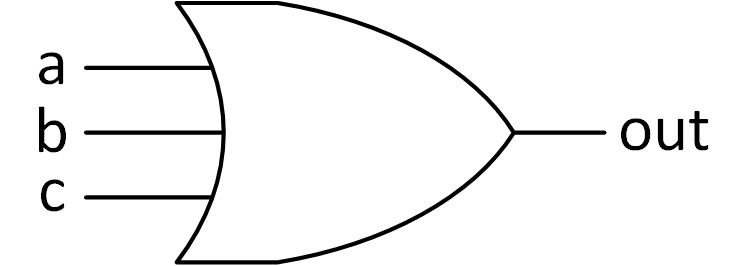
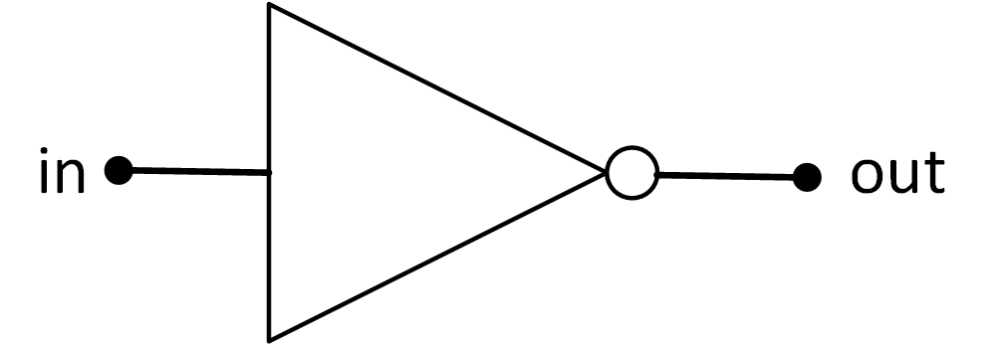
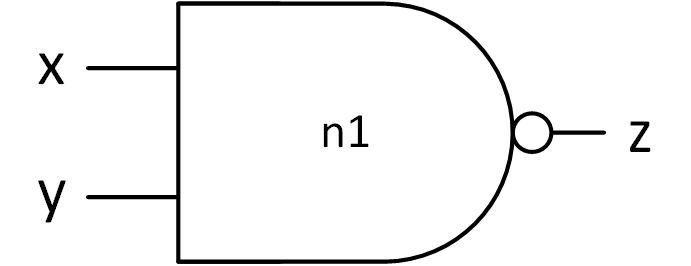

# Structura limbajului Verilog

În laboratorul curent ne vom concentra asupra asimilării limbajului **Verilog**, începând cu **descrierea structurală a unui circuit combinațional**.

Atunci când proiectăm un circuit digital folosind un HDL, începem prin a face o descriere textuală a circuitului, adică scriem cod. Acesta este compilat, iar în urma procesului va rezulta un model al circuitului care poate fi apoi rulat într-un simulator cu scopul de a verifica funcționalitatea descrierii. O alternativă la simulare este folosirea unui utilitar de sintetizare, care preia codul HDL și generează fișiere de configurare pentru FPGA.

Însă proiectarea circuitelor poate deveni complexă. Datorită acestui motiv, se preferă proiectarea de tip top-down, o modalitate de partiționare sistematică și repetată a unui sistem complex în unități funcționale mai simple, a căror implementare poate fi făcută mai facil. O partiționare și organizare la nivel înalt a unui sistem reprezintă arhitectura acestuia. Unitățile funcționale individuale ce rezultă în urma partiționării sunt mai ușor de proiectat și de testat decât întregul sistem. Strategia divide-et-impera a proiectării top-down ne permite proiectarea de circuite care conțin milioane de porți.

## Module

Modulul este unitatea de bază a limbajului Verilog, element ce încapsulează inferfața și comportamentul unui circuit. Modelul _black-box_ este cel mai apropiat de definiția unui modul, întrucât se cunosc elementele de legătură: intrările și ieșirile din modul precum și funcționalitatea precisă a modulului, cu un accent mai redus asupra detaliilor de implementare și a modului în care acesta funcționează.

Pentru declararea unui modul, se folosesc cuvintele cheie ''module'' și ''endmodule''. Pe lângă aceste cuvinte cheie, declarația unui modul mai conține: 
  - numele acestuia,
  - lista de porturi (pentru interfața cu exteriorul): pot fi de intrare (input), ieșire (output) sau intrare - ieșire (inout) și pot avea unul sau mai mulți biți, 
  - și, desigur, implementarea funcționalității modulului.

Ordinea porturilor unui modul nu este restricționată. Intrările și ieșirile pot fi declarate în orice ordine, însă, pentru consistență, o regulă de bună practică este folosirea convenției (obligatorie la primitive): prima dată se declară ieșirile, apoi intrările.

### Exemplu declarare modul

```verilog
module my_beautiful_module (
    output out,
    input [3:0] a, 
    input b);        
/* descrierea funcționalității */
endmodule
```

Pentru implementarea modului avem la dispoziție câteva elemente, care sunt descrise în ceea ce urmează.


## Primitive


Element ce stă la baza descrierii structurale a circuitelor, primitiva este o funcție asociată unei porți logice de bază. Verilog are o suită de primitive predefinite:
  - primitive asociate porților logice: and, or, nand, nor, xor, xnor;
  - primitive asociate porților de transmisie: not, buf, etc;
  - primitive asociate tranzistorilor: pmos, tranif, etc.

Fiecare primitivă are porturi, prin care este conectată în exterior. Primitivele predefinite oferă posibilitatea conectării mai multor intrări (ex. or, and, xor etc.) sau mai multor ieșiri (ex. buf, not). Folosirea unei primitive se face prin instanțierea sa cu lista de semnale care vor fi conectate la porturile ei. Pentru primitivele predefinite porturile de ieșire sunt declarate **înaintea** porturilor de intrare.

Tabelul de mai jos oferă câteva exemple de instanțiere a unor porți în Verilog. Pentru primitivele predefinite numele instanței este opțional.

| Simbol                                | Cod                                                                 |
|---------------------------------------|---------------------------------------------------------------------|
|  | ```or(out, a, b, c);``` _sau_  ```or o1(out, a, b, c);```           |
|  | ```not(out, in);``` _sau_  ```not my_not(out, in);`    ``           |
|  | ```nand (z, x, y);```  _sau_  ```nand n(z, x, y);```                 |

_Table: Exemple de instanțiere a primitivelor_


## Wires

Un singur modul sau o singură primitivă nu poate îndeplini singură funcția cerută. Astfel, apare necesitatea interconectării modulelor sau a primitivelor. Specificarea semnalelor dintr-o diagramă se face prin **wires**, care se declară prin cuvântul cheie ''wire''.


| Simbol                                | Cod                                                                 |
|---------------------------------------|---------------------------------------------------------------------|
|  | ```wire y1, y2; xor(out, y1, y2); and(y1, in1, in2); nand(y2, in3, in4, in5);``` |

_Table: Exemplu de fromare a unei porti complexe din primitive_


În exemplul anterior y1 și y2 sunt semnale de câte 1 bit care leagă ieșirile porților and (y1) și nand (y2) la intrările porții xor.

Pentru a declara semnale pe mai mulți biți se pot folosi vectori precum în declarațiile următoare: m reprezintă un semnal de 8 biți, iar n reprezintă un semnal de 5 biți. Bitul cel mai semnificativ (eng. most significant bit - MSB) este situat întotdeauna în stânga, iar bitul cel mai puțin semnificativ (eng. least significant bit - LSB) în dreapta.

În mod implicit semnalele care nu sunt declarate sunt considerate ca fiind de tip wire și având 1 bit (ex. in1, in2, … din codul de mai sus). Putem accesa individual biții dintr-un wire sau putem accesa un grup consecutiv de biți specificând intervalul (ex. m[0], m[3:1], m[7:2]).

```verilog
wire[7:0] m; _ 8 biti, MSB este bitul 7, LSB bitul 0 
wire[0:4] n;  _ 5 biti, MSB este bitul 0, LSB bitul 4
wire[7:0] a [9:0]; _ array multidimensional cu 10 elemente de 8 biti
```