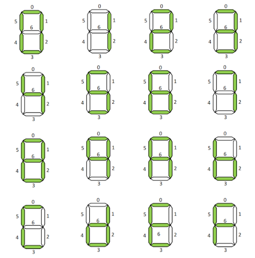

# Exerciții 

## Seven-segment display

Acest tip de dispozitiv de afișare este alcătuit, așa cum vă puteți da seama și din numele acestuia, din 7 segmente controlabile individual. Așadar, putem aprinde (1 logic) sau stinge (0 logic) fiecare segment din componența acestuia.

_Figure: Reprezentarea numerelor în format hexazecimal considerând un afișaj cu 7 segmente_

De exemplu, dacă dorim să afișăm cifra 6, ieșirea noastră va avea valoarea ''7’b111_1101''.

Pentru mai multe detalii asupra acestui tip de modul, consultați pagina de [Wiki](https://en.wikipedia.org/wiki/Seven-segment_display).

  Soluția se află în repo-ul materiei [GitHub](https://github.com/cs-pub-ro/computer-architecture/tree/main/chapters/verilog/behavioral/drills/tasks). 

1. Implementați și simulați un **multiplicator pe 4 biți** fără a folosi operatorul * (înmulțire).
    - _Hint_: Folosiți convenția Verilog pentru interfața modulului. Câți biți are ieșirea? 
    - _Hint_: Înmulțiți pe hârtie, în baza 2, numerele 1001 și 1011. Transpuneți în limbajul Verilog algoritmul folosit.
2. Implementați și simulați un modul de **afișaj cu 7 segmente** pentru numere în baza 10.
    - _Hint_: Există o ieșire validă pentru fiecare intrare? Nu uitați de cazul ''default''. 
    - _Hint_: Se vor testa doar cifrele de la 0 la 9.
3. Implementați o **unitate aritmetico-logică** simplă (UAL), pe **4** biți, cu 2 operații: adunare și înmulțire. Folosiți o intrare de selecție de 1 bit pentru a alege între cele două operații astfel: 0 - adunare, 1 - înmulțire.
    - _Hint_: Câți biți au ieșirea sumatorului și a multiplicatorului? Dar a UAL-ului? 
    - _Hint_: Pentru selecția dintre ieșirea sumatorului și cea a multiplicatorului se poate folosi atribuirea continuă sau se poate implementa un modul multiplexor 2:1 
    - Pentru o utilizare mai generală, implementați un UAL cu operatori cu dimensiune variabilă. 
      - _Hint_: Pentru a-l implementa, este necesară implementarea unui multiplicator parametrizat - atenție la dimensiunea semnalelor!  

## TEST

1. Implmentați modulul verilog pentru afisarea 7-led-segment dat prin iesirile o_w_ca, o_w_cb, o_w_cc, o_w_cd, o_w_ce, o_w_cf, o_w_cg pentru 4 cifre ce vor fi selectate in functie de i_w_in.
Pentru numarul XYZT, pentru i_w_in=0 se va afisa cifra T, pentru i_w_in=1 cifra Z, pentru i_w_in=2 cifra Y, pentru i_w_in=3 cifra X.

2. Implmentați modulul verilog pentru un ALU (arithmetic logic unit) cu 2 operanzi i_w_op1 și i_w_op2 pe 4 biți fiecare, cu rezultatul pe 4 biți o_w_out și o linie de selecție pe 2 biți a operație i_w_sel.