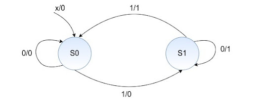
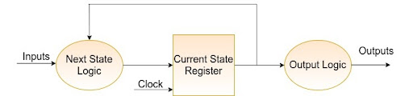

# Automate de stări

Automatele de stări sunt absolut necesare în implementarea oricărui circuit digital. Există două tipuri de automate de stări, clasificate după tipurile de ieșiri generate de fiecare. Primul tip este **Mașina Mealy,** caracterizată de faptul că una sau mai multe ieșiri depind atât de starea curentă, cât și de una sau mai multe intrări, iar al doilea este **Mașina Moore**, ale cărei ieșiri sunt doar o funcție care depinde doar de starea curentă.

## Mașina Mealy

Un model general al unei mașini secvențiale Mealy este format dintr-o rețea combinațională care generează ieșirile, starea următoare și o stare “Current State Register” reprezentând starea curentă, ca în figura de mai jos. Starea “Current State Register” este modelată utilizând bistabili D și este sensibilă la semnalul de ceas (Clock). Atât ieșirea, cât și determinarea stării următoare depind de intrare și de starea curentă.


_Figure: Mealy_

### Exemplu de automat de stări Mealy:



_Figure: Exemplu Mealy_

```v
module mealy_fsm(
    output reg parity,
    input clk,
    input reset,
    input x);
    
    reg state, next_state;
    parameter S0=0;
    parameter S1=1;

    // Partea secvențială
    always @(posedge clk or negedge reset)
        if (!reset)
            state <= S0;
        else
            state <= next_state;

    // Partea combinațională
    always @(*) begin
        parity = 1'b0;
        case(state)
            S0: 
                if(x) 
                    next_state = S1;
                else
                    next_state = S0;
            S1: 
                if(x) begin
                    parity = 1;
                    next_state = S0;
                end
                else begin
                    parity = 1;
                    next_state = S1;
                end
            default:
                next_state = S0;
        endcase
    end
endmodule
```

## Mașina Moore

Un model general al unei mașini secvențiale Moore este prezentat mai jos. Ieșirea sa este dependentă doar de blocul stării curente, iar starea următoare este determinată pe baza intrării și a stării curente. În schema de mai jos, starea “Current State Register” este modelată utilizând bistabili D. Mașinile Moore obișnuite sunt descrise prin intermediul a trei blocuri, dintre care unul conține logică secvențială, iar celelalte două conțin logică de tip combinațională.



_Figure: Moore_

### Exemplu de automat de stări Moore:


_Figure: Exemplu Moore_

```verilog
module moore_fsm(
    output reg parity,
    input clk,
    input reset,
    input x);
    
    reg state, next_state;
    parameter S0=0;
    parameter S1=1;

     // Partea secvențială
    always @(posedge clk or negedge reset)
        if (!reset)
            state <= S0;
        else
            state <= next_state;

    always @(*) begin
        case(state)
            S0: begin
                parity = 0;
                if (x)
                    next_state = S1;
                else
                    next_state = S0;
            end
            S1: begin
                parity = 1;
                if(!x)
                    next_state = S1;
                else
                    next_state = S0;
            end
        endcase
    end
endmodule
```
