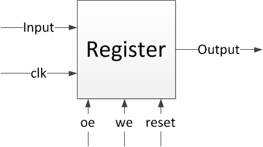

# Memorie

## Registrul

Bistabilul este o celulă de memorie având capacitate de un bit, care poate fi utilizată pentru a stoca date digitale. Pentru a extinde capacitatea de stocare în ceea ce privește numărul de biți, se va utiliza un grup de bistabili, cunoscut și sub termenul de **registru**. Registrul de **n** biți este alcătuit din **n** bistabili și are capacitate de stocare de **n** biți.

Un registru, ca orice alt circuit secvențial este sensibil la schimbarea de front a semnalelor _clk_ și _reset_. De asemenea, pentru a putea fi conectat la o magistrală, acesta are nevoie să execute două operații simple:
  - citire - informația deja existentă în registru este preluată și eliberată pe ieșirea registrului
  - scriere - informația aflată pe magistrală la un moment de timp se scrie în registru

Pentru o vizualizare mai clară a specificațiilor unui astfel de circuit digital secvențial, studiați interfața acestuia:

_Figure: Registrul_

## Memorie cu acces aleatoriu (RAM)

Memoria poate fi asociată cu creierul uman, fiind folosită pentru a stoca date și instrucțiuni. Memoria unui calculator este spațiul de stocare din calculator unde sunt păstrate datele care urmează să fie procesate și instrucțiunile necesare pentru procesare. Aceasta se împarte în mai multe elemente cu caracteristici similare, numite celule. Fiecare celulă are o adresă unică numerotată de la 0 la N-1, unde N este dimensiunea blocului de memorie (numărul de celule din memorie).

Componenta hardware de tip memorie a unui calculator unde sunt stocate sistemul de operare, programele de bază și datele utilizate la momentul curent, pentru a fi accesate cu ușurință de procesor se numește **RAM** (Random Access Memory). RAM-ul este o memorie volatilă, însemnând că toate informațiile stocate în acesta vor fi pierdute la deconectarea calculatorului de la sursa electrică, urmând să fie recuperate la repornirea sistemului de pe HDD/SSD. RAM-ul este mic, atât ca dimensiune fizică, cât și din punct de vedere al capacității de stocare de date.

În comparație cu registrele, memoria de tip RAM este mai greu de accesat de către procesor. Fiind un circuit secvențial complex sunt necesari mai mulți cicli de ceas pentru a citi/scrie informația necesară. Totodată, oferă o capacitate mult mai mare de stocare, de care registrele nu dispun. Prin urmare, pentru implementarea eficientă a unui circuit digital, este foarte importantă gestionarea resurselor între memorie și registre, astfel încât să se permită stocarea și accesul la toate informațiile necesare într-un timp cât mai scurt.