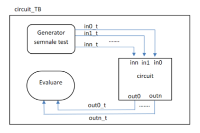

# Testare

Pentru testarea unui modul folosind simulatorul se creează module speciale de test, în care, printre altele, se vor atribui valori intrărilor. Simularea permite detecția rapidă a erorilor de implementare și corectarea acestora. 

Pentru a creea un modul de test și a-l simula puteți urma tutorialul de simulare [[https:_ocw.cs.pub.ro/courses/ac-is/tutoriale/2-ise-simulare|aici]], iar această secțiune va prezenta câteva din construcțiile de limbaj pe care le puteți folosi într-un astfel de modul. 




_Figure: Diagrama testare circuit_


## Blocul initial


Blocurile _initial_ descriu un comportament executat o singură dată la începerea/activarea simulării și sunt folosite pentru inițializări și în module de test. Instrucțiunile sale trebuie încadrate între cuvintele cheie _begin_ și _end_ și sunt executate secvențial.

```verilog
initial begin 
    a = 0; 
    b = 1; 
    #10; _ delay 10 unități de timp de simulare 
    a = 1; 
    b = 0; 
end 
```

Blocurile ''initial'' nu sunt sintetizabile, fiind folosite doar în simulări.


## Sincronizarea prin întârziere


Folosind operatorul _#_ se poate specifica o durată de timp între apariția instrucțiunii și momentul executării acesteia. Aceasta este utilă pentru a separa temporal diversele atribuiri ale intrărilor. Durata de timp este reprezentată prin unități de timp de simulare. De exemplu, dacă simularea folosește un _timescale_ în nanosecunde, _#n_ va reprezenta n nanosecunde.


## Afișare


Atât în modulele de test cât și în modulele testate se pot folosi construcții pentru afișare în interiorul blocurilor _initial_ și _always_. Una dintre aceste instrucțiuni este ''display'':

```verilog
$display(arguments);
```

Argumentele acestei comenzi sunt similare cu cele ale funcției _printf_ din C, ca în exemplul de mai jos, iar specificația completă o puteți găsi . _$display_ adaugă o linie nouă, iar dacă nu se dorește acest lucru se poate folosi comanda _$write_. 

```verilog
a = 1; b = 4;

$display("suma=%d", a+b);
```
